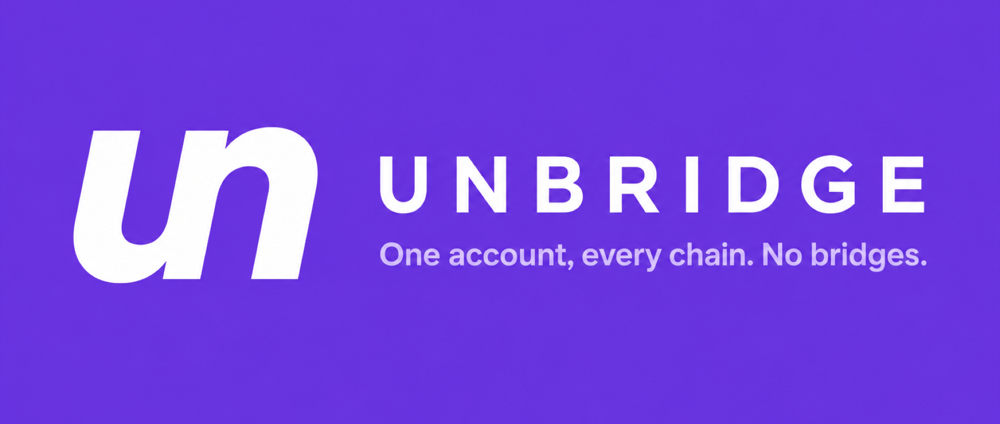

<p align="center">
  
</p>

<h1 align="center">Unbridge</h1>

<p align="center"><strong>Solana's first private multisig.</strong></p>

<p align="center">
  A vault your team controls together. On-chain it looks like one ordinary wallet:
  no member list, no threshold, no visible balance, and no trail from one payment to the next.
</p>

<p align="center">
  <a href="https://unbridge.dev"></a>
  <a href="https://github.com/unbridgeDev/unbridge/actions/workflows/ci.yml"></a>
  <a href="LICENSE"></a>
  <a href="https://github.com/unbridgeDev/unbridge/releases/latest"></a>
</p>

<p align="center">
  
  <a href="https://github.com/unbridgeDev/unbridge/commits/main"></a>
  <a href="https://github.com/unbridgeDev/unbridge/stargazers"></a>
  <a href="https://x.com/Unbridgedev"></a>
</p>

---

Solana team treasuries stand in front of the chain naked. A normal multisig
publishes the signer set, the threshold, every balance, and every payment. It
is a map of who runs your money. Unbridge keeps the shared control and removes
the map: on-chain the vault is one ordinary wallet, spends come out of a
zero-knowledge proof, and no observer can tell one deposit from another.

The on-chain program is live on Solana mainnet at
`6ESjwd4u6qW8SP9PtNwNus1hBJTxKViWra91C36RRALu`
([Solana Explorer](https://explorer.solana.com/address/6ESjwd4u6qW8SP9PtNwNus1hBJTxKViWra91C36RRALu)).
The Rust source lives in [`programs/zkcash`](programs/zkcash). The client
runs in your browser at [unbridge.dev](https://unbridge.dev): proving and
FROST signing happen on your device, never on a server. See
[`docs/verify.mdx`](docs/verify.mdx) for the on-chain checks that back every
claim on this page.

## Features

| Feature                                              | Status | Notes                                                |
|------------------------------------------------------|--------|------------------------------------------------------|
| Shielded pool on Solana mainnet                      | stable | Program `6ESjwd...` verified on-chain                |
| Personal vault (1-of-1)                              | stable | Deposit + relayed withdrawal to a fresh address      |
| Team vault, `t`-of-`n` FROST signing                 | stable | Group key never assembled, not even at signing time  |
| Threshold spend verified inside Groth16              | stable | Baby Jubjub FROST + BN254 pairing on-chain           |
| Standard-denomination deposits (0.1 to 100 SOL)      | stable | Ten fixed sizes prevent amount fingerprints          |
| Relayer-paid withdrawals                             | stable | Prepaid-fee model; recipient unlinkable to members   |
| Async resumable team approvals                       | stable | Backed by a member-funded durable nonce              |
| Vault recovery from chain + wallet                   | stable | No reliance on local cache                           |
| Open trusted-setup ceremony                          | beta   | Public entropy at unbridge.dev/ceremony              |
| SPL token pools                                      | alpha  | Program surface exists; mainnet allow-list is empty  |
| Third-party audit                                    | pending| Scheduled after the ceremony's next-key rotation     |

## Architecture

<p align="center">
  
</p>

Four moving parts, only one of which is trusted for correctness:

| Party                | Can move funds?                       | What it learns                             |
|----------------------|---------------------------------------|--------------------------------------------|
| On-chain program     | Only by verifying a valid Groth16 proof | Public tree state, spent nullifiers      |
| A single member      | No (needs a threshold)                 | Their own key share                        |
| Coordinator          | No (holds no key shares)               | Encrypted ceremony messages                |
| Relayer              | No (proof binds outputs)               | Recipient address, at submit time only     |
| Upgrade authority    | No (no sweep instruction exists)       | Nothing private                            |

Full write-up in [`docs/architecture.mdx`](docs/architecture.mdx).

## Build

```bash
git clone --recurse-submodules https://github.com/unbridgeDev/unbridge.git
cd unbridge

# Type-check without producing binaries
make check

# Build the on-chain program (requires cargo-build-sbf)
make build

# Verify the local build size matches the deployed mainnet program
make verify
```

The build output at `target/deploy/zkcash.so` should reproduce the same
502320-byte program deployed on mainnet. See the [Makefile](Makefile) for the
full target list.

## Quick start

Any wallet can inspect the deployed program:

```bash
solana program show 6ESjwd4u6qW8SP9PtNwNus1hBJTxKViWra91C36RRALu \
    --url mainnet-beta
# Owner:     BPFLoaderUpgradeab1e11111111111111111111111
# Authority: YZykTqXgx91g2FSXoTh7q46HJnbwEH17jRhbNzbfppf
# Length:    502320
```

Read the pool's global config account from a script:

```rust
use anchor_lang::prelude::*;
use solana_client::rpc_client::RpcClient;

let rpc = RpcClient::new("https://api.mainnet-beta.solana.com".to_string());
let program_id: Pubkey = "6ESjwd4u6qW8SP9PtNwNus1hBJTxKViWra91C36RRALu".parse()?;
let (config_pda, _) = Pubkey::find_program_address(&[b"global_config"], &program_id);
let account = rpc.get_account(&config_pda)?;
// Deserialize with the type in programs/zkcash/idl/zkcash.json → GlobalConfig
```

Same read from the browser once the client bundle is pinned:

```ts
import { Connection, PublicKey } from "@solana/web3.js";

const rpc = new Connection("https://api.mainnet-beta.solana.com");
const programId = new PublicKey("6ESjwd4u6qW8SP9PtNwNus1hBJTxKViWra91C36RRALu");
const [configPda] = PublicKey.findProgramAddressSync(
    [Buffer.from("global_config")],
    programId,
);
const account = await rpc.getAccountInfo(configPda);
// Returns: { lamports, owner: programId, data, executable: false, ... }
```

## Project structure

```
.
|-- Anchor.toml                  # Anchor 0.31 workspace + program IDs per cluster
|-- Cargo.toml                   # workspace manifest, pinned solana 1.18.26
|-- Cargo.lock                   # committed for reproducible builds
|-- Dockerfile                   # multi-stage reproducible builder
|-- Makefile                     # build, check, test, lint, format, verify
|-- rust-toolchain.toml          # pinned Rust 1.78
|-- rustfmt.toml
|-- clippy.toml
|-- .env.example                 # RPC + keypair reference
|-- docs/
|   |-- index.mdx                # overview
|   |-- architecture.mdx         # components + trust model
|   |-- how-it-works.mdx         # deposit -> spend flow
|   |-- security.mdx             # threat model, disclosures
|   |-- verify.mdx               # on-chain checks anyone can run
|   |-- getting-started.mdx
|   `-- faq.mdx
|-- programs/
|   `-- zkcash/                  # on-chain program (mainnet: 6ESjwd...)
|       |-- Cargo.toml
|       |-- Xargo.toml
|       |-- README.md
|       |-- idl/
|       |   `-- zkcash.json      # instruction and account schema
|       |-- src/
|       |   |-- lib.rs           # ten entrypoints (3 proof-gated, 7 admin)
|       |   |-- merkle_tree.rs   # sparse 26-level tree + root history
|       |   |-- groth16.rs       # BN254 pairing verify via syscalls
|       |   |-- verifying_keys.rs
|       |   |-- utils.rs         # denomination + fee math
|       |   `-- errors.rs
|       `-- tests/
|           `-- unit/            # unit coverage for utils, merkle, groth16
`-- .github/
    |-- workflows/ci.yml         # format check, cargo check, secret scan
    |-- workflows/release.yml    # publish release on v* tag
    |-- ISSUE_TEMPLATE/
    |-- PULL_REQUEST_TEMPLATE.md
    `-- CODEOWNERS
```

## Deployments

| Cluster       | Program ID                                             | Explorer                                                                                                    |
|---------------|--------------------------------------------------------|-------------------------------------------------------------------------------------------------------------|
| mainnet-beta  | `6ESjwd4u6qW8SP9PtNwNus1hBJTxKViWra91C36RRALu`         | [view](https://explorer.solana.com/address/6ESjwd4u6qW8SP9PtNwNus1hBJTxKViWra91C36RRALu)                    |
| devnet        | `6je63wko2Koor98MXFJntixKQ1X3J2BHUdnAfKbDs4uL`         | [view](https://explorer.solana.com/address/6je63wko2Koor98MXFJntixKQ1X3J2BHUdnAfKbDs4uL?cluster=devnet)     |

Upgrade authority: `YZykTqXgx91g2FSXoTh7q46HJnbwEH17jRhbNzbfppf` (disclosed,
scheduled to be dropped after the trusted-setup ceremony closes).

## Trusted setup

The Groth16 proving system needs a one-time setup. Its first phase uses the
public Perpetual Powers of Tau. The circuit-specific second phase was
bootstrapped by the project, which means the operator must currently be
trusted not to have kept the setup randomness. We are removing that assumption
in the open: anyone can contribute fresh entropy at
[unbridge.dev/ceremony](https://unbridge.dev/ceremony). The setup is safe the
moment one honest contributor is someone other than us. This is disclosed
plainly. See [`docs/security.mdx`](docs/security.mdx).

## Documentation

- [Overview](docs/index.mdx)
- [Architecture](docs/architecture.mdx)
- [How it works](docs/how-it-works.mdx)
- [Security and threat model](docs/security.mdx)
- [Verify it yourself](docs/verify.mdx)
- [Getting started](docs/getting-started.mdx)
- [FAQ](docs/faq.mdx)

## Contributing

See [CONTRIBUTING.md](CONTRIBUTING.md). Security reports go to
[SECURITY.md](SECURITY.md) or the private
[advisory route](https://github.com/unbridgeDev/unbridge/security/advisories/new).
Community guidelines in [CODE_OF_CONDUCT.md](CODE_OF_CONDUCT.md).

## Status

Live on Solana mainnet. Unaudited. Trusted-setup ceremony ongoing. Do not
deposit more than you are willing to expose to that risk.

## Links

- Website: [unbridge.dev](https://unbridge.dev)
- Docs: [unbridge.dev/docs](https://unbridge.dev/docs)
- X: [@Unbridgedev](https://x.com/Unbridgedev)
- GitHub: [unbridgeDev/unbridge](https://github.com/unbridgeDev/unbridge)
- Explorer: [6ESjwd...RRALu](https://explorer.solana.com/address/6ESjwd4u6qW8SP9PtNwNus1hBJTxKViWra91C36RRALu)

## License

MIT. See [LICENSE](LICENSE).
