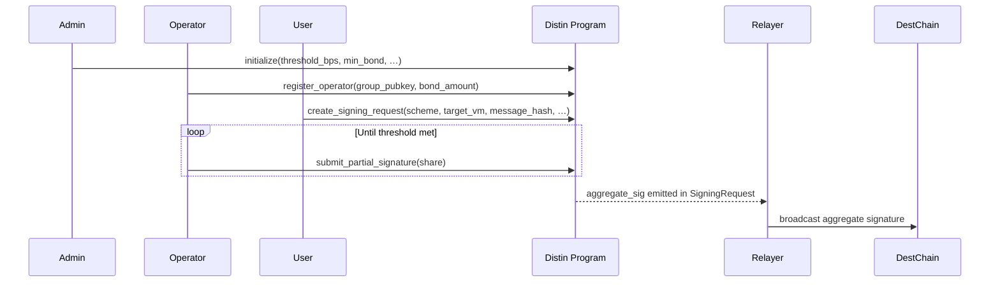
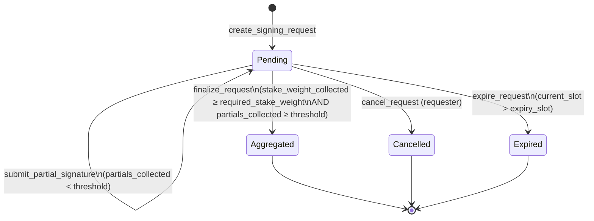

# Distin API Reference

## Program Overview

| Field | Value |
|---|---|
| Program ID | `4xy9dYHfAzi7cAcX5JHxNR6EoMJ9PGfeQDMHx6YUQQM6` |
| Framework | Anchor 0.30.1 |
| Token standard | Token-2022 |
| Solana program crate | `solana-program = 1.18.26` |

The Distin program is the on-chain control plane for a threshold-signature coordination network. Its responsibilities are strictly accounting, economic security, threshold enforcement, liveness deadlines, and slashing. Cryptographic share verification and group-combine are delegated to the off-chain `kobe-{svm,evm,tron,cosmos}` signing libraries; the program records the final 64-byte aggregate in `SigningRequest.aggregate_sig` once the staked-weight threshold is met.

---

## Global Constants

```rust
pub const BPS_DENOMINATOR: u64 = 10_000;
pub const MAX_VALIDITY_SLOTS_CEILING: u64 = 432_000; // ~48 h at 400 ms/slot
```

`BPS_DENOMINATOR` is the denominator for every basis-point fraction in the protocol. `threshold_bps` of `10_000` means 100% of total staked weight is required; `6_667` means ⅔.

`MAX_VALIDITY_SLOTS_CEILING` is the absolute upper bound on how long a signing request may remain open before expiry. At Solana's 400 ms per-slot target, 432,000 slots equals 48 hours. Per-request `validity_slots` must satisfy `1 ≤ validity_slots ≤ 432_000`.

---

## PDA Derivation Reference

All accounts are program-derived. The canonical seeds are constants defined in `state.rs`.

| Account | Seed formula | Derivation sketch |
|---|---|---|
| `Protocol` | `[b"protocol"]` | singleton; one per deployment |
| `bond_vault` | `[b"bond_vault", protocol_pubkey]` | Token-2022 account owned by protocol PDA |
| `slash_pool` | `[b"slash_pool", protocol_pubkey]` | Token-2022 account owned by protocol PDA |
| `Operator` | `[b"operator", protocol_pubkey, authority_pubkey]` | one per operator authority |
| `SigningRequest` | `[b"request", protocol_pubkey, request_id_le]` | `request_id` is the u64 nonce serialized little-endian |
| `PartialSignature` | `[b"partial", request_pubkey, operator_pubkey]` | uniqueness prevents double-submit per operator per request |

```rust
// Rust derivation examples
let (protocol_pda, bump) = Pubkey::find_program_address(
    &[b"protocol"],
    &program_id,
);

let (operator_pda, bump) = Pubkey::find_program_address(
    &[b"operator", &protocol_pda.to_bytes(), &authority.to_bytes()],
    &program_id,
);

let (request_pda, bump) = Pubkey::find_program_address(
    &[b"request", &protocol_pda.to_bytes(), &request_id.to_le_bytes()],
    &program_id,
);

let (partial_pda, bump) = Pubkey::find_program_address(
    &[b"partial", &request_pda.to_bytes(), &operator_pda.to_bytes()],
    &program_id,
);
```

```typescript
// TypeScript / @coral-xyz/anchor
import { PublicKey } from "@solana/web3.js";

const [protocolPda] = PublicKey.findProgramAddressSync(
  [Buffer.from("protocol")],
  Distin_PROGRAM_ID
);

const [operatorPda] = PublicKey.findProgramAddressSync(
  [Buffer.from("operator"), protocolPda.toBuffer(), authority.toBuffer()],
  Distin_PROGRAM_ID
);

const requestIdBuf = Buffer.alloc(8);
requestIdBuf.writeBigUInt64LE(BigInt(requestId));
const [requestPda] = PublicKey.findProgramAddressSync(
  [Buffer.from("request"), protocolPda.toBuffer(), requestIdBuf],
  Distin_PROGRAM_ID
);
```

---

## Type Definitions

### `SignatureScheme`

Branched per destination VM family. Must match the target chain's native signature format.

| Variant | Value | Used for |
|---|---|---|
| `FrostEd25519` | `0` | SVM, Aptos, Sui — FROST Schnorr over Ed25519 |
| `Gg20Secp256k1` | `1` | EVM, BTC, Tron — GG20 threshold ECDSA over secp256k1 |

The scheme is validated at `create_signing_request` and again when operators submit partial shares (`SchemeMismatch` is thrown if the submitted scheme does not match the stored request scheme).

### `TargetVm`

Identifies the destination chain family. Used by off-chain relayers to select the broadcast adapter.

| Variant | Value | Destination |
|---|---|---|
| `Svm` | `0` | Solana / SVM-compatible |
| `Evm` | `1` | EVM-compatible (Ethereum, Arbitrum, Base, …) |
| `Tron` | `2` | Tron (secp256k1, same curve as EVM) |
| `Cosmos` | `3` | Cosmos SDK chains |
| `Bitcoin` | `4` | Bitcoin (secp256k1) |

### `RequestStatus`

Lifecycle state stored in `SigningRequest.status`.

| Variant | Value | Meaning |
|---|---|---|
| `Pending` | `0` | Waiting for partial signatures |
| `Aggregated` | `1` | Threshold met; `aggregate_sig` is populated |
| `Cancelled` | `2` | Requester cancelled before expiry |
| `Expired` | `3` | Passed `expiry_slot` without reaching threshold |

---

## State Accounts

### `Protocol`

Singleton protocol configuration and global accounting.

Seeds: `[b"protocol"]`
Space: `8 (discriminator) + 248 = 256 bytes`

| Field | Type | Description |
|---|---|---|
| `admin` | `Pubkey` | Current admin authority |
| `pending_admin` | `Pubkey` | Nominated successor; `Pubkey::default()` until set |
| `bond_mint` | `Pubkey` | Token-2022 LST mint accepted as bonded collateral |
| `bond_vault` | `Pubkey` | Protocol-owned vault holding active bonds |
| `slash_pool` | `Pubkey` | Protocol-owned pool collecting slashed collateral |
| `lst_price_feed` | `Pubkey` | Pyth price account for valuing the LST bond in SOL terms |
| `threshold_bps` | `u16` | Fraction of total staked weight required to finalize (in bps, denominator `10_000`) |
| `min_bond` | `u64` | Minimum bond an operator must post to join the signing set (in LST raw units) |
| `unbonding_slots` | `u64` | Slots between `begin_unbonding` and `withdraw_bond` |
| `request_fee` | `u64` | Lamports charged per `create_signing_request` (transferred to protocol PDA) |
| `max_validity_slots` | `u64` | Upper bound on a request's validity window; capped at `432_000` |
| `operator_count` | `u32` | Number of operators currently in the active signing set |
| `total_bonded` | `u64` | Sum of active operators' staked economic weight |
| `request_nonce` | `u64` | Monotonic counter seeding `SigningRequest` PDAs |
| `paused` | `bool` | Emergency pause flag; blocks all user/operator state transitions |
| `bump` | `u8` | PDA canonical bump |

### `Operator`

A bonded signing operator record.

Seeds: `[b"operator", protocol_pubkey, authority_pubkey]`
Space: `8 + 143 = 151 bytes`

| Field | Type | Description |
|---|---|---|
| `protocol` | `Pubkey` | Owning protocol PDA |
| `authority` | `Pubkey` | Operator authority (required signer for submissions and lifecycle actions) |
| `group_pubkey` | `[u8; 33]` | Compressed group public key / FROST public-share identifier (33 bytes = compressed secp/ed point) |
| `bonded_amount` | `u64` | Raw LST amount currently held in the bond vault |
| `stake_weight` | `u64` | SOL-denominated economic weight derived from `bonded_amount` via the Pyth oracle |
| `partials_submitted` | `u64` | Lifetime count of partial signatures submitted |
| `slash_count` | `u32` | Number of times this operator has been slashed |
| `jailed` | `bool` | `true` when unbonding or when bond falls below `min_bond`; operator cannot sign while jailed |
| `unbonding_at` | `u64` | Slot at which unbonding completes; `0` while actively bonded |
| `joined_slot` | `u64` | Slot the operator joined the signing set |
| `bump` | `u8` | PDA canonical bump |

### `SigningRequest`

A user's cross-VM signing intent and its aggregation progress.

Seeds: `[b"request", protocol_pubkey, request_id.to_le_bytes()]`
Space: `8 + 224 = 232 bytes`

| Field | Type | Description |
|---|---|---|
| `protocol` | `Pubkey` | Owning protocol PDA |
| `requester` | `Pubkey` | Account that posted the intent; receives rent refund on close |
| `request_id` | `u64` | Monotonic id (taken from `protocol.request_nonce` at creation) |
| `scheme` | `SignatureScheme` | Required signature scheme for the destination VM |
| `target_vm` | `TargetVm` | Destination VM family |
| `target_chain_id` | `u64` | Destination chain identifier (EVM chain id, Cosmos chain index, etc.) |
| `message_hash` | `[u8; 32]` | 32-byte hash of the transaction or message to be signed off-chain |
| `threshold` | `u16` | Minimum number of distinct partial signatures required |
| `partials_collected` | `u16` | Partial signatures collected so far |
| `stake_weight_collected` | `u64` | Staked economic weight accumulated so far |
| `required_stake_weight` | `u64` | Economic-security target snapshotted at creation (`total_bonded × threshold_bps / 10_000`) |
| `created_slot` | `u64` | Slot the request was created |
| `expiry_slot` | `u64` | Slot after which the request can no longer be fulfilled |
| `status` | `RequestStatus` | Current lifecycle state |
| `aggregate_sig` | `[u8; 64]` | Running aggregate signature accumulator; populated on finalization |
| `bump` | `u8` | PDA canonical bump |

### `PartialSignature`

A single operator's partial-signature contribution to a request. The PDA uniqueness constraint (`[b"partial", request, operator]`) enforces that each operator may submit exactly one share per request; a second attempt fails at account initialization with an `AccountAlreadyInitialized` error at the runtime level.

Seeds: `[b"partial", request_pubkey, operator_pubkey]`
Space: `8 + 146 = 154 bytes`

| Field | Type | Description |
|---|---|---|
| `request` | `Pubkey` | Request this share contributes to |
| `operator` | `Pubkey` | Operator PDA that submitted the share |
| `scheme` | `SignatureScheme` | Scheme of the share (must match the request scheme) |
| `share` | `[u8; 64]` | 64-byte partial-signature share material |
| `submitted_slot` | `u64` | Slot the share was submitted |
| `stake_weight` | `u64` | Staked weight credited for this contribution |
| `bump` | `u8` | PDA canonical bump |

---

## Instructions



---

### `initialize`

Bootstrap the protocol singleton. Creates the `Protocol` config account, the bonded-collateral vault, and the slash pool (both Token-2022 accounts owned by the protocol PDA). Can only be called once per deployment.

```rust
pub fn initialize(
    ctx: Context<Initialize>,
    threshold_bps: u16,
    min_bond: u64,
    unbonding_slots: u64,
    request_fee: u64,
    max_validity_slots: u64,
    lst_price_feed: Pubkey,
) -> Result<()>
```

**Accounts**

| Account | Constraint | Description |
|---|---|---|
| `admin` | `Signer` | Becomes the initial admin authority |
| `protocol` | `init`, PDA `[b"protocol"]`, `mut` | Singleton config account |
| `bond_mint` | Token-2022 `Mint` | LST mint accepted as collateral |
| `bond_vault` | `init`, PDA `[b"bond_vault", protocol]`, `mut` | Vault receiving operator bonds |
| `slash_pool` | `init`, PDA `[b"slash_pool", protocol]`, `mut` | Pool receiving slashed collateral |
| `token_program` | `TokenInterface` | Token-2022 program |
| `system_program` | `Program<System>` | For account initialization |

**Parameters**

| Parameter | Type | Constraints | Description |
|---|---|---|---|
| `threshold_bps` | `u16` | `1 ≤ threshold_bps ≤ 10_000` | Fraction of total staked weight required to finalize a request |
| `min_bond` | `u64` | `> 0` | Minimum LST bond to join the signing set |
| `unbonding_slots` | `u64` | `> 0` (not validated on-chain, operator-set governance) | Slots between begin_unbonding and withdraw_bond |
| `request_fee` | `u64` | any | Lamports per signing request; `0` to disable |
| `max_validity_slots` | `u64` | `1 ≤ max_validity_slots ≤ 432_000` | Maximum allowed validity window for requests |
| `lst_price_feed` | `Pubkey` | — | Pyth price account for LST → SOL valuation |

**Errors thrown**

| Error | Condition |
|---|---|
| `InvalidThreshold` | `threshold_bps < 1` or `threshold_bps > 10_000` |
| `InsufficientBond` | `min_bond == 0` |
| `InvalidValidityWindow` | `max_validity_slots < 1` or `max_validity_slots > 432_000` |

---

### `update_config`

Admin: tune live economic-security and liveness parameters. All fields are `Option`; only provided `Some` values are applied.

```rust
pub fn update_config(
    ctx: Context<AdminConfig>,
    threshold_bps: Option<u16>,
    min_bond: Option<u64>,
    unbonding_slots: Option<u64>,
    request_fee: Option<u64>,
    max_validity_slots: Option<u64>,
) -> Result<()>
```

**Accounts**

| Account | Constraint | Description |
|---|---|---|
| `admin` | `Signer`, must equal `protocol.admin` | Current admin |
| `protocol` | PDA `[b"protocol"]`, `mut` | Config account to update |

**Parameters**

All parameters mirror `initialize` semantics. Any field set to `None` is left unchanged.

**Errors thrown**

| Error | Condition |
|---|---|
| `Unauthorized` | Signer does not match `protocol.admin` |
| `InvalidThreshold` | Provided `threshold_bps` out of `[1, 10_000]` |
| `InsufficientBond` | Provided `min_bond` is `0` |
| `InvalidValidityWindow` | Provided `max_validity_slots` out of `[1, 432_000]` |

---

### `transfer_admin`

Step 1 of the two-step admin handover. Nominates a successor by writing `new_admin` into `Protocol.pending_admin`. The current admin retains control until `accept_admin` is called.

```rust
pub fn transfer_admin(
    ctx: Context<AdminConfig>,
    new_admin: Pubkey,
) -> Result<()>
```

**Accounts**

Same as `update_config` (`AdminConfig` context).

**Parameters**

| Parameter | Type | Constraints | Description |
|---|---|---|---|
| `new_admin` | `Pubkey` | must not be `Pubkey::default()` | Nominated successor admin |

**Errors thrown**

| Error | Condition |
|---|---|
| `Unauthorized` | Signer does not match `protocol.admin` |
| `InvalidAdminTransfer` | `new_admin == Pubkey::default()` |

---

### `accept_admin`

Step 2 of the two-step admin handover. The nominated account (`pending_admin`) signs this transaction to accept the role. On success, `protocol.admin` is set to the nominee and `protocol.pending_admin` is reset to `Pubkey::default()`.

```rust
pub fn accept_admin(ctx: Context<AcceptAdmin>) -> Result<()>
```

**Accounts**

| Account | Constraint | Description |
|---|---|---|
| `new_admin` | `Signer` | Must match `protocol.pending_admin` |
| `protocol` | PDA `[b"protocol"]`, `mut` | Config account |

**Errors thrown**

| Error | Condition |
|---|---|
| `Unauthorized` | Signer does not match `protocol.pending_admin` |

---

### `pause`

Emergency brake: sets `protocol.paused = true`. All user and operator state transitions (`register_operator`, `begin_unbonding`, `create_signing_request`, and partial submission) will immediately fail with `ProtocolPaused` until `unpause` is called. Admin-only management instructions (`update_config`, `transfer_admin`, `accept_admin`, `slash_operator`) remain callable while paused.

```rust
pub fn pause(ctx: Context<AdminConfig>) -> Result<()>
```

**Accounts**: Same as `update_config`.

**Errors thrown**

| Error | Condition |
|---|---|
| `Unauthorized` | Signer does not match `protocol.admin` |

---

### `unpause`

Resumes normal operation by setting `protocol.paused = false`.

```rust
pub fn unpause(ctx: Context<AdminConfig>) -> Result<()>
```

**Accounts**: Same as `update_config`.

**Errors thrown**: Same as `pause`.

---

### `register_operator`

Join the signing set by bonding LST collateral. Transfers `bond_amount` of Token-2022 LST from the operator's token account into the protocol-owned `bond_vault`. The oracle-derived `stake_weight` is added to `protocol.total_bonded` immediately.

```rust
pub fn register_operator(
    ctx: Context<RegisterOperator>,
    group_pubkey: [u8; 33],
    bond_amount: u64,
) -> Result<()>
```

**Accounts**

| Account | Constraint | Description |
|---|---|---|
| `authority` | `Signer` | Operator wallet; becomes `operator.authority` |
| `protocol` | PDA `[b"protocol"]`, `mut` | Updated: `operator_count += 1`, `total_bonded += stake_weight` |
| `operator` | `init`, PDA `[b"operator", protocol, authority]` | Created operator record |
| `operator_token_account` | Token-2022, `mut` | Source of the LST bond |
| `bond_vault` | PDA `[b"bond_vault", protocol]`, `mut` | Destination |
| `bond_mint` | Token-2022 `Mint` | Required by `transfer_checked` |
| `lst_price_feed` | Pyth price account | Must match `protocol.lst_price_feed` |
| `token_program` | `TokenInterface` | Token-2022 |
| `system_program` | `Program<System>` | For `operator` account initialization |

**Parameters**

| Parameter | Type | Constraints | Description |
|---|---|---|---|
| `group_pubkey` | `[u8; 33]` | non-zero | Compressed 33-byte group/FROST public key. Used by off-chain signing library to route share material |
| `bond_amount` | `u64` | `≥ protocol.min_bond` | Raw LST units to bond |

**Behavior details**

- The bond is transferred via `transfer_checked` (Token-2022 CPI), which enforces `bond_mint.decimals` — no manual decimal math.
- `stake_weight` is computed by `compute_stake_weight(&lst_price_feed, bond_amount)`. The exact oracle math is implemented off-chain; the on-chain effect is a proportional `u64` weight assigned to this operator.
- `operator.unbonding_at` is initialized to `0`, indicating active bonded status.
- Emits `OperatorRegistered { operator, authority, stake_weight }`.

**Errors thrown**

| Error | Condition |
|---|---|
| `ProtocolPaused` | `protocol.paused == true` |
| `InsufficientBond` | `bond_amount < protocol.min_bond` |
| `InvalidOracleAccount` | `lst_price_feed` key does not match `protocol.lst_price_feed` |
| `StaleOraclePrice` | Oracle price data has exceeded freshness threshold |
| `MathOverflow` | `total_bonded` or `operator_count` would overflow |

**Example**

```typescript
const bondAmount = new BN(1_000_000_000); // 1 LST (assuming 9 decimals)
const groupPubkey = Buffer.from(operatorCompressedPubkey); // 33 bytes

await program.methods
  .registerOperator([...groupPubkey], bondAmount)
  .accounts({
    authority: wallet.publicKey,
    protocol: protocolPda,
    operator: operatorPda,
    operatorTokenAccount: operatorAta,
    bondVault: bondVaultPda,
    bondMint: lstMint,
    lstPriceFeed: pythFeedAccount,
    tokenProgram: TOKEN_2022_PROGRAM_ID,
    systemProgram: SystemProgram.programId,
  })
  .signers([wallet])
  .rpc();
```

---

### `begin_unbonding`

Operator: start the unbonding timer and exit the active signing set. The operator is immediately `jailed = true` and its `stake_weight` is subtracted from `protocol.total_bonded`. The operator can no longer be assigned to new requests, but its bond remains in the vault (still slashable) until `unbonding_at` is reached.

```rust
pub fn begin_unbonding(ctx: Context<OperatorLifecycle>) -> Result<()>
```

**Accounts**

| Account | Constraint | Description |
|---|---|---|
| `authority` | `Signer` | Must match `operator.authority` |
| `protocol` | PDA `[b"protocol"]`, `mut` | `total_bonded -= operator.stake_weight`; `operator_count -= 1` |
| `operator` | PDA `[b"operator", protocol, authority]`, `mut` | Sets `unbonding_at`, `jailed = true` |

**Behavior details**

`operator.unbonding_at` is set to `current_slot + protocol.unbonding_slots`. While `unbonding_at != 0` and the current slot is before `unbonding_at`, the bond is still slashable — economic security is preserved during the exit window.

**Errors thrown**

| Error | Condition |
|---|---|
| `ProtocolPaused` | `protocol.paused == true` |
| `AlreadyUnbonding` | `operator.unbonding_at != 0` |
| `MathOverflow` | `current_slot + unbonding_slots` overflows `u64` |

---

### `withdraw_bond`

Operator: reclaim the bond after the unbonding window has elapsed. Transfers `operator.bonded_amount` from the vault back to the operator's token account and closes the operator account (returning rent to the authority).

```rust
pub fn withdraw_bond(ctx: Context<WithdrawBond>) -> Result<()>
```

**Accounts**

| Account | Constraint | Description |
|---|---|---|
| `authority` | `Signer` | Must match `operator.authority`; receives rent |
| `protocol` | PDA `[b"protocol"]` | Signing authority for vault CPI |
| `operator` | PDA `[b"operator", protocol, authority]`, `mut`, `close = authority` | Closed on success |
| `operator_token_account` | Token-2022, `mut` | Receives the returned bond |
| `bond_vault` | PDA `[b"bond_vault", protocol]`, `mut` | Source |
| `bond_mint` | Token-2022 `Mint` | Required by `transfer_checked` |
| `token_program` | `TokenInterface` | Token-2022 |

The vault transfer is signed by the protocol PDA using `[b"protocol", bump]` as signer seeds.

**Errors thrown**

| Error | Condition |
|---|---|
| `NotUnbonding` | `operator.unbonding_at == 0` (never called `begin_unbonding`) |
| `UnbondingNotComplete` | `current_slot < operator.unbonding_at` |

---

### `slash_operator`

Admin: slash a misbehaving operator by moving `amount` LST from the bond vault to the slash pool. If the residual bond falls below `protocol.min_bond`, the operator is jailed. If the operator was active (not already unbonding/jailed) before the slash, `protocol.total_bonded` is reduced by the weight delta.

```rust
pub fn slash_operator(
    ctx: Context<SlashOperator>,
    amount: u64,
    reason: u8,
) -> Result<()>
```

**Accounts**

| Account | Constraint | Description |
|---|---|---|
| `admin` | `Signer`, must equal `protocol.admin` | Slashing authority |
| `protocol` | PDA `[b"protocol"]`, `mut` | Updated if operator was active |
| `operator` | PDA of target operator, `mut` | Bond reduced; may be jailed |
| `bond_vault` | PDA `[b"bond_vault", protocol]`, `mut` | Source |
| `slash_pool` | PDA `[b"slash_pool", protocol]`, `mut` | Destination |
| `bond_mint` | Token-2022 `Mint` | Required by `transfer_checked` |
| `token_program` | `TokenInterface` | Token-2022 |

**Parameters**

| Parameter | Type | Description |
|---|---|---|
| `amount` | `u64` | LST amount to slash; must not exceed `operator.bonded_amount` |
| `reason` | `u8` | Fraud-proof category code (equivocation = 0, invalid-share = 1, liveness = 2; encoding is off-chain convention, not validated on-chain) |

**Behavior details**

The on-chain weight accounting after a slash:

```
new_weight = compute_stake_weight(oracle, operator.bonded_amount - amount)
weight_delta = old_weight - new_weight

if operator was active:
    protocol.total_bonded -= weight_delta
    if operator.bonded_amount - amount < min_bond:
        protocol.total_bonded -= new_weight   // also remove remaining weight
        protocol.operator_count -= 1
        operator.jailed = true
```

Emits `OperatorSlashed { operator, amount, reason }`.

In production, `slash_operator` is gated by a fraud-proof verified off-chain by the signing library before the admin submits this transaction. The on-chain code enforces collateral movement and jailing; fraud-proof logic itself is not implemented on-chain.

**Errors thrown**

| Error | Condition |
|---|---|
| `Unauthorized` | Signer does not match `protocol.admin` |
| `SlashAmountExceedsBond` | `amount > operator.bonded_amount` |
| `MathOverflow` | `slash_count` increment overflows |

---

### `create_signing_request`

User: post a cross-VM signing intent for the operator set to fulfill. Charges `protocol.request_fee` lamports via `system_program::transfer` and allocates a `SigningRequest` account. Snapshots `required_stake_weight = total_bonded × threshold_bps / 10_000` at creation time so threshold evaluation is deterministic against the operator set at the moment of posting.

```rust
pub fn create_signing_request(
    ctx: Context<CreateSigningRequest>,
    scheme: SignatureScheme,
    target_vm: TargetVm,
    target_chain_id: u64,
    message_hash: [u8; 32],
    threshold: u16,
    validity_slots: u64,
) -> Result<()>
```

**Accounts**

| Account | Constraint | Description |
|---|---|---|
| `requester` | `Signer` | Pays request fee and request account rent |
| `protocol` | PDA `[b"protocol"]`, `mut` | Receives fee; `request_nonce` incremented |
| `signing_request` | `init`, PDA `[b"request", protocol, request_nonce.to_le_bytes()]` | Created signing intent |
| `system_program` | `Program<System>` | For fee transfer and account init |

**Parameters**

| Parameter | Type | Constraints | Description |
|---|---|---|---|
| `scheme` | `SignatureScheme` | valid variant | Cryptographic scheme for the target VM |
| `target_vm` | `TargetVm` | valid variant | Destination VM family |
| `target_chain_id` | `u64` | any | Chain identifier on the destination network |
| `message_hash` | `[u8; 32]` | at least one non-zero byte | 32-byte hash of the off-chain payload |
| `threshold` | `u16` | `1 ≤ threshold ≤ protocol.operator_count` | Minimum partial signatures to collect |
| `validity_slots` | `u64` | `1 ≤ validity_slots ≤ protocol.max_validity_slots` | Request lifetime in slots |

**Errors thrown**

| Error | Condition |
|---|---|
| `ProtocolPaused` | `protocol.paused == true` |
| `NoActiveOperators` | `protocol.operator_count == 0` |
| `EmptyMessageHash` | All 32 bytes of `message_hash` are `0x00` |
| `InvalidThreshold` | `threshold < 1` or `threshold > protocol.operator_count` |
| `InvalidValidityWindow` | `validity_slots < 1` or `validity_slots > protocol.max_validity_slots` |
| `MathOverflow` | `total_bonded × threshold_bps` overflows before division |

**Example**

```typescript
import { keccak256, toBytes } from "viem";

// Encode the EVM transaction you want signed
const txPayload = encodeFunctionData({ abi, functionName: "transfer", args: [...] });
const messageHash = Array.from(keccak256(toBytes(txPayload)));

await program.methods
  .createSigningRequest(
    { gg20Secp256k1: {} },          // SignatureScheme variant
    { evm: {} },                     // TargetVm variant
    new BN(8453),                    // Base chain id
    messageHash,                     // [u8; 32]
    5,                               // threshold: at least 5 partials
    new BN(750),                     // validity_slots: ~5 min
  )
  .accounts({
    requester: wallet.publicKey,
    protocol: protocolPda,
    signingRequest: requestPda,      // derived from protocol + nonce
    systemProgram: SystemProgram.programId,
  })
  .signers([wallet])
  .rpc();
```

**Scheme × VM matrix**

| `target_vm` | Required `scheme` | Off-chain library |
|---|---|---|
| `Svm` | `FrostEd25519` | `kobe-svm` |
| `Evm` | `Gg20Secp256k1` | `kobe-evm` |
| `Tron` | `Gg20Secp256k1` | `kobe-tron` |
| `Cosmos` | `FrostEd25519` or `Gg20Secp256k1` | `kobe-cosmos` |
| `Bitcoin` | `Gg20Secp256k1` | `kobe-evm` (secp256k1 compatible) |

The program does not validate scheme-vm pairing itself; the off-chain relayer and `kobe-*` libraries enforce this. Submitting an incompatible combination will produce a `MalformedPartialSignature` during share aggregation.

---

## Partial Submission and Finalization

The `submit_partial_signature` and `finalize_request` instructions are implemented in the full program but were not included in the provided code excerpt. Based on the `PartialSignature` account structure and `SigningRequest` accumulator fields, the on-chain flow is:



Each `submit_partial_signature` call:
1. Initializes a `PartialSignature` PDA at `[b"partial", request, operator]` — the PDA uniqueness prevents double-submit without any explicit duplicate check.
2. Validates `scheme` matches `request.scheme` (throws `SchemeMismatch` otherwise).
3. Validates the operator is not jailed/unbonding (throws `OperatorJailed`).
4. Validates the request is `Pending` and has not passed `expiry_slot` (throws `RequestNotPending`, `RequestExpired`).
5. Accumulates `stake_weight_collected` and increments `partials_collected`.

Finalization publishes the 64-byte aggregate signature into `request.aggregate_sig` and sets `status = Aggregated`. The aggregate is assembled off-chain by the `kobe-*` libraries and passed as an instruction argument; the program stores it without performing any elliptic-curve verification on-chain (verification is done by the destination chain upon broadcast).

---

## Events

Two events are emitted via Anchor's `emit!` macro and appear in the transaction log. Off-chain indexers subscribe to these for operator tracking and slashing alerts.

### `OperatorRegistered`

```rust
pub struct OperatorRegistered {
    pub operator: Pubkey,   // OperatorPDA
    pub authority: Pubkey,  // operator.authority
    pub stake_weight: u64,  // oracle-derived weight at join time
}
```

Emitted by: `register_operator`

### `OperatorSlashed`

```rust
pub struct OperatorSlashed {
    pub operator: Pubkey,  // OperatorPDA
    pub amount: u64,       // LST amount moved to slash pool
    pub reason: u8,        // fraud-proof category code
}
```

Emitted by: `slash_operator`

---

## Error Reference

All errors are defined in `programs/distin/src/errors.rs` as variants of `DistinError`. Anchor encodes these starting at offset `6000` in the program's error namespace.

| Variant | Message | Common trigger |
|---|---|---|
| `ProtocolPaused` | "Protocol is paused" | Any user/operator call while `protocol.paused == true` |
| `Unauthorized` | "Caller is not authorized for this action" | Admin instruction signed by non-admin; `accept_admin` signed by non-nominee |
| `InvalidThreshold` | "Threshold must be between 1 and the active operator count / 10000 bps" | `threshold_bps` outside `[1, 10_000]`; per-request `threshold > operator_count` |
| `InsufficientBond` | "Bond amount is below the configured minimum" | `bond_amount < protocol.min_bond`; `min_bond == 0` in initialize |
| `OperatorJailed` | "Operator is jailed or unbonding and cannot sign" | Jailed operator attempts `submit_partial_signature` |
| `AlreadyUnbonding` | "Operator is already unbonding" | Calling `begin_unbonding` a second time |
| `NotUnbonding` | "Operator has not begun unbonding" | Calling `withdraw_bond` without prior `begin_unbonding` |
| `UnbondingNotComplete` | "Unbonding period has not elapsed yet" | `current_slot < operator.unbonding_at` |
| `RequestExpired` | "Signing request has expired" | `submit_partial_signature` after `expiry_slot` |
| `RequestNotPending` | "Signing request is not in a pending state" | Acting on `Aggregated`, `Cancelled`, or `Expired` request |
| `ThresholdNotMet` | "Collected staked weight or partial count is below threshold" | Premature finalization attempt |
| `RequestAlreadyFinalized` | "Signing request has already been finalized" | Second finalization attempt |
| `MalformedPartialSignature` | "Partial signature share is malformed" | 64-byte `share` fails off-chain format check |
| `EmptyMessageHash` | "Message hash must be non-empty" | `message_hash` is all-zero bytes |
| `SchemeMismatch` | "Submitted scheme does not match the request scheme" | Operator submits FROST share for GG20 request or vice versa |
| `StaleOraclePrice` | "Oracle price is stale" | Pyth price account has aged past the staleness threshold |
| `InvalidOracleAccount` | "Oracle account does not match the configured price feed" | `lst_price_feed` passed does not match `protocol.lst_price_feed` |
| `InvalidVault` | "Provided vault or pool account is invalid" | Vault/pool key mismatch |
| `InvalidValidityWindow` | "Validity window is outside the allowed bounds" | `validity_slots` or `max_validity_slots` outside `[1, 432_000]` |
| `NoActiveOperators` | "No active operators in the signing set" | `create_signing_request` when `protocol.operator_count == 0` |
| `SlashAmountExceedsBond` | "Slash amount exceeds the operator's bonded collateral" | `amount > operator.bonded_amount` in `slash_operator` |
| `InvalidAdminTransfer` | "Invalid admin transfer target" | `new_admin == Pubkey::default()` |
| `MathOverflow` | "Arithmetic overflow" | `checked_add`/`checked_mul` returns `None` |

---

## Account Size Reference

| Account | INIT_SPACE | Total (with discriminator) |
|---|---|---|
| `Protocol` | 248 bytes | 256 bytes |
| `Operator` | 143 bytes | 151 bytes |
| `SigningRequest` | 224 bytes | 232 bytes |
| `PartialSignature` | 146 bytes | 154 bytes |

Rent values at the Solana mainnet minimum (0.00000348 SOL/byte):

| Account | Approx. rent-exempt balance |
|---|---|
| `Protocol` | ~0.00179 SOL |
| `Operator` | ~0.00107 SOL |
| `SigningRequest` | ~0.00163 SOL |
| `PartialSignature` | ~0.00108 SOL |

Operators pay `SigningRequest` and `PartialSignature` rent at instruction time. `SigningRequest` rent is refunded to `requester` when the account is closed on finalization, cancellation, or expiry.

---

## Economic Security Invariant

The threshold check at finalization evaluates two conditions simultaneously:

```
partials_collected >= request.threshold
AND
stake_weight_collected >= request.required_stake_weight
```

where:

```
request.required_stake_weight = protocol.total_bonded × protocol.threshold_bps / 10_000
```

`required_stake_weight` is **snapshotted at request creation**, not re-evaluated at finalization. This means:
- Operators that unbond or are slashed after a request is created do not lower the bar for existing requests.
- Operators that join after a request is created can still contribute partials (their `stake_weight` is added to `stake_weight_collected`), but the snapshot target does not increase.

Both conditions must be true. A large number of small-weight operators can meet the `partials_collected >= threshold` count without satisfying the stake-weight floor, and vice versa if a single high-weight operator cannot provide enough partials on its own.