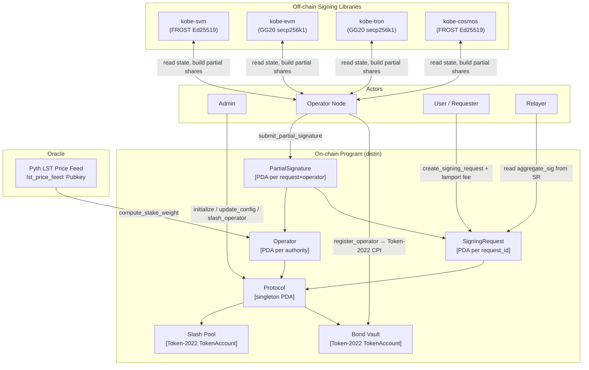
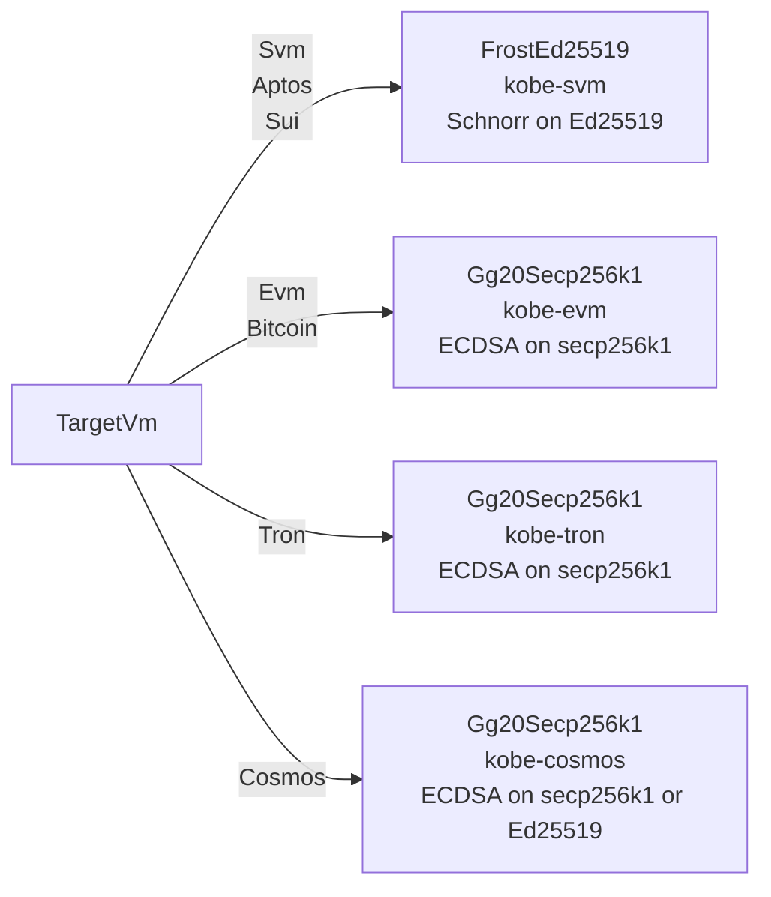
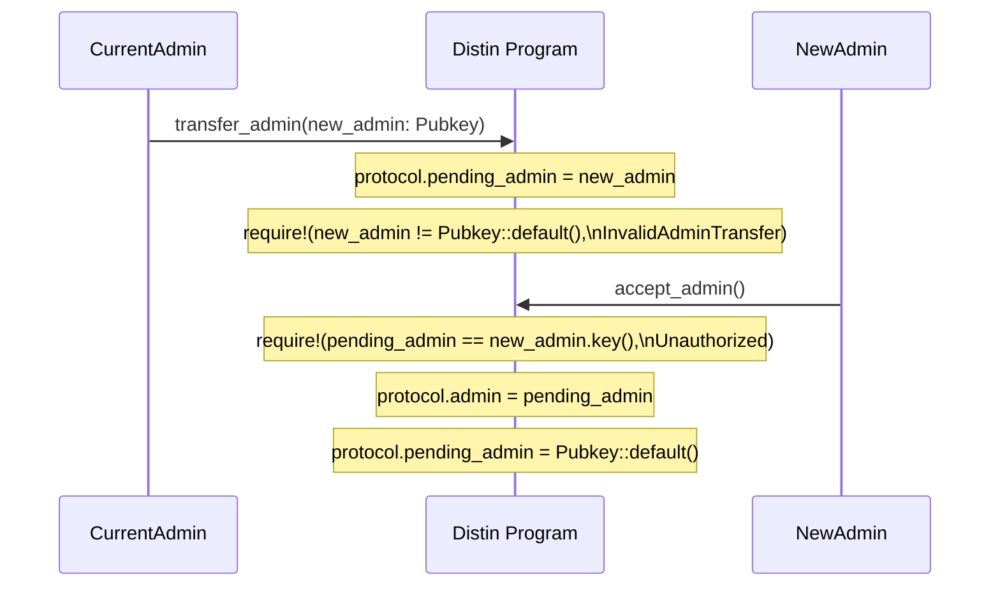

# Architecture

## System Overview

Distin is a threshold-signature coordination and aggregation layer deployed as a Solana program. The program's sole responsibility is the *control plane*: accounting for bonded economic security, sequencing signing intents, collecting partial-signature shares, enforcing threshold rules, and publishing finalized aggregate signatures. The cryptographic heavy lifting (DKG, partial-share generation, Lagrange combination) is performed by off-chain signing libraries (`kobe-svm`, `kobe-evm`, `kobe-tron`, `kobe-cosmos`) that operate against the on-chain state as a coordination bus.

Solana's ~400 ms per-slot finality is the architectural premise. A single multi-round MPC protocol that takes 2–4 Solana slots to collect shares (800 ms – 1.6 s) would require minutes on an EVM chain used as the control plane. This slot cadence makes near-real-time threshold signing across all VM families tractable.

**Program ID:** `4xy9dYHfAzi7cAcX5JHxNR6EoMJ9PGfeQDMHx6YUQQM6`

---

## Component Architecture



---

## Account Layout

Distin uses six PDA account types. Every account derives `InitSpace`; rent reservation is `8 (discriminator) + T::INIT_SPACE` bytes.

### Protocol — Singleton Config

**Seeds:** `[b"protocol"]`
**Size:** 248 bytes + 8 discriminator = **256 bytes**

| Field | Type | Bytes | Description |
|---|---|---|---|
| `admin` | `Pubkey` | 32 | Current admin authority |
| `pending_admin` | `Pubkey` | 32 | Nominated successor (two-step handover); `Pubkey::default()` until set |
| `bond_mint` | `Pubkey` | 32 | Token-2022 LST mint accepted as collateral |
| `bond_vault` | `Pubkey` | 32 | Protocol-owned vault holding active bonds |
| `slash_pool` | `Pubkey` | 32 | Protocol-owned pool collecting slashed collateral |
| `lst_price_feed` | `Pubkey` | 32 | Pyth price account for valuing LST in SOL |
| `threshold_bps` | `u16` | 2 | Fraction of `total_bonded` required to finalize (basis points; range `1..=10_000`) |
| `min_bond` | `u64` | 8 | Minimum bond an operator must post |
| `unbonding_slots` | `u64` | 8 | Slots between `begin_unbonding` and `withdraw_bond` |
| `request_fee` | `u64` | 8 | Lamport fee charged per signing request |
| `max_validity_slots` | `u64` | 8 | Upper bound on a request's validity window (hard ceiling: `432_000`) |
| `operator_count` | `u32` | 4 | Number of operators currently in the active signing set |
| `total_bonded` | `u64` | 8 | Sum of active operators' staked economic weight |
| `request_nonce` | `u64` | 8 | Monotonic counter seeding request PDAs |
| `paused` | `bool` | 1 | Emergency pause flag |
| `bump` | `u8` | 1 | PDA canonical bump |

The global threshold check at finalization time computes:

```
required_stake_weight = total_bonded × threshold_bps / BPS_DENOMINATOR
```

where `BPS_DENOMINATOR = 10_000`. A `threshold_bps` of `6_667` therefore requires two-thirds of total staked weight.

---

### Operator — Bonded Signing Node

**Seeds:** `[b"operator", protocol, authority]`
**Size:** 143 bytes + 8 discriminator = **151 bytes**

| Field | Type | Bytes | Description |
|---|---|---|---|
| `protocol` | `Pubkey` | 32 | Owning protocol PDA |
| `authority` | `Pubkey` | 32 | Signer for all operator lifecycle actions |
| `group_pubkey` | `[u8; 33]` | 33 | Compressed group public key / FROST public-share identifier |
| `bonded_amount` | `u64` | 8 | Raw LST amount held in the vault |
| `stake_weight` | `u64` | 8 | SOL-denominated economic weight (oracle-derived via Pyth) |
| `partials_submitted` | `u64` | 8 | Lifetime count of partial signatures submitted |
| `slash_count` | `u32` | 4 | Number of times this operator has been slashed |
| `jailed` | `bool` | 1 | If `true`, operator cannot sign new requests |
| `unbonding_at` | `u64` | 8 | Slot at which unbonding completes; `0` while actively bonded |
| `joined_slot` | `u64` | 8 | Slot the operator joined |
| `bump` | `u8` | 1 | PDA canonical bump |

The `stake_weight` field is the oracle-adjusted economic weight and is what the threshold arithmetic operates on, not the raw `bonded_amount`. After a slash, `stake_weight` is recomputed from `operator.bonded_amount` via `compute_stake_weight`. An operator whose `bonded_amount` drops below `min_bond` is automatically jailed.

---

### SigningRequest — Cross-VM Signing Intent

**Seeds:** `[b"request", protocol, request_id_le]`
**Size:** 224 bytes + 8 discriminator = **232 bytes**

The `request_id` seed bytes are the little-endian encoding of `protocol.request_nonce` at the moment of creation. This makes every request PDA globally unique and allows O(1) lookup by `(protocol, request_id)`.

| Field | Type | Bytes | Description |
|---|---|---|---|
| `protocol` | `Pubkey` | 32 | Owning protocol PDA |
| `requester` | `Pubkey` | 32 | Account that posted the intent (rent refund destination on close) |
| `request_id` | `u64` | 8 | Monotonic id — value of `request_nonce` at creation time |
| `scheme` | `SignatureScheme` | 1 | `FrostEd25519` or `Gg20Secp256k1` |
| `target_vm` | `TargetVm` | 1 | `Svm` / `Evm` / `Tron` / `Cosmos` / `Bitcoin` |
| `target_chain_id` | `u64` | 8 | EVM chain id, Cosmos chain index, etc. |
| `message_hash` | `[u8; 32]` | 32 | 32-byte hash of the message/transaction to sign |
| `threshold` | `u16` | 2 | Minimum distinct partial signatures required |
| `partials_collected` | `u16` | 2 | Partial signatures collected so far |
| `stake_weight_collected` | `u64` | 8 | Staked economic weight accumulated so far |
| `required_stake_weight` | `u64` | 8 | Economic-security target snapshotted at creation |
| `created_slot` | `u64` | 8 | Slot the request was created |
| `expiry_slot` | `u64` | 8 | Slot after which the request can no longer be fulfilled |
| `status` | `RequestStatus` | 1 | `Pending` / `Aggregated` / `Cancelled` / `Expired` |
| `aggregate_sig` | `[u8; 64]` | 64 | Running accumulator; published on finalization |
| `bump` | `u8` | 1 | PDA canonical bump |

`required_stake_weight` is snapshotted from `total_bonded × threshold_bps / 10_000` at creation time, not at finalization time. This prevents a race where operators unbond between request creation and threshold collection in order to lower the effective bar.

---

### PartialSignature — Operator's Share Contribution

**Seeds:** `[b"partial", request, operator]`
**Size:** 146 bytes + 8 discriminator = **154 bytes**

The two-pubkey seed `(request, operator)` enforces uniqueness: a single operator cannot submit two shares for the same request. Any second attempt from the same authority would collide on PDA derivation and fail with an Anchor account-already-exists error before any instruction logic executes.

| Field | Type | Bytes | Description |
|---|---|---|---|
| `request` | `Pubkey` | 32 | Request this share contributes to |
| `operator` | `Pubkey` | 32 | Operator that submitted the share |
| `scheme` | `SignatureScheme` | 1 | Must match the parent request's scheme |
| `share` | `[u8; 64]` | 64 | 64-byte partial-signature share material |
| `submitted_slot` | `u64` | 8 | Slot the share was submitted |
| `stake_weight` | `u64` | 8 | Staked weight credited for this contribution |
| `bump` | `u8` | 1 | PDA canonical bump |

---

## PDA Derivation Reference

```rust
// Protocol (singleton)
let (protocol_pda, bump) = Pubkey::find_program_address(
    &[b"protocol"],
    &program_id,
);

// Bond vault
let (bond_vault_pda, _) = Pubkey::find_program_address(
    &[b"bond_vault", protocol_pda.as_ref()],
    &program_id,
);

// Slash pool
let (slash_pool_pda, _) = Pubkey::find_program_address(
    &[b"slash_pool", protocol_pda.as_ref()],
    &program_id,
);

// Operator (one per authority)
let (operator_pda, _) = Pubkey::find_program_address(
    &[b"operator", protocol_pda.as_ref(), authority.as_ref()],
    &program_id,
);

// Signing request (one per request_id)
let request_id_bytes = request_id.to_le_bytes();
let (request_pda, _) = Pubkey::find_program_address(
    &[b"request", protocol_pda.as_ref(), &request_id_bytes],
    &program_id,
);

// Partial signature (one per request × operator)
let (partial_pda, _) = Pubkey::find_program_address(
    &[b"partial", request_pda.as_ref(), operator_pda.as_ref()],
    &program_id,
);
```

---

## Signature Scheme Routing

The `scheme` field on both `SigningRequest` and `PartialSignature` gates which off-chain library handles share generation and combination.



The on-chain program stores `scheme: SignatureScheme` as a single discriminant byte. The `SchemeMismatch` error (`6014`) is raised if an operator submits a `PartialSignature` whose `scheme` does not equal the parent `SigningRequest.scheme`.

| `SignatureScheme` variant | Byte | Target VMs | Off-chain library |
|---|---|---|---|
| `FrostEd25519` | `0` | `Svm`, `Cosmos` (SDK chains) | `kobe-svm` |
| `Gg20Secp256k1` | `1` | `Evm`, `Tron`, `Bitcoin` | `kobe-evm`, `kobe-tron`, `kobe-cosmos` |

`TargetVm::Cosmos` maps to either scheme depending on the specific Cosmos SDK chain's key type. The `target_chain_id` field disambiguates at the off-chain layer; the on-chain program records it verbatim without interpreting it.

---

## Full Signing Lifecycle — Sequence Diagram

```mermaid
sequenceDiagram
    participant ADM as Admin
    participant OPR as Operator Node
    participant USR as User
    participant PRG as Distin Program
    participant VLT as Bond Vault (Token-2022)
    participant RLY as Relayer

    ADM->>PRG: initialize(threshold_bps, min_bond, unbonding_slots,\nrequest_fee, max_validity_slots, lst_price_feed)
    PRG-->>PRG: create Protocol PDA [b"protocol"]
    PRG-->>VLT: create Bond Vault [b"bond_vault", protocol]
    PRG-->>PRG: create Slash Pool [b"slash_pool", protocol]

    OPR->>PRG: register_operator(group_pubkey, bond_amount)
    PRG->>VLT: transfer_checked(bond_amount) via Token-2022 CPI
    PRG-->>PRG: compute_stake_weight(lst_price_feed, bond_amount)
    PRG-->>PRG: create Operator PDA [b"operator", protocol, authority]
    PRG-->>PRG: protocol.total_bonded += stake_weight
    PRG-->>PRG: emit OperatorRegistered { operator, authority, stake_weight }

    USR->>PRG: create_signing_request(scheme, target_vm, target_chain_id,\nmessage_hash, threshold, validity_slots)
    PRG->>PRG: system_program::transfer(request_fee lamports)
    PRG-->>PRG: snapshot required_stake_weight = total_bonded × threshold_bps / 10_000
    PRG-->>PRG: create SigningRequest PDA [b"request", protocol, request_nonce_le]
    PRG-->>PRG: request_nonce += 1

    loop Each signing operator
        OPR->>PRG: submit_partial_signature(share: [u8;64], scheme)
        PRG-->>PRG: verify scheme matches request.scheme\n(SchemeMismatch if not)
        PRG-->>PRG: verify operator not jailed, request not expired
        PRG-->>PRG: create PartialSignature PDA\n[b"partial", request, operator]
        PRG-->>PRG: request.stake_weight_collected += operator.stake_weight
        PRG-->>PRG: request.partials_collected += 1
        PRG-->>PRG: operator.partials_submitted += 1
        alt threshold reached
            PRG-->>PRG: accumulate aggregate_sig
            PRG-->>PRG: request.status = Aggregated
        end
    end

    RLY->>PRG: read SigningRequest.aggregate_sig
    RLY->>DestinationChain: broadcast aggregate signature
```

---

## Economic Security Data Flow

The staked weight accounting is the core invariant the program maintains. Three state transitions mutate `total_bonded`:

### Registration

```
protocol.total_bonded += compute_stake_weight(lst_price_feed, bond_amount)
protocol.operator_count += 1
```

### Unbonding

```rust
// begin_unbonding sets:
operator.unbonding_at = clock.slot + protocol.unbonding_slots;
operator.jailed = true;
protocol.total_bonded -= operator.stake_weight;   // saturating_sub
protocol.operator_count -= 1;                     // saturating_sub
```

After `begin_unbonding`, the operator is removed from the active signing set immediately. Its bond remains in the vault and slashable for the full `unbonding_slots` window. Only after `clock.slot >= operator.unbonding_at` can `withdraw_bond` execute the Token-2022 CPI back to the operator's token account.

### Slashing

```rust
// slash_operator transfers `amount` from bond_vault to slash_pool:
operator.bonded_amount -= amount;                    // saturating_sub
operator.stake_weight  = compute_stake_weight(lst_price_feed, operator.bonded_amount);
if operator.bonded_amount < protocol.min_bond {
    operator.jailed = true;
}

// If the operator was active before the slash:
let weight_delta = weight_before - new_weight;
protocol.total_bonded -= weight_delta;
if newly_jailed {
    protocol.total_bonded -= new_weight;
    protocol.operator_count -= 1;
}
```

The slash path checks whether the operator was active (`unbonding_at == 0 && !jailed`) before the slash to avoid double-subtracting weight for already-inactive operators.

---

## Threshold Enforcement Logic

A request finalization check requires both dimensions to pass simultaneously:

| Dimension | Condition |
|---|---|
| Partial count | `partials_collected >= threshold` |
| Economic weight | `stake_weight_collected >= required_stake_weight` |

`required_stake_weight` is computed at request-creation time:

```
required_stake_weight = total_bonded × threshold_bps / BPS_DENOMINATOR
```

For example, with `threshold_bps = 6_667` and `total_bonded = 1_000_000`:

```
required_stake_weight = 1_000_000 × 6_667 / 10_000 = 666_700
```

The `create_signing_request` instruction also validates its own `threshold` argument (minimum number of distinct partials):

```rust
require!(
    threshold >= 1 && (threshold as u32) <= protocol.operator_count,
    DistinError::InvalidThreshold
);
```

This means a requester cannot set a threshold higher than the current active operator count, preventing permanently unsatisfiable requests.

---

## Validity Window Constraints

The `validity_slots` parameter in `create_signing_request` is bounded by two guards:

```rust
// Hard ceiling enforced in initialize / update_config:
pub const MAX_VALIDITY_SLOTS_CEILING: u64 = 432_000; // ~48h at 400ms slots

// Per-request guard:
require!(
    validity_slots >= 1 && validity_slots <= protocol.max_validity_slots,
    DistinError::InvalidValidityWindow
);
```

`protocol.max_validity_slots` is set by the admin and cannot itself exceed `432_000`. The `expiry_slot` stored on the request is:

```
expiry_slot = created_slot + validity_slots
```

Any partial signature submission after `clock.slot > expiry_slot` returns `DistinError::RequestExpired` (`6008`). The request's `status` field transitions to `Expired` at the finalizer's discretion (off-chain relayer observation).

---

## Admin Governance — Two-Step Handover

Admin authority follows an explicit two-transaction commit/confirm pattern to prevent one-shot fat-finger transfers:



If the nominated admin never calls `accept_admin`, `pending_admin` remains set but has no authority until confirmed. The current `admin` retains all privileges and can re-nominate.

Emergency controls (`pause` / `unpause`) are admin-only and gate all user and operator state transitions:

```rust
require!(!protocol.paused, DistinError::ProtocolPaused);
```

This guard appears in `register_operator`, `begin_unbonding`, and `create_signing_request`. The slash path does not check `paused`, allowing the admin to slash misbehaving operators even while the protocol is halted.

---

## On-chain vs Off-chain Boundary

| Responsibility | On-chain (Distin program) | Off-chain (kobe-* libraries) |
|---|---|---|
| Bond accounting | ✓ Token-2022 CPI | — |
| Stake weight oracle | reads Pyth `lst_price_feed` | — |
| Threshold counting | ✓ `stake_weight_collected` / `partials_collected` | — |
| Share storage | ✓ `PartialSignature.share [u8; 64]` | — |
| Share validity (crypto) | — | ✓ FROST/GG20 share verification |
| Lagrange combination | — | ✓ produces `aggregate_sig` |
| Equivocation detection | slash entrypoint (effect only) | ✓ produces fraud proof |
| Aggregate broadcast | — | ✓ relayer reads `aggregate_sig`, submits to dst chain |
| DKG / resharing | — | ✓ fully off-chain |

The program treats `share: [u8; 64]` as opaque bytes. Cryptographic verification of share correctness is performed by the off-chain `kobe-*` signing library before the relayer calls `aggregate_signing_request`. The on-chain layer enforces that a share came from a bonded, non-jailed operator and that the scheme matches, but it does not verify the elliptic-curve mathematics.

---

## On-chain Events

Two events are emitted as Anchor event CPI logs, consumable by indexers:

### `OperatorRegistered`

Emitted by `register_operator`:

```rust
emit!(OperatorRegistered {
    operator: operator.key(),
    authority: operator.authority,
    stake_weight,           // u64 — oracle-adjusted weight at join time
});
```

### `OperatorSlashed`

Emitted by `slash_operator`:

```rust
emit!(OperatorSlashed {
    operator: operator.key(),
    amount,   // u64 — LST token units moved to slash_pool
    reason,   // u8 — opaque reason code (equivocation / invalid-share / liveness)
});
```

No event is emitted for `create_signing_request` or partial-signature submission in the visible code; indexers must parse the instruction discriminator and account changes directly for those transitions.

---

## Edge Cases and Failure Modes

### Slash reduces weight below minimum between request creation and finalization

`required_stake_weight` is snapshotted at creation time. If enough operators are slashed after a request is created but before it is finalized, `stake_weight_collected` may never reach `required_stake_weight` even with all remaining active operators contributing, leaving the request permanently stuck in `Pending` until `expiry_slot`. The request expires and a new one must be submitted with updated parameters.

### Operator attempts double-submit on a request

Because `PartialSignature` PDA seeds include both `request` and `operator`, a second submission by the same operator for the same request fails at Anchor's account-init stage (`AccountAlreadyInitialized`) before any instruction logic runs. `stake_weight` cannot be double-counted this way.

### Bond falls below `min_bond` mid-unbonding due to slash

`withdraw_bond` only checks `operator.unbonding_at != 0` and `clock.slot >= operator.unbonding_at`. A bond reduced below `min_bond` by a slash while unbonding still completes withdrawal; the operator was already jailed and removed from `operator_count` at slash time. The `slash_operator` instruction guards against over-slashing with:

```rust
require!(
    amount <= ctx.accounts.operator.bonded_amount,
    DistinError::SlashAmountExceedsBond
);
```

### `total_bonded` underflow

All decrements to `total_bonded` use `saturating_sub`, not checked arithmetic. This means a sequencing bug that would otherwise underflow to a panic instead floors at zero, which is safe but would corrupt the threshold math. The `operator_count` field is also `saturating_sub`-decremented.

### Oracle staleness

`compute_stake_weight` reads `lst_price_feed` at registration time and at slash time. If the Pyth feed is stale, the instruction returns `DistinError::StaleOraclePrice` (`6015`). If an incorrect oracle account is passed, `DistinError::InvalidOracleAccount` (`6016`) is raised. The stored `stake_weight` on the Operator account is the weight at the time of the last oracle read, not a live value — weight does not auto-update as the LST price changes between calls.

### `request_nonce` monotonicity

`request_nonce` is incremented with `checked_add`, returning `DistinError::MathOverflow` (`6022`) at `u64::MAX`. At theoretical saturation of one request per slot, `u64::MAX` slots at 400 ms/slot is ~2.3 × 10¹¹ years.