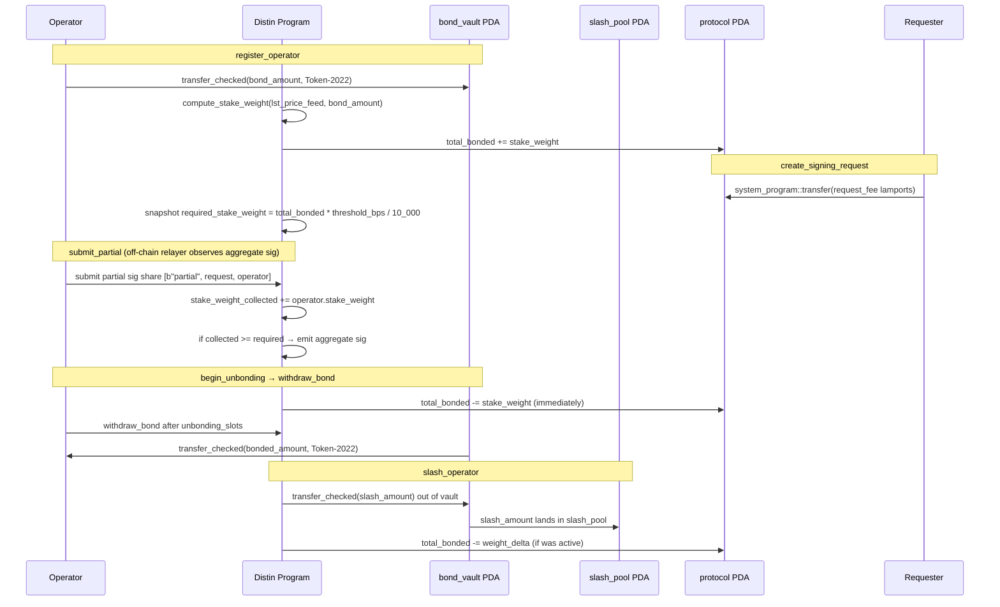

# Economics

Distin's economic security model is built on three interlocking mechanisms: bonded LST collateral that converts to stake-weighted signing power, a lamport fee charged per signing request that flows directly to the protocol PDA, and a slashing system that moves misbehaving operators' bonds into an isolated slash pool. Everything is enforced on-chain by the program at `4xy9dYHfAzi7cAcX5JHxNR6EoMJ9PGfeQDMHx6YUQQM6`.

---

## Core Parameters

The singleton `Protocol` account (PDA seed `[b"protocol"]`) stores every live economic parameter. They are set at `initialize` and can be tuned by the admin at any time via `update_config`.

| Field | Type | Role |
|---|---|---|
| `threshold_bps` | `u16` | Fraction of `total_bonded` required to finalize a request, expressed in basis points (1 = 0.01 %, 10 000 = 100 %) |
| `min_bond` | `u64` | Minimum raw LST units an operator must deposit to enter the signing set |
| `unbonding_slots` | `u64` | Slots between `begin_unbonding` and `withdraw_bond`; the operator's weight leaves `total_bonded` immediately but the collateral remains slashable until withdrawal |
| `request_fee` | `u64` | Lamports charged to the requester per `create_signing_request` |
| `max_validity_slots` | `u64` | Per-request deadline ceiling; hard upper bound is the protocol constant `MAX_VALIDITY_SLOTS_CEILING = 432_000` (~48 h at 400 ms/slot) |
| `lst_price_feed` | `Pubkey` | Pyth price account used by `compute_stake_weight` to denominate bonds in SOL-equivalent weight |
| `total_bonded` | `u64` | Running sum of all active operators' `stake_weight`; the denominator in threshold arithmetic |
| `operator_count` | `u32` | Count of operators currently in the active signing set (jailed / unbonding operators are excluded) |
| `request_nonce` | `u64` | Monotonic counter that seeds every `SigningRequest` PDA |

Hard-coded module-level constants in `lib.rs`:

```rust
pub const BPS_DENOMINATOR: u64 = 10_000;
pub const MAX_VALIDITY_SLOTS_CEILING: u64 = 432_000; // ~48 h
```

`BPS_DENOMINATOR` is the only divisor used in threshold arithmetic — there is no separate percentage helper.

---

## Operator Bonding

### Bond deposit

An operator enters the signing set by calling `register_operator`, providing:

```rust
pub fn register_operator(
    ctx: Context<RegisterOperator>,
    group_pubkey: [u8; 33],  // compressed FROST/ECDSA group pubkey share
    bond_amount: u64,         // raw LST token units
) -> Result<()>
```

The program immediately performs a Token-2022 `transfer_checked` CPI, moving `bond_amount` from the operator's token account into the protocol-owned vault:

```rust
transfer_checked(
    CpiContext::new(
        ctx.accounts.token_program.to_account_info(),
        TransferChecked {
            from: ctx.accounts.operator_token_account.to_account_info(),
            mint: ctx.accounts.bond_mint.to_account_info(),
            to:   ctx.accounts.bond_vault.to_account_info(),
            authority: ctx.accounts.authority.to_account_info(),
        },
    ),
    bond_amount,
    ctx.accounts.bond_mint.decimals,
)?;
```

The vault PDA (`[b"bond_vault", protocol]`) is the sole Token-2022 token account owned by the protocol PDA. No third party can withdraw from it; only the program's own signer seeds can authorize outbound transfers.

### Stake weight and the oracle

Raw LST units are not used directly in threshold math. The program calls `compute_stake_weight(&ctx.accounts.lst_price_feed, bond_amount)` to produce a SOL-denominated `stake_weight: u64` stored on the `Operator` account. The feed is the Pyth account whose key is stored in `protocol.lst_price_feed`. If the oracle is stale the function returns `DistinError::StaleOraclePrice` and registration fails atomically.

The mapping is 1:1 under the current oracle policy: `stake_weight` is directly proportional to the SOL value of the LST at the moment of registration (or slashing recompute). The `Operator` account stores both raw and weighted figures:

```
Operator {
    bonded_amount:  u64,   // raw LST units in the vault
    stake_weight:   u64,   // SOL-equivalent weight used in threshold math
    ...
}
```

### Global accounting invariant

After every registration the program updates protocol-level counters with checked arithmetic to prevent silent overflow:

```rust
protocol.total_bonded = protocol.total_bonded
    .checked_add(stake_weight)
    .ok_or(DistinError::MathOverflow)?;
protocol.operator_count = protocol.operator_count
    .checked_add(1)
    .ok_or(DistinError::MathOverflow)?;
```

### Minimum bond enforcement

```rust
require!(bond_amount >= protocol.min_bond, DistinError::InsufficientBond);
```

This check runs before the Token-2022 CPI. If `min_bond` is later raised by `update_config`, existing operators who are already bonded are grandfathered in; they only encounter the new floor if they are slashed below the new threshold (which triggers an automatic jail, see [Slashing](#slashing)).

---

## Threshold Arithmetic

### Required stake weight per request

When a user calls `create_signing_request` the program snapshots the security target into the new `SigningRequest` account:

```rust
let required_stake_weight = protocol.total_bonded
    .checked_mul(protocol.threshold_bps as u64)
    .ok_or(DistinError::MathOverflow)?
    / BPS_DENOMINATOR;
```

This value is immutable for the lifetime of the request. It does not change if operators join, leave, or are slashed after the request is created. A request created when `total_bonded = 1_000_000` and `threshold_bps = 6_666` requires exactly `666_600` stake weight to finalize, regardless of what happens to the operator set afterwards.

### Finalization condition

A request moves to `RequestStatus::Aggregated` when the aggregation instruction verifies that both of the following hold:

1. `stake_weight_collected >= required_stake_weight`
2. `partials_collected >= threshold` (the per-request minimum-operator-count floor set by the requester at creation)

Neither condition alone is sufficient; the program enforces both. The `ThresholdNotMet` error is returned if either is unsatisfied.

### Request-level threshold parameter

```rust
pub fn create_signing_request(
    ...
    threshold: u16,        // minimum distinct partial sigs required
    validity_slots: u64,   // slots until expiry
) -> Result<()>
```

The requester's `threshold` argument is bounded:

```rust
require!(
    threshold >= 1 && (threshold as u32) <= protocol.operator_count,
    DistinError::InvalidThreshold
);
```

This means a requester cannot demand more signers than currently exist in the active set, and cannot set it to zero.

---

## Request Fee Model

Every `create_signing_request` call transfers `protocol.request_fee` lamports from the requester to the protocol PDA via a System Program CPI:

```rust
if protocol.request_fee > 0 {
    system_program::transfer(
        CpiContext::new(
            ctx.accounts.system_program.to_account_info(),
            SystemTransfer {
                from: ctx.accounts.requester.to_account_info(),
                to:   ctx.accounts.protocol.to_account_info(),
            },
        ),
        protocol.request_fee,
    )?;
}
```

The fee is denominated in lamports, not LST units. It accumulates in the protocol PDA's native SOL balance. There is no per-request escrow account; the fee is non-refundable once the instruction succeeds, regardless of whether the request is ultimately fulfilled, expired, or cancelled.

Fee distribution to operators (e.g. pro-rata by partials submitted) is not implemented in the current on-chain program. The `Operator.partials_submitted` counter tracks lifetime contribution and is the natural basis for an off-chain or future on-chain distribution, but no disbursement logic exists on-chain today.

---

## Unbonding

Unbonding is a two-step process designed to keep bonds slashable through the exit period.

### Step 1: begin_unbonding

```rust
pub fn begin_unbonding(ctx: Context<OperatorLifecycle>) -> Result<()>
```

Effects:
- Sets `operator.unbonding_at = clock.slot + protocol.unbonding_slots`
- Sets `operator.jailed = true` (the operator cannot accept new requests)
- Subtracts `operator.stake_weight` from `protocol.total_bonded`
- Decrements `protocol.operator_count`

The operator is removed from the active signing set immediately. Future signing requests will not count this operator toward `required_stake_weight`. However the raw `bonded_amount` remains in the vault — the program can still slash it.

Guard:

```rust
require!(operator.unbonding_at == 0, DistinError::AlreadyUnbonding);
```

Calling `begin_unbonding` a second time returns `AlreadyUnbonding`.

### Step 2: withdraw_bond

```rust
pub fn withdraw_bond(ctx: Context<WithdrawBond>) -> Result<()>
```

Guards:

```rust
require!(operator.unbonding_at != 0, DistinError::NotUnbonding);
require!(clock.slot >= operator.unbonding_at, DistinError::UnbondingNotComplete);
```

On success the program transfers `operator.bonded_amount` from the vault back to the operator's token account using the protocol PDA as the signer:

```rust
let signer_seeds: &[&[&[u8]]] = &[&[PROTOCOL_SEED, &[ctx.accounts.protocol.bump]]];
transfer_checked(
    CpiContext::new_with_signer(..., signer_seeds),
    amount,
    ctx.accounts.bond_mint.decimals,
)?;
```

The `Operator` account is closed and rent is returned to the authority.

### Timeline

```
slot N              slot N + unbonding_slots
  |                          |
  begin_unbonding         withdraw_bond (earliest)
  weight removed          bond unlocked
  jailed = true
  still slashable ──────────────────────────────>
```

During the entire `unbonding_slots` window, `slash_operator` can still reduce `bonded_amount` to zero and permanently jail the operator even though they have already left the active set.

---

## Slashing

### Mechanics

```rust
pub fn slash_operator(
    ctx: Context<SlashOperator>,
    amount: u64,
    reason: u8,
) -> Result<()>
```

The `reason` byte is an opaque tag — the current program stores it in the emitted `OperatorSlashed` event for off-chain indexing. It is not validated or range-checked on-chain.

The program enforces a ceiling:

```rust
require!(
    amount <= ctx.accounts.operator.bonded_amount,
    DistinError::SlashAmountExceedsBond
);
```

Slashed collateral moves from the vault into the slash pool (PDA seed `[b"slash_pool", protocol]`):

```rust
transfer_checked(
    CpiContext::new_with_signer(..., signer_seeds),  // protocol PDA signs
    amount,
    ctx.accounts.bond_mint.decimals,
)?;
```

### Post-slash accounting

After the transfer the program recomputes the operator's stake weight from the residual bond:

```rust
operator.bonded_amount = operator.bonded_amount.saturating_sub(amount);
operator.slash_count   = operator.slash_count.checked_add(1)?;
let new_weight = compute_stake_weight(&ctx.accounts.lst_price_feed, operator.bonded_amount)?;
operator.stake_weight  = new_weight;
if operator.bonded_amount < min_bond {
    operator.jailed = true;
}
```

If the operator was active (not already jailed or unbonding) at the time of the slash, the protocol-wide `total_bonded` is decremented by the weight delta and, if the operator is now jailed, by the remaining new weight as well:

```rust
if was_active {
    let weight_delta = operator_weight_before.saturating_sub(new_weight);
    protocol.total_bonded = protocol.total_bonded.saturating_sub(weight_delta);
    if operator.jailed {
        protocol.total_bonded = protocol.total_bonded.saturating_sub(new_weight);
        protocol.operator_count = protocol.operator_count.saturating_sub(1);
    }
}
```

`saturating_sub` is used throughout the weight-removal path to avoid underflow panics in edge cases where state could be inconsistent.

### Slash pool

The slash pool is a separate Token-2022 account (PDA seed `[b"slash_pool", protocol]`) that accumulates all slashed collateral. There is no on-chain disbursement instruction in the current program. Redistribution — e.g., to compensate affected users or burn the LST — is outside the on-chain scope and would require a new governance instruction.

---

## Fund Flow Diagram



---

## Signing Request Lifecycle and Validity Window

```rust
require!(
    validity_slots >= 1 && validity_slots <= protocol.max_validity_slots,
    DistinError::InvalidValidityWindow
);
```

The `max_validity_slots` field is itself bounded by `MAX_VALIDITY_SLOTS_CEILING = 432_000`. At 400 ms per slot this is exactly 48 hours. The program rejects any attempt to configure a tighter ceiling of zero or a looser one above 432,000 with `InvalidValidityWindow`.

Once `clock.slot > expiry_slot` the request transitions to `RequestStatus::Expired`. Any instruction that touches an expired request (e.g., a late partial submission) will return `RequestExpired`. The request fee is not refunded.

| Condition | Error |
|---|---|
| `validity_slots == 0` | `InvalidValidityWindow` |
| `validity_slots > max_validity_slots` | `InvalidValidityWindow` |
| `max_validity_slots > 432_000` | `InvalidValidityWindow` |
| Partial submitted after `expiry_slot` | `RequestExpired` |
| Status not `Pending` at aggregation | `RequestNotPending` |
| Request already `Aggregated` | `RequestAlreadyFinalized` |

---

## Stake Weight and Threshold: Worked Example

Assume the protocol is initialized with:

- `threshold_bps = 6_667` (~66.67 %)
- `min_bond = 1_000_000` (1 000 000 raw LST units)
- `unbonding_slots = 216_000` (~24 h)
- `request_fee = 5_000_000` lamports (0.005 SOL)
- `max_validity_slots = 432_000` (~48 h)

Three operators bond:

| Operator | `bonded_amount` | `stake_weight` (oracle) |
|---|---|---|
| A | 5 000 000 | 4 800 000 |
| B | 3 000 000 | 2 900 000 |
| C | 2 000 000 | 1 950 000 |

After all three register:

```
total_bonded    = 4_800_000 + 2_900_000 + 1_950_000 = 9_650_000
operator_count  = 3
```

A requester calls `create_signing_request` with `threshold = 2` (at least 2 distinct operators):

```
required_stake_weight = 9_650_000 * 6_667 / 10_000 = 6_433_555
```

Operators A and B submit partial signatures. Their combined weight is `4_800_000 + 2_900_000 = 7_700_000`. Both conditions are met:

```
7_700_000 >= 6_433_555   ✓  (stake weight)
2         >= 2           ✓  (partial count)
```

The request finalizes. If only operator B had submitted (`2_900_000 < 6_433_555`), the stake threshold would be unmet even though the partial count is 1 (also below threshold = 2).

---

## Edge Cases and Failure Modes

### Operator slashed below min_bond mid-request

If operator A is slashed mid-flight on a pending request, `required_stake_weight` is **not** retroactively updated — it was snapshotted at creation. The weight that A would contribute to partial collection (`operator.stake_weight`) is, however, recomputed after the slash. If A's residual weight after slashing still satisfies the threshold alongside other operators, the request can finalize normally. If not, it expires at `expiry_slot`.

### total_bonded drops to zero after creation

If every operator unbonds after a request is created, `required_stake_weight` is already snapshotted. The request will simply expire, since no operator is left to contribute partials. Subsequent `create_signing_request` calls gate on `protocol.operator_count > 0`:

```rust
require!(protocol.operator_count > 0, DistinError::NoActiveOperators);
```

But this guard protects new requests only; existing pending requests are not cancelled.

### Double unbonding

```rust
require!(operator.unbonding_at == 0, DistinError::AlreadyUnbonding);
```

An operator who has already called `begin_unbonding` cannot call it again. This prevents `total_bonded` from being double-decremented.

### Slash during unbonding

`was_active` is computed before the slash transfer as:

```rust
let was_active = operator.unbonding_at == 0 && !operator.jailed;
```

An unbonding operator has `unbonding_at != 0`, so `was_active = false`. The weight delta path that adjusts `total_bonded` is skipped — the weight was already removed when `begin_unbonding` ran. Only the `bonded_amount` in the vault is reduced, and if it falls below `min_bond` the operator is jailed (it already is in practice, since `begin_unbonding` sets `jailed = true`).

### Oracle staleness at registration

`compute_stake_weight` reads the Pyth feed. If the feed is stale the function returns `StaleOraclePrice` and the `register_operator` transaction fails atomically, leaving the bond in the operator's token account. No partial state is committed.

### Math overflow guards

All additive paths on `total_bonded`, `operator_count`, `stake_weight_collected`, and `request_nonce` use `checked_add` / `checked_mul` and map overflow to `DistinError::MathOverflow`. Subtractive paths on `total_bonded` use `saturating_sub` to avoid panics during cleanup (e.g., if weight accounting drifts due to oracle price changes between registration and slash).

---

## Account Space and Rent

Account sizes are derived from `InitSpace` (field-level derivation) plus the 8-byte Anchor discriminator. Economics-relevant accounts:

| Account | PDA Seeds | INIT_SPACE | Total rent-exempt bytes |
|---|---|---|---|
| `Protocol` | `[b"protocol"]` | 248 | 256 |
| `Operator` | `[b"operator", protocol, authority]` | 143 | 151 |
| `SigningRequest` | `[b"request", protocol, request_id_le]` | 224 | 232 |
| `PartialSignature` | `[b"partial", request, operator]` | 146 | 154 |

`SigningRequest` rent is paid by the requester at account creation. `PartialSignature` rent is paid by the submitting operator. On close (finalization or expiry), rent is returned to the `requester` (for `SigningRequest`) and to the submitting operator's authority (for `PartialSignature`). Rent economics are independent of the LST bond system; they are standard Solana lamport mechanics.