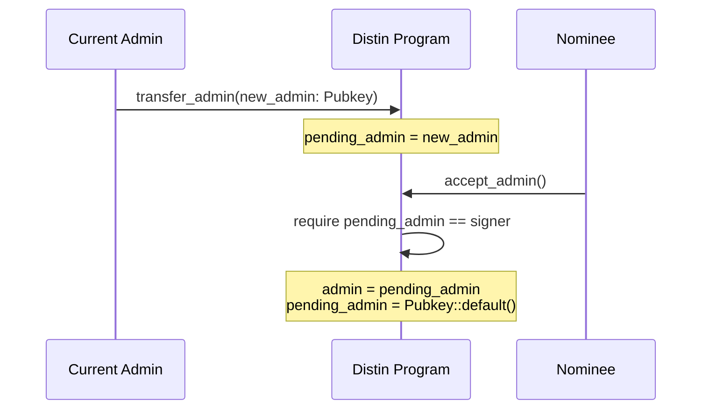
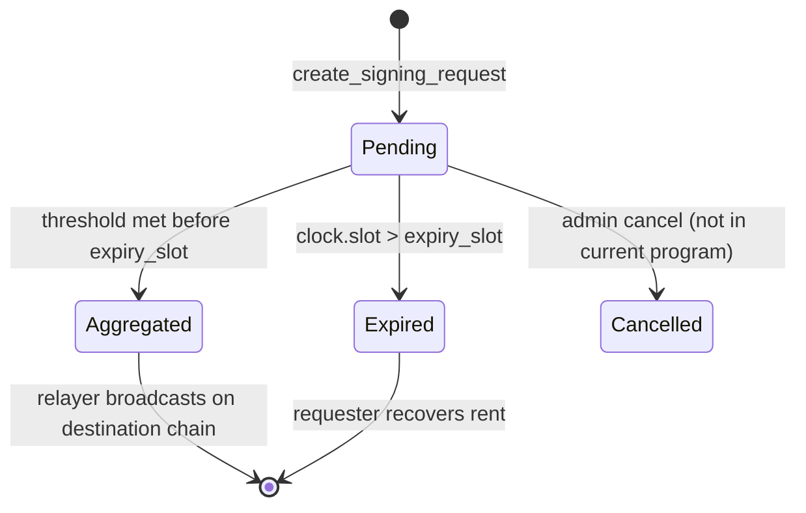

# Error Reference

Complete reference for every custom error the Distin on-chain program can emit. Each entry maps the Anchor error code to its exact trigger condition in `programs/distin/src/lib.rs`, the on-chain state that caused it, and the concrete steps to resolve it.

Program ID: `4xy9dYHfAzi7cAcX5JHxNR6EoMJ9PGfeQDMHx6YUQQM6`
Error enum: `DistinError` in `programs/distin/src/errors.rs`
Anchor base offset for custom errors: **6000**

---

## Quick Reference

| Code | Name | Anchor # | Message |
|------|------|----------|---------|
| `ProtocolPaused` | Protocol frozen | 6000 | Protocol is paused |
| `Unauthorized` | Wrong signer | 6001 | Caller is not authorized for this action |
| `InvalidThreshold` | Out-of-range bps or count | 6002 | Threshold must be between 1 and the active operator count / 10000 bps |
| `InsufficientBond` | Bond below minimum | 6003 | Bond amount is below the configured minimum |
| `OperatorJailed` | Jailed operator attempt | 6004 | Operator is jailed or unbonding and cannot sign |
| `AlreadyUnbonding` | Double unbond | 6005 | Operator is already unbonding |
| `NotUnbonding` | Premature withdrawal | 6006 | Operator has not begun unbonding |
| `UnbondingNotComplete` | Too early to withdraw | 6007 | Unbonding period has not elapsed yet |
| `RequestExpired` | Slot deadline passed | 6008 | Signing request has expired |
| `RequestNotPending` | Wrong lifecycle state | 6009 | Signing request is not in a pending state |
| `ThresholdNotMet` | Insufficient weight/count | 6010 | Collected staked weight or partial count is below threshold |
| `RequestAlreadyFinalized` | Post-finalization write | 6011 | Signing request has already been finalized |
| `MalformedPartialSignature` | Bad share bytes | 6012 | Partial signature share is malformed |
| `EmptyMessageHash` | All-zero hash | 6013 | Message hash must be non-empty |
| `SchemeMismatch` | Wrong scheme enum | 6014 | Submitted scheme does not match the request scheme |
| `StaleOraclePrice` | Price feed too old | 6015 | Oracle price is stale |
| `InvalidOracleAccount` | Wrong price feed key | 6016 | Oracle account does not match the configured price feed |
| `InvalidVault` | Bad vault/pool account | 6017 | Provided vault or pool account is invalid |
| `InvalidValidityWindow` | Slot range out of bounds | 6018 | Validity window is outside the allowed bounds |
| `NoActiveOperators` | Empty signing set | 6019 | No active operators in the signing set |
| `SlashAmountExceedsBond` | Slash > bond | 6020 | Slash amount exceeds the operator's bonded collateral |
| `InvalidAdminTransfer` | Zero pubkey target | 6021 | Invalid admin transfer target |
| `MathOverflow` | u64 checked arithmetic | 6022 | Arithmetic overflow |

---

## Error Taxonomy

```mermaid
graph TD
    E[DistinError] --> P[Protocol-Level]
    E --> O[Operator Lifecycle]
    E --> R[Request Lifecycle]
    E --> X[Cryptographic / Schema]
    E --> Q[Oracle & Vault]
    E --> A[Arithmetic]

    P --> P1[ProtocolPaused]
    P --> P2[Unauthorized]
    P --> P3[InvalidAdminTransfer]

    O --> O1[InsufficientBond]
    O --> O2[OperatorJailed]
    O --> O3[AlreadyUnbonding]
    O --> O4[NotUnbonding]
    O --> O5[UnbondingNotComplete]
    O --> O6[SlashAmountExceedsBond]

    R --> R1[InvalidThreshold]
    R --> R2[InvalidValidityWindow]
    R --> R3[NoActiveOperators]
    R --> R4[EmptyMessageHash]
    R --> R5[RequestExpired]
    R --> R6[RequestNotPending]
    R --> R7[ThresholdNotMet]
    R --> R8[RequestAlreadyFinalized]

    X --> X1[MalformedPartialSignature]
    X --> X2[SchemeMismatch]

    Q --> Q1[StaleOraclePrice]
    Q --> Q2[InvalidOracleAccount]
    Q --> Q3[InvalidVault]

    A --> A1[MathOverflow]
```



---

## Protocol-Level Errors

### `ProtocolPaused` — 6000

**Message:** `Protocol is paused`

The `paused: bool` flag on the singleton `Protocol` account (PDA seed `[b"protocol"]`) is `true`. Every user-facing and operator-facing state transition gate-checks this flag before doing any work:

```rust
// register_operator, begin_unbonding, create_signing_request all start with:
require!(!protocol.paused, DistinError::ProtocolPaused);
```

The flag is set by `pause(ctx: Context<AdminConfig>)` and cleared by `unpause(ctx: Context<AdminConfig>)`. Both instructions require `ctx.accounts.admin.key() == protocol.admin`.

**Affected instructions:** `register_operator`, `begin_unbonding`, `create_signing_request`, `submit_partial` (any instruction that calls `require!(!protocol.paused, ...)`).

**Resolution:**

1. Confirm the pause is intentional. Check `Protocol.paused` on-chain:

```bash
anchor account distin.Protocol 4xy9dYHfAzi7cAcX5JHxNR6EoMJ9PGfeQDMHx6YUQQM6
```

2. If you are the admin (`Protocol.admin`), call `unpause`:

```typescript
await program.methods.unpause().accounts({ protocol, admin }).rpc();
```

3. If you are not the admin, wait for the protocol to be unpaused or contact the admin (`Protocol.admin` field).

**Edge case:** A transaction that reads `paused = false` at simulation time can still land `ProtocolPaused` if another transaction calling `pause` is confirmed in the same slot. The protocol processes instructions in slot order; retry after the unpause transaction is confirmed.

---

### `Unauthorized` — 6001

**Message:** `Caller is not authorized for this action`

Triggered exclusively in `accept_admin` when the signer does not match `Protocol.pending_admin`:

```rust
require_keys_eq!(
    protocol.pending_admin,
    ctx.accounts.new_admin.key(),
    DistinError::Unauthorized
);
```

The two-step admin handover flow is:



**Resolution:** The nominee (`new_admin` as set by `transfer_admin`) must be the transaction signer for `accept_admin`. Verify:

```typescript
// pending_admin must equal the key that signs this tx
const { pendingAdmin } = await program.account.protocol.fetch(protocolPda);
console.log("Must sign with:", pendingAdmin.toBase58());
```

---

### `InvalidAdminTransfer` — 6021

**Message:** `Invalid admin transfer target`

Triggered in `transfer_admin` if `new_admin` is `Pubkey::default()` (all-zero 32 bytes):

```rust
require_keys_neq!(new_admin, Pubkey::default(), DistinError::InvalidAdminTransfer);
```

**Resolution:** Pass a real 32-byte public key as `new_admin`. The zero pubkey is rejected to prevent accidentally locking out the admin role.

---

## Operator Lifecycle Errors

### `InsufficientBond` — 6003

**Message:** `Bond amount is below the configured minimum`

Triggered in two contexts:

| Instruction | Condition |
|-------------|-----------|
| `initialize` | `min_bond == 0` |
| `update_config` | `min_bond == Some(0)` |
| `register_operator` | `bond_amount < protocol.min_bond` |

The `min_bond` field is stored in the `Protocol` account as a raw LST token amount (not lamports). The Token-2022 mint used is `Protocol.bond_mint`.

```rust
// initialize / update_config
require!(min_bond > 0, DistinError::InsufficientBond);

// register_operator
require!(bond_amount >= protocol.min_bond, DistinError::InsufficientBond);
```

**Resolution:**

```typescript
// Read the current minimum before attempting to register
const { minBond } = await program.account.protocol.fetch(protocolPda);
// bond_amount must be >= minBond in raw token units (respect decimals)
const bondAmount = minBond; // or higher
await program.methods
  .registerOperator(groupPubkey, new BN(bondAmount))
  .accounts({ ... })
  .rpc();
```

**Edge case:** `min_bond` can be raised by `update_config` after an operator is already bonded. Existing operators with bonds below the new minimum are not retroactively jailed by `update_config` itself; the slashing path (`slash_operator`) applies the check by comparing `operator.bonded_amount < min_bond` post-slash and jailing if true.

---

### `OperatorJailed` — 6004

**Message:** `Operator is jailed or unbonding and cannot sign`

An `Operator` account has `jailed: bool = true`. This field is set to `true` by:

- `begin_unbonding` (operator voluntarily exits)
- `slash_operator` when `operator.bonded_amount < protocol.min_bond` after the slash

A jailed operator's `stake_weight` contribution is excluded from `Protocol.total_bonded`. The operator PDA (seed `[b"operator", protocol, authority]`) stores the flag at byte offset 113 in the `Operator` struct (after the fixed-width fields).

**Resolution:** An operator that has begun unbonding cannot re-enter the signing set via the current program. The operator must `withdraw_bond` after the unbonding window and then call `register_operator` again with a fresh bond. There is no `unjail` instruction in the current on-chain program.

---

### `AlreadyUnbonding` — 6005

**Message:** `Operator is already unbonding`

```rust
// begin_unbonding
require!(operator.unbonding_at == 0, DistinError::AlreadyUnbonding);
```

`Operator.unbonding_at` is set to `clock.slot + protocol.unbonding_slots` on the first call to `begin_unbonding`. Any subsequent call to `begin_unbonding` for the same operator account hits this guard.

**Resolution:** Check `Operator.unbonding_at`. If non-zero, the operator is already in the unbonding period. Wait until `clock.slot >= unbonding_at` and call `withdraw_bond` to close the account. There is no way to cancel an in-progress unbonding.

---

### `NotUnbonding` — 6006

**Message:** `Operator has not begun unbonding`

```rust
// withdraw_bond
require!(operator.unbonding_at != 0, DistinError::NotUnbonding);
```

`withdraw_bond` is called before `begin_unbonding`. The operator account's `unbonding_at` field is `0` (the default for an actively bonded operator).

**Resolution:** Call `begin_unbonding` first. This sets `unbonding_at`, jails the operator, and removes its weight from `Protocol.total_bonded` and `Protocol.operator_count`.

---

### `UnbondingNotComplete` — 6007

**Message:** `Unbonding period has not elapsed yet`

```rust
// withdraw_bond
require!(
    clock.slot >= operator.unbonding_at,
    DistinError::UnbondingNotComplete
);
```

The current slot has not yet reached `Operator.unbonding_at`. The unbonding window is `Protocol.unbonding_slots` slots long (set at `initialize`, tunable via `update_config`). At ~400 ms per slot this translates to roughly:

| `unbonding_slots` | Real-world duration |
|-------------------|---------------------|
| 216,000 | ~24 hours |
| 432,000 | ~48 hours |
| 1,296,000 | ~6 days |

**Resolution:**

```typescript
const { unbondingAt } = await program.account.operator.fetch(operatorPda);
const slot = await connection.getSlot();
const slotsLeft = unbondingAt.toNumber() - slot;
const secondsLeft = slotsLeft * 0.4;
console.log(`Withdraw available in ~${Math.ceil(secondsLeft)}s`);
```

---

### `SlashAmountExceedsBond` — 6020

**Message:** `Slash amount exceeds the operator's bonded collateral`

```rust
// slash_operator
require!(
    amount <= ctx.accounts.operator.bonded_amount,
    DistinError::SlashAmountExceedsBond
);
```

The `slash_operator` instruction moves `amount` from `bond_vault` to `slash_pool` via a PDA-signed `transfer_checked` CPI (signer seeds `[b"protocol", &[protocol.bump]]`). Passing `amount > operator.bonded_amount` would overdraw the vault if allowed through, so it is rejected before the CPI.

**Resolution:** Read `Operator.bonded_amount` and cap the slash amount to that value. Partial slashes are supported; only a full-bond slash (amount == bonded\_amount) will drain the operator completely.

```typescript
const op = await program.account.operator.fetch(operatorPda);
const slashAmount = op.bondedAmount; // full slash
await program.methods
  .slashOperator(new BN(slashAmount), reason)
  .accounts({ ... })
  .rpc();
```

---

## Request Lifecycle Errors

### `InvalidThreshold` — 6002

**Message:** `Threshold must be between 1 and the active operator count / 10000 bps`

The same error name covers two distinct range checks in two distinct contexts:

**Context A — protocol-wide bps threshold (`initialize` / `update_config`)**

```rust
require!(
    threshold_bps as u64 >= 1 && threshold_bps as u64 <= BPS_DENOMINATOR,
    DistinError::InvalidThreshold
);
// BPS_DENOMINATOR = 10_000
```

`threshold_bps: u16` in the `Protocol` account must fall in `[1, 10_000]`. A value of `6_000` means 60% of `total_bonded` must be accumulated before a request finalizes.

**Context B — per-request operator count threshold (`create_signing_request`)**

```rust
require!(
    threshold >= 1 && (threshold as u32) <= protocol.operator_count,
    DistinError::InvalidThreshold
);
```

Here `threshold: u16` is the minimum number of distinct partial signatures (by operator count, not weight) the request requires. It is bounded by the live `Protocol.operator_count` at creation time.

| Field | Account | Type | Range |
|-------|---------|------|-------|
| `threshold_bps` | `Protocol` | `u16` | 1–10,000 |
| `threshold` (per request) | `SigningRequest` | `u16` | 1–`operator_count` |

**Resolution:** For protocol config, pass a value in `[1, 10_000]`. For per-request threshold, query `Protocol.operator_count` first and set `threshold <= operator_count`.

---

### `InvalidValidityWindow` — 6018

**Message:** `Validity window is outside the allowed bounds`

Checked in three places:

```rust
// initialize / update_config (max_validity_slots on the protocol)
require!(
    max_validity_slots >= 1 && max_validity_slots <= MAX_VALIDITY_SLOTS_CEILING,
    DistinError::InvalidValidityWindow
);
// MAX_VALIDITY_SLOTS_CEILING = 432_000  (~48h at 400ms/slot)

// create_signing_request (per-request validity_slots)
require!(
    validity_slots >= 1 && validity_slots <= protocol.max_validity_slots,
    DistinError::InvalidValidityWindow
);
```

`Protocol.max_validity_slots` acts as a ceiling that admins can tighten below `MAX_VALIDITY_SLOTS_CEILING`. A user request's `validity_slots` must be within `[1, protocol.max_validity_slots]`.

**Resolution:** Read `Protocol.max_validity_slots` before building the request instruction:

```typescript
const { maxValiditySlots } = await program.account.protocol.fetch(protocolPda);
// Pass any value in [1, maxValiditySlots.toNumber()]
const validitySlots = Math.min(desiredSlots, maxValiditySlots.toNumber());
```

---

### `NoActiveOperators` — 6019

**Message:** `No active operators in the signing set`

```rust
// create_signing_request
require!(protocol.operator_count > 0, DistinError::NoActiveOperators);
```

`Protocol.operator_count` is a `u32` incremented by `register_operator` and decremented by `begin_unbonding` and `slash_operator` (when the operator is subsequently jailed). If the set empties, request creation is blocked until at least one operator bonds.

**Resolution:** One or more operators must call `register_operator` with `bond_amount >= Protocol.min_bond`. Monitor the set before submitting requests:

```typescript
const { operatorCount } = await program.account.protocol.fetch(protocolPda);
if (operatorCount === 0) throw new Error("No active signing operators");
```

---

### `EmptyMessageHash` — 6013

**Message:** `Message hash must be non-empty`

```rust
// create_signing_request
require!(message_hash.iter().any(|b| *b != 0), DistinError::EmptyMessageHash);
```

The `message_hash: [u8; 32]` parameter (stored as `SigningRequest.message_hash`) must have at least one non-zero byte. All-zero 32 bytes is rejected to prevent accidental or malicious null-hash requests that operators would otherwise be obligated to sign.

**Resolution:** Hash the actual transaction payload intended for the destination chain before calling `create_signing_request`. For EVM targets (`TargetVm::Evm` / `SignatureScheme::Gg20Secp256k1`) this is typically `keccak256(rlp(tx))`; for SVM targets (`SignatureScheme::FrostEd25519`) it is `sha256(message_bytes)`.

---

### `RequestExpired` — 6008

**Message:** `Signing request has expired`

A `SigningRequest` expires at slot `expiry_slot`, which is computed at creation as:

```
expiry_slot = clock.slot + validity_slots
```

After `expiry_slot` the request's `status` transitions to `RequestStatus::Expired` and any `submit_partial` or finalization instruction will hit this error. The `expiry_slot` is stored in the `SigningRequest` account (see Account Layout below).



**Resolution:** Submit partial signatures within the `validity_slots` window. If the window is too tight and `RequestExpired` fires before threshold is met, the requester must create a new `SigningRequest` with a larger `validity_slots` value (up to `Protocol.max_validity_slots`).

---

### `RequestNotPending` — 6009

**Message:** `Signing request is not in a pending state`

`submit_partial` and the aggregation/finalization instruction both require `SigningRequest.status == RequestStatus::Pending`. Trying to submit a partial to an already-`Aggregated`, `Cancelled`, or `Expired` request triggers this error.

`RequestStatus` is a one-byte discriminated enum stored in `SigningRequest.status`:

| Variant | Wire value | Meaning |
|---------|-----------|---------|
| `Pending` | `0` | Accepting partial signatures |
| `Aggregated` | `1` | Threshold met; aggregate sig published |
| `Cancelled` | `2` | Administratively cancelled |
| `Expired` | `3` | `expiry_slot` passed before threshold met |

**Resolution:** Read `SigningRequest.status` before submitting. Only `0` (Pending) allows further writes.

---

### `ThresholdNotMet` — 6010

**Message:** `Collected staked weight or partial count is below threshold`

The finalization check requires both conditions simultaneously:

- `SigningRequest.partials_collected >= SigningRequest.threshold` (operator count gate)
- `SigningRequest.stake_weight_collected >= SigningRequest.required_stake_weight` (economic security gate)

`required_stake_weight` is snapshotted at creation:

```rust
let required_stake_weight = protocol.total_bonded
    .checked_mul(protocol.threshold_bps as u64)
    .ok_or(DistinError::MathOverflow)?
    / BPS_DENOMINATOR;
```

So if `total_bonded = 500_000` and `threshold_bps = 6_000`, then `required_stake_weight = 300_000`. Weight from jailed or unbonding operators does not count toward `stake_weight_collected`.

**Resolution:** Wait for more operators to submit partials. Track progress:

```typescript
const req = await program.account.signingRequest.fetch(requestPda);
const pctWeight = req.stakeWeightCollected.toNumber() / req.requiredStakeWeight.toNumber();
const pctCount  = req.partialsCollected / req.threshold;
console.log(`Weight: ${(pctWeight * 100).toFixed(1)}%  Count: ${(pctCount * 100).toFixed(1)}%`);
```

Both must reach 100% for finalization to succeed.

---

### `RequestAlreadyFinalized` — 6011

**Message:** `Signing request has already been finalized`

The request `status` is `Aggregated` (1). The `aggregate_sig: [u8; 64]` field in `SigningRequest` has already been written. Any subsequent finalization attempt is rejected.

**Resolution:** Read the `aggregate_sig` from the finalized `SigningRequest` account and pass it to the off-chain relayer (`kobe-evm` / `kobe-svm` / `kobe-cosmos`) for broadcast on the destination chain. No further on-chain action is required.

---

## Cryptographic / Schema Errors

### `MalformedPartialSignature` — 6012

**Message:** `Partial signature share is malformed`

The `share: [u8; 64]` field in a `PartialSignature` submission failed structural validation. The exact validation is delegated to the off-chain `kobe-{svm,evm,tron,cosmos}` signing libraries and the program calls into their verification logic. An all-zero share or a share whose length does not match the declared `scheme` triggers this error.

`PartialSignature` account layout for reference (seed `[b"partial", request, operator]`):

| Field | Type | Bytes |
|-------|------|-------|
| `request` | `Pubkey` | 32 |
| `operator` | `Pubkey` | 32 |
| `scheme` | `SignatureScheme` | 1 |
| `share` | `[u8; 64]` | 64 |
| `submitted_slot` | `u64` | 8 |
| `stake_weight` | `u64` | 8 |
| `bump` | `u8` | 1 |
| Anchor discriminator | | 8 |
| **Total** | | **154 bytes** |

**Resolution:** Verify the `share` bytes using the appropriate signing library before submitting the instruction. For FROST (Ed25519): the 64 bytes encode `(R, s)` per RFC 8032. For GG20 (secp256k1): the 64 bytes encode the `(r, s)` components without the recovery byte.

---

### `SchemeMismatch` — 6014

**Message:** `Submitted scheme does not match the request scheme`

The `scheme: SignatureScheme` provided in `submit_partial` does not equal `SigningRequest.scheme`. The scheme is set at request creation and cannot change:

| `TargetVm` | Required `SignatureScheme` |
|------------|--------------------------|
| `Svm` | `FrostEd25519` |
| `Aptos` (future) | `FrostEd25519` |
| `Evm` | `Gg20Secp256k1` |
| `Tron` | `Gg20Secp256k1` |
| `Cosmos` | scheme depends on chain; check request |
| `Bitcoin` | `Gg20Secp256k1` |

```rust
pub enum SignatureScheme {
    FrostEd25519,   // SVM / Aptos / Sui style chains
    Gg20Secp256k1,  // EVM / BTC / Tron style chains
}
```

**Resolution:** Read `SigningRequest.scheme` and `SigningRequest.target_vm` before constructing the partial signature. Pass the matching `SignatureScheme` variant to `submit_partial`.

---

## Oracle and Vault Errors

### `StaleOraclePrice` — 6015

**Message:** `Oracle price is stale`

Triggered inside `compute_stake_weight`, a private helper called by `register_operator` and `slash_operator` to convert a raw LST bond amount into SOL-denominated `stake_weight`. The LST price feed account is `Protocol.lst_price_feed` (a Pyth price account pubkey). If the Pyth price timestamp is too old relative to `Clock::get()?.unix_timestamp`, the helper returns `DistinError::StaleOraclePrice`.

**Resolution:**

1. Ensure the Pyth publisher is actively pricing the bond LST. Check the feed on-chain.
2. Operators should not attempt to register or be slashed during oracle outages; retry once fresh pricing is available.
3. If you are running a devnet deployment with a mock price feed, ensure your mock publisher is cranking.

---

### `InvalidOracleAccount` — 6016

**Message:** `Oracle account does not match the configured price feed`

`compute_stake_weight` validates that the account passed as `lst_price_feed` in the instruction's remaining accounts matches `Protocol.lst_price_feed`:

```rust
// (within compute_stake_weight)
require_keys_eq!(
    lst_price_feed.key(),
    protocol.lst_price_feed,
    DistinError::InvalidOracleAccount
);
```

**Resolution:** Pass exactly `Protocol.lst_price_feed` as the oracle account. This pubkey is set in `initialize` and can only be changed via `update_config` (admin only). Do not substitute a different Pyth account.

---

### `InvalidVault` — 6017

**Message:** `Provided vault or pool account is invalid`

Account constraints in `initialize` and the bond/slash CPI paths validate that `bond_vault` and `slash_pool` are the expected PDAs (seeds `[b"bond_vault", protocol]` and `[b"slash_pool", protocol]` respectively). Passing any other token account triggers this error.

**Resolution:** Derive the PDA addresses correctly:

```typescript
const [bondVault] = PublicKey.findProgramAddressSync(
  [Buffer.from("bond_vault"), protocolPda.toBuffer()],
  programId
);
const [slashPool] = PublicKey.findProgramAddressSync(
  [Buffer.from("slash_pool"), protocolPda.toBuffer()],
  programId
);
```

Both are Token-2022 accounts owned by the protocol PDA and initialized in `initialize`.

---

## Arithmetic Error

### `MathOverflow` — 6022

**Message:** `Arithmetic overflow`

The program uses Rust's `checked_*` arithmetic throughout and surfaces any `None` result as `MathOverflow`. Every site where this can occur:

| Instruction | Expression |
|-------------|-----------|
| `register_operator` | `total_bonded.checked_add(stake_weight)` |
| `register_operator` | `operator_count.checked_add(1)` |
| `begin_unbonding` | `clock.slot.checked_add(unbonding_slots)` |
| `slash_operator` | `slash_count.checked_add(1)` |
| `create_signing_request` | `total_bonded.checked_mul(threshold_bps as u64)` |
| `create_signing_request` | `request_nonce.checked_add(1)` (implied by nonce increment) |
| `submit_partial` | `stake_weight_collected.checked_add(operator.stake_weight)` |
| `submit_partial` | `partials_collected.checked_add(1)` |

All fields involved are `u64` (or `u32` for `operator_count`). `MathOverflow` in practice signals either:

- `total_bonded` exceeding `u64::MAX` (essentially impossible under realistic bond sizes)
- `clock.slot + unbonding_slots` overflowing `u64` (impossible: Solana genesis slot is 0, and `MAX_VALIDITY_SLOTS_CEILING = 432_000` is far from u64 max)
- Malicious or misconfigured `threshold_bps × total_bonded` overflow (`threshold_bps` is bounded to `10_000` and `total_bonded` is bounded by realistic LST supply)

**Resolution:** `MathOverflow` in production indicates a protocol invariant violation or a deeply unexpected state. Log the full instruction context, read all relevant account fields, and file a bug report. Do not retry blindly.

---

## PDA Seed Reference (for error context)

When decoding an error, the account at fault is often identifiable by its PDA seed:

| Account | Seeds | Size (INIT_SPACE + 8) |
|---------|-------|-----------------------|
| `Protocol` | `[b"protocol"]` | 256 bytes |
| `bond_vault` | `[b"bond_vault", protocol]` | Token-2022 TokenAccount |
| `slash_pool` | `[b"slash_pool", protocol]` | Token-2022 TokenAccount |
| `Operator` | `[b"operator", protocol, authority]` | 151 bytes |
| `SigningRequest` | `[b"request", protocol, request_id_le]` | 232 bytes |
| `PartialSignature` | `[b"partial", request, operator]` | 154 bytes |

`request_id_le` is the 8-byte little-endian encoding of `Protocol.request_nonce` at the time of request creation.

---

## Decoding Errors in TypeScript

Anchor serializes custom errors with code `6000 + variant_index`. To decode programmatically:

```typescript
import { AnchorError } from "@coral-xyz/anchor";

try {
  await program.methods.createSigningRequest(...).rpc();
} catch (err) {
  if (err instanceof AnchorError) {
    console.log("Error code:", err.error.errorCode.number);   // e.g. 6013
    console.log("Error name:", err.error.errorCode.code);     // e.g. "EmptyMessageHash"
    console.log("Error msg: ", err.error.errorMessage);       // human-readable
    console.log("Program:   ", err.program.toBase58());
  }
}
```

Raw transaction logs expose the code as:

```
Program log: AnchorError thrown in programs/distin/src/lib.rs:NNN.
Program log: Error Code: EmptyMessageHash. Error Number: 6013.
Program log: Error Message: Message hash must be non-empty.
```

---

## Error Frequency in Normal Operation

| Error | Normal? | Operator | User | Admin |
|-------|---------|----------|------|-------|
| `ProtocolPaused` | Rare | Wait / retry | Wait / retry | Unpause |
| `InsufficientBond` | Occasional | Increase bond amount | — | — |
| `AlreadyUnbonding` | Idempotent guard | Don't call twice | — | — |
| `UnbondingNotComplete` | Timing | Wait for slot | — | — |
| `EmptyMessageHash` | Integration bug | — | Fix hash derivation | — |
| `SchemeMismatch` | Integration bug | — | Match scheme to VM | — |
| `InvalidValidityWindow` | Config mismatch | — | Read `max_validity_slots` | Tune config |
| `NoActiveOperators` | Bootstrap state | Register | Retry later | — |
| `RequestExpired` | Timing / liveness | Sign faster | Increase `validity_slots` | — |
| `ThresholdNotMet` | Liveness | More partials needed | Wait | — |
| `StaleOraclePrice` | Oracle outage | Retry | Retry | Monitor feed |
| `MathOverflow` | Bug / extreme state | Report | Report | Report |