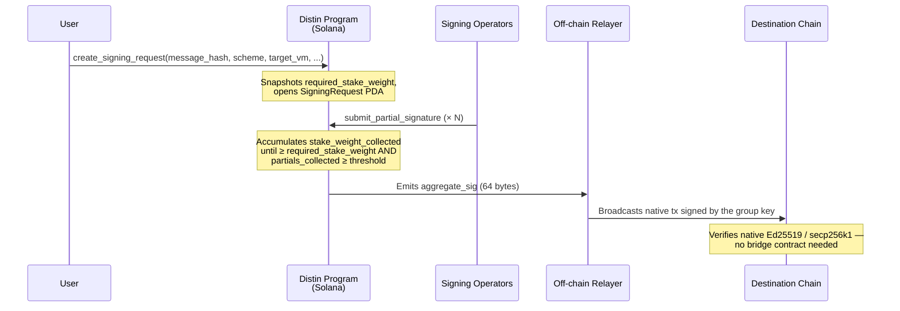
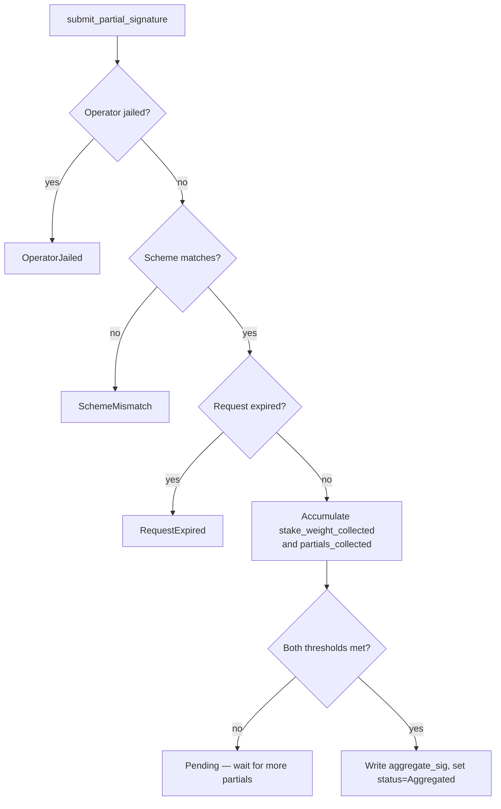
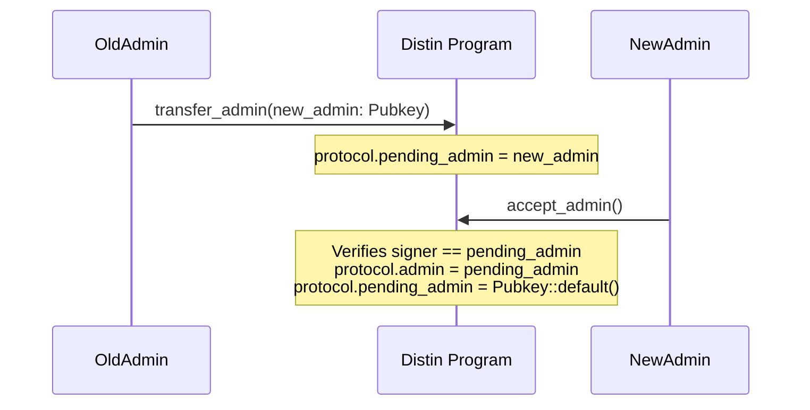

# Frequently Asked Questions

---

## 1. What exactly is Distin, and how is it different from a traditional bridge?

Traditional bridges work by locking asset A on chain X and minting a wrapped IOU on chain Y. The user ends up holding a synthetic derivative backed by a custodial vault, a multisig, or an optimistic challenge game. Distin does none of that.

Distin is a **threshold-signature coordination layer**. When you want to move or sign on chain Y, Distin's operator set produces a valid **native signature** that chain Y's own RPC would accept directly — the same Ed25519 or secp256k1 bytes that the destination VM checks natively. There is no wrapped token, no liquidity pool to route through, and no IOU to redeem.



The trust assumption shifts from "trust the bridge's custodians" to "trust that a staked-weight majority of bonded operators is honest." Those operators have slashable LST collateral on the line for every request they process.

---

## 2. Which chains and signature schemes are supported?

The program defines two enums — `SignatureScheme` and `TargetVm` — that together determine how the off-chain signing libraries are invoked. The on-chain branching is enforced at the `SigningRequest` level: a partial share submitted with the wrong scheme triggers `DistinError::SchemeMismatch`.

| `TargetVm` | `SignatureScheme` | Off-chain library | Native verification |
|---|---|---|---|
| `Svm` | `FrostEd25519` | `kobe-svm` | Ed25519 program |
| `Cosmos` | `FrostEd25519` | `kobe-cosmos` | Tendermint secp/ed |
| `Evm` | `Gg20Secp256k1` | `kobe-evm` | `ecrecover` |
| `Tron` | `Gg20Secp256k1` | `kobe-tron` | Tron's `ecrecover` variant |
| `Bitcoin` | `Gg20Secp256k1` | *(not yet released)* | Script `OP_CHECKSIG` |

> **FrostEd25519** uses FROST Schnorr over Ed25519 — the threshold aggregation produces a standard Ed25519 signature indistinguishable from a single-key signature on the destination chain. **Gg20Secp256k1** uses GG20-style threshold ECDSA over secp256k1, producing a standard `(r, s, v)` tuple that any EVM contract's `ecrecover` accepts.

The `target_chain_id` field (a `u64`) carries the chain-specific discriminator: EVM chain ID for EVM targets, a Cosmos chain index for Cosmos, and so on. Distin does not validate the numeric value itself — the off-chain relayer is responsible for routing to the correct RPC.

---

## 3. How does the threshold calculation work? There seem to be two thresholds.

There are indeed two separate, independent threshold conditions, and **both must be satisfied** before a request can be finalized:

**a) Stake-weight threshold (economic security)**

Set globally in `Protocol.threshold_bps` (e.g., `6667` = two-thirds majority). At request creation, `create_signing_request` snapshots:

```
required_stake_weight = (total_bonded × threshold_bps) / 10_000
```

`BPS_DENOMINATOR = 10_000` is the hard-coded denominator. This value is frozen into `SigningRequest.required_stake_weight` at creation time — a spike in `total_bonded` after the fact cannot raise the bar retroactively. As each operator submits a partial signature, their `Operator.stake_weight` is added to `SigningRequest.stake_weight_collected`. Finalization requires:

```
stake_weight_collected >= required_stake_weight
```

**b) Operator-count threshold (sybil floor)**

`create_signing_request` accepts a `threshold: u16` argument — the minimum number of **distinct** operators that must contribute partial shares. This prevents a single operator with an overwhelming bond from satisfying the economic threshold alone. The program enforces `threshold >= 1` and `threshold <= operator_count`. As partials arrive, `partials_collected` is incremented; finalization also requires:

```
partials_collected >= threshold
```

If either condition is unmet when finalization is attempted, the program returns `DistinError::ThresholdNotMet`.



---

## 4. What happens to my signing request if operators don't respond in time?

Every request has a hard deadline. When you call `create_signing_request`, you supply `validity_slots: u64`. The program computes:

```
expiry_slot = Clock::slot + validity_slots
```

The ceiling is `MAX_VALIDITY_SLOTS_CEILING = 432_000 slots`. At 400 ms per slot that is approximately 48 hours. The floor is 1 slot. Any value outside `[1, 432_000]` returns `DistinError::InvalidValidityWindow`.

Once `Clock::slot > expiry_slot`, any further partial submission or finalization attempt returns `DistinError::RequestExpired`. At that point the request's `status` field holds `RequestStatus::Expired`. The `SigningRequest` PDA can then be closed by the relayer or the requester to reclaim rent lamports; the protocol does **not** automatically close expired accounts.

Practical guidance: for EVM targets where the destination chain is itself slow, set `validity_slots` long enough to give operators several Solana epochs. For Svm-to-Svm intents, a window of a few hundred slots (2–3 minutes) is typically sufficient because Solana's 400 ms slots make the coordination loop near-real-time.

---

## 5. How does operator bonding and slashing work?

### Bonding

An operator calls `register_operator`, providing:
- `bond_amount: u64` — raw LST token units (must be `>= Protocol.min_bond`)
- `group_pubkey: [u8; 33]` — compressed group public key / FROST public-share identifier

The program pulls `bond_amount` from the operator's Token-2022 account into the protocol-owned `bond_vault` PDA via `transfer_checked`. The bond is **not** SOL — it is whatever Token-2022 LST mint is registered in `Protocol.bond_mint`.

`compute_stake_weight` converts the raw LST amount to a SOL-denominated economic weight using the Pyth price feed configured in `Protocol.lst_price_feed`. The result is stored in `Operator.stake_weight` and added to `Protocol.total_bonded`.

### Slashing

Admin calls `slash_operator(amount: u64, reason: u8)`. The program:
1. Validates `amount <= operator.bonded_amount` (else `SlashAmountExceedsBond`)
2. Moves `amount` from `bond_vault` → `slash_pool` via `transfer_checked` (PDA-signed)
3. Recomputes `Operator.stake_weight` from the residual `bonded_amount`
4. Jails the operator (`operator.jailed = true`) if `bonded_amount < min_bond` after slashing
5. Decrements `Protocol.total_bonded` and `Protocol.operator_count` for active operators

The on-chain effect is immediate; the fraud-proof generation (equivocation / invalid-share / liveness fault detection) is performed off-chain by the `kobe-*` signing libraries and submitted to the admin before this instruction is called.

| Condition | Effect |
|---|---|
| `bonded_amount` drops below `min_bond` after slash | Operator auto-jailed |
| Operator was active (not already unbonding/jailed) | `total_bonded` and `operator_count` adjusted |
| Operator was already unbonding | Weight adjustment skipped (already subtracted on `begin_unbonding`) |

An `OperatorSlashed` event is emitted with the operator pubkey, slashed amount, and reason code.

---

## 6. How long must an operator wait before withdrawing their bond?

Withdrawal is a two-step process gated by `Protocol.unbonding_slots`.

**Step 1 — `begin_unbonding`:**

```
operator.unbonding_at = Clock::slot + protocol.unbonding_slots
operator.jailed = true
```

The operator is immediately removed from the active signing set (`total_bonded` and `operator_count` decremented). Importantly, jailing means the operator **cannot take on new requests** while the bond is still slashable — this prevents a slash-window exploit where an operator exits right before a fraud proof lands.

**Step 2 — `withdraw_bond`:**

Only callable once `Clock::slot >= operator.unbonding_at`. If called early, the program returns `DistinError::UnbondingNotComplete`. On success, the full `operator.bonded_amount` is transferred from `bond_vault` back to the operator's token account (PDA-signed), and the `Operator` account is closed, returning its rent to the `authority`.

```
withdraw_bond constraints:
  operator.unbonding_at != 0        → else NotUnbonding
  Clock::slot >= operator.unbonding_at  → else UnbondingNotComplete
```

If an operator calls `begin_unbonding` a second time while already unbonding, the program returns `DistinError::AlreadyUnbonding`.

---

## 7. What is the request fee, and where does it go?

The `Protocol.request_fee` field holds a lamport amount. When a user calls `create_signing_request` and the fee is nonzero, the program transfers that many lamports from the requester's account to the `Protocol` PDA itself using a `system_program::transfer` CPI:

```rust
// excerpt from create_signing_request
if protocol.request_fee > 0 {
    system_program::transfer(
        CpiContext::new(...),
        protocol.request_fee,
    )?;
}
```

The lamports accumulate in the `Protocol` PDA's native account balance. There is no on-chain distribution mechanism in the current program — fee sweeps to operator reward pools or the treasury are handled off-chain by the admin. The fee is set during `initialize` and can be updated at any time by the admin via `update_config(request_fee: Some(new_fee))`.

A fee of `0` is valid; the CPI is skipped entirely.

---

## 8. What does the aggregate signature actually look like, and how does it reach the destination chain?

The `SigningRequest.aggregate_sig` field is a `[u8; 64]` accumulator. Its encoding depends on the scheme:

- **`FrostEd25519`**: standard 64-byte Ed25519 signature `(R || s)` — verifiable by any Ed25519 library without modification.
- **`Gg20Secp256k1`**: 64-byte compact ECDSA signature `(r || s)` — the `v` recovery bit is communicated out-of-band by the relayer based on the message hash.

Once both threshold conditions are satisfied, the program writes the final aggregate bytes into `aggregate_sig` and sets `status = RequestStatus::Aggregated`. The program also emits a Solana event.

The off-chain relayer monitors Solana for `Aggregated` requests, reads the `aggregate_sig`, and broadcasts a native transaction on the destination chain. **The relayer is not part of the on-chain program** — it is a permissionless off-chain daemon. Any party watching the Distin program's logs can relay the signature; there is no designated relayer role in the contract.

```
SigningRequest PDA (after finalization)
┌────────────────────────────────────────────────────────┐
│ status            : Aggregated                         │
│ aggregate_sig     : [u8; 64]  ← 64 bytes, scheme-enc  │
│ partials_collected: threshold (or more)                │
│ stake_weight_collected: ≥ required_stake_weight        │
└────────────────────────────────────────────────────────┘
           │
           ▼ off-chain relayer reads & broadcasts
┌────────────────────────────────────────────────────────┐
│ Destination chain receives a *native* signed tx        │
│ No bridge contract, no wrapped token mint/burn         │
└────────────────────────────────────────────────────────┘
```

---

## 9. What are the on-chain accounts and how are their PDAs derived?

All accounts are Anchor PDAs derived with fixed seeds. The table below lists every seed, the space (rent-exempt size), and the key fields:

| Account | Seeds | Space | Key Fields |
|---|---|---|---|
| `Protocol` | `[b"protocol"]` | 256 bytes (248 + 8 disc) | `threshold_bps`, `total_bonded`, `request_nonce`, `paused` |
| `bond_vault` | `[b"bond_vault", protocol]` | Token-2022 account | Holds active operator bonds |
| `slash_pool` | `[b"slash_pool", protocol]` | Token-2022 account | Receives slashed collateral |
| `Operator` | `[b"operator", protocol, authority]` | 151 bytes (143 + 8 disc) | `stake_weight`, `jailed`, `unbonding_at` |
| `SigningRequest` | `[b"request", protocol, request_id_le]` | 232 bytes (224 + 8 disc) | `scheme`, `target_vm`, `aggregate_sig`, `status` |
| `PartialSignature` | `[b"partial", request, operator]` | 154 bytes (146 + 8 disc) | `share: [u8; 64]`, `stake_weight` |

`request_id_le` is the little-endian encoding of `Protocol.request_nonce` at the time the request is created. The nonce is monotonically incremented, which guarantees globally unique PDA addresses for all time.

The `PartialSignature` PDA seed `[b"partial", request, operator]` naturally enforces **uniqueness**: an operator cannot submit two shares for the same request because the PDA would already be initialized, causing Anchor's account-init constraint to fail.

---

## 10. What errors can I encounter, and what do they mean?

| Error | Anchor code | When it fires |
|---|---|---|
| `ProtocolPaused` | `6000` | Admin has called `pause`; all user/operator state transitions blocked |
| `Unauthorized` | `6001` | Caller is not the admin, or pending admin mismatch in `accept_admin` |
| `InvalidThreshold` | `6002` | `threshold_bps` outside `[1, 10_000]`, or request `threshold` outside `[1, operator_count]` |
| `InsufficientBond` | `6003` | `bond_amount < min_bond` on `register_operator`, or `min_bond = 0` on `update_config` |
| `OperatorJailed` | `6004` | Jailed or unbonding operator attempts to submit a partial signature |
| `AlreadyUnbonding` | `6005` | `begin_unbonding` called on an operator where `unbonding_at != 0` |
| `NotUnbonding` | `6006` | `withdraw_bond` called before `begin_unbonding` |
| `UnbondingNotComplete` | `6007` | `withdraw_bond` called before `Clock::slot >= unbonding_at` |
| `RequestExpired` | `6008` | `Clock::slot > expiry_slot` when submitting a partial or finalizing |
| `RequestNotPending` | `6009` | Request `status != Pending` (already `Aggregated`, `Cancelled`, or `Expired`) |
| `ThresholdNotMet` | `6010` | Finalization attempted but `stake_weight_collected < required_stake_weight` or `partials_collected < threshold` |
| `RequestAlreadyFinalized` | `6011` | Attempt to write to a request already in `Aggregated` state |
| `MalformedPartialSignature` | `6012` | 64-byte share fails the off-chain library's validity check |
| `EmptyMessageHash` | `6013` | All 32 bytes of `message_hash` are zero |
| `SchemeMismatch` | `6014` | Partial submitted with a different `SignatureScheme` than the request |
| `StaleOraclePrice` | `6015` | Pyth price feed account slot is too far behind `Clock::slot` |
| `InvalidOracleAccount` | `6016` | Oracle account key does not match `Protocol.lst_price_feed` |
| `InvalidVault` | `6017` | Provided vault or slash pool does not match the protocol config |
| `InvalidValidityWindow` | `6018` | `validity_slots` outside `[1, 432_000]` |
| `NoActiveOperators` | `6019` | `create_signing_request` called when `operator_count == 0` |
| `SlashAmountExceedsBond` | `6020` | Slash `amount > operator.bonded_amount` |
| `InvalidAdminTransfer` | `6021` | `transfer_admin` called with `Pubkey::default()` as the target |
| `MathOverflow` | `6022` | Checked arithmetic overflowed (nonce increment, weight accumulation, etc.) |

---

## 11. How does the emergency pause work, and how is admin authority transferred safely?

### Emergency Pause

The admin calls `pause`, which sets `Protocol.paused = true`. All instructions that change user or operator state check this flag first and return `DistinError::ProtocolPaused` immediately. Read-only queries (account fetches) are unaffected.

The admin calls `unpause` to resume normal operation.

Neither instruction requires additional accounts beyond the admin signer and the `Protocol` PDA. They are designed for rapid response — a single transaction halts the entire protocol.

### Two-Step Admin Handover

To prevent accidental renouncement to an invalid key, admin transfer is a two-transaction process:



`transfer_admin` rejects `Pubkey::default()` (`DistinError::InvalidAdminTransfer`). `accept_admin` verifies that the transaction signer's pubkey matches `Protocol.pending_admin` exactly (`DistinError::Unauthorized` if not). Until the nominee calls `accept_admin`, the old admin retains full authority. The `Protocol.pending_admin` field reverts to `Pubkey::default()` after a successful handover.

---

## 12. "Bridge-free" — aren't there still trust assumptions?

Yes, and Distin is explicit about it. "Bridge-free" means no wrapped tokens, no liquidity pools, no custodial vault on either chain. It does **not** mean trustless in the cryptographic sense. Here is the honest breakdown:

| Property | Distin's answer |
|---|---|
| **Does it issue wrapped tokens?** | No. The destination chain receives a native signature, not a synthetic asset. |
| **Is there a trusted custodian?** | No single custodian. There is a **staked-weight majority** of bonded operators. |
| **What is the economic security?** | At any given moment: `Protocol.total_bonded × threshold_bps / 10_000` units of SOL-equivalent collateral must collude to forge a signature. |
| **Can the admin steal funds?** | The admin controls `pause`, `update_config`, and `slash_operator`. Slashed funds go to `slash_pool` (a protocol-owned PDA), not the admin wallet. The admin cannot directly move user funds. |
| **What if operators go offline?** | The request expires at `expiry_slot` with status `Expired`. No funds are moved; the user retries with a new request. |
| **What stops an operator from signing arbitrary messages?** | The group key is a **threshold** key — no single operator holds enough shares to produce a valid aggregate signature alone. The security assumption is honest majority by stake weight. |
| **Are the cryptographic proofs verified on-chain?** | Partial-share validation (FROST commitment verification, GG20 zero-knowledge proofs) is performed by the off-chain `kobe-*` libraries. The on-chain program enforces accounting, economic thresholds, and liveness deadlines. This is a deliberate scope boundary — full ZK verification on Solana BPF would be prohibitively expensive per-instruction. |

The risk model is analogous to a staked validator set in a PoS chain: as long as over `threshold_bps / 10_000` of total staked weight is honest and online, the system produces correct signatures. The slashing mechanism in `slash_operator` is the deterrent; the unbonding window (`unbonding_slots`) is the slashing opportunity window.