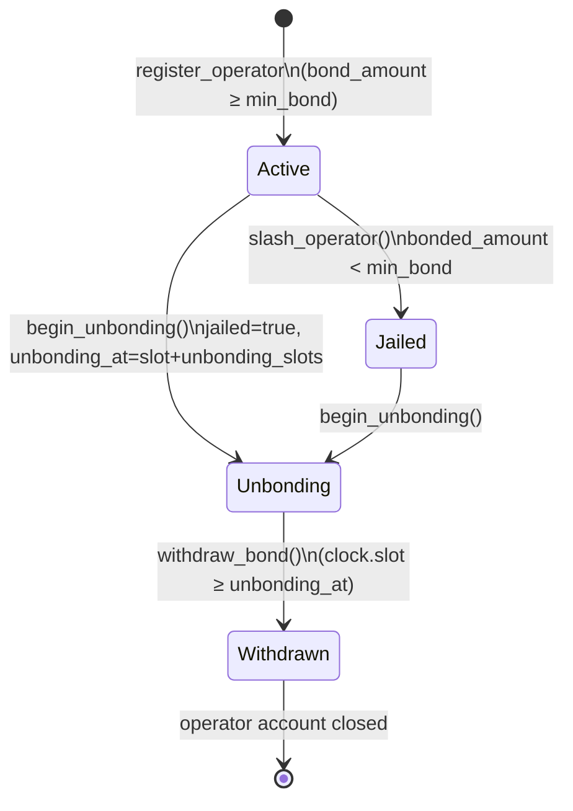

# Getting Started with Distin

Distin is a threshold-signature coordination and aggregation layer deployed on Solana. This guide walks you from a bare machine to a running devnet deployment with a live signing request — covering every prerequisite, build flag, PDA derivation, and on-chain call with the exact parameters the program enforces.

## Prerequisites

### Toolchain Versions

| Tool | Required version | Notes |
|---|---|---|
| Rust (stable) | 1.75+ | `rustup update stable` |
| Solana CLI | 1.18.26 | Must match `solana-program =1.18.26` in Cargo |
| Anchor CLI | 0.30.1 | Program was written against Anchor 0.30.1 |
| Node.js | 20 LTS | Client SDK scripts |
| Yarn / pnpm | any | Package manager for the TS client |

Solana CLI and Anchor version must be pinned exactly — the on-chain program depends on `solana-program =1.18.26` and `anchor-lang` / `anchor-spl` 0.30.1. Mismatched toolchains produce incompatible discriminators.

```bash
# Install Solana CLI 1.18.26
sh -c "$(curl -sSfL https://release.solana.com/v1.18.26/install)"

# Install Anchor CLI 0.30.1 via avm
cargo install --git https://github.com/coral-xyz/anchor avm --locked --force
avm install 0.30.1
avm use 0.30.1

# Verify
anchor --version   # anchor-cli 0.30.1
solana --version   # solana-cli 1.18.26
```

### Accounts You Need Before Starting

- **Admin keypair** — will be set as `protocol.admin` at `initialize`. Keep this offline in production.
- **Operator keypair** — per-operator authority signer for `register_operator`, `begin_unbonding`, `withdraw_bond`, and `submit_partial_signature`.
- **Token-2022 LST mint** — the collateral mint. Must be a Token-2022 mint (not legacy Token); `register_operator` uses `transfer_checked` via `TokenInterface`.
- **Pyth price feed account** — passed as `lst_price_feed` on `initialize`. Used inside `compute_stake_weight` to value bonded LST in SOL terms.

## Workspace Layout

```
distin/
├── Anchor.toml
├── Cargo.toml          # workspace root
├── programs/
│   └── distin/
│       ├── Cargo.toml
│       └── src/
│           ├── lib.rs
│           ├── state.rs
│           └── errors.rs
└── tests/
    └── distin.ts
```

The program is declared at:

```
declare_id!("4xy9dYHfAzi7cAcX5JHxNR6EoMJ9PGfeQDMHx6YUQQM6");
```

This is the canonical program ID. Every PDA derivation must use this pubkey as the program ID.

## Build

```bash
anchor build
```

The build produces `target/deploy/distin.so` and `target/idl/distin.json`. The IDL is what the TypeScript client uses for account deserialization and instruction encoding.

If the build errors on the Token-2022 CPI path, confirm `anchor-spl` has the `token-2022` feature enabled in `programs/distin/Cargo.toml`:

```toml
anchor-spl = { version = "0.30.1", features = ["token-2022"] }
```

## Deploy to Devnet

```bash
# Point CLI at devnet
solana config set --url https://api.devnet.solana.com

# Airdrop SOL to your deploy authority
solana airdrop 4

# Deploy
anchor deploy --provider.cluster devnet
```

This sets the program at `4xy9dYHfAzi7cAcX5JHxNR6EoMJ9PGfeQDMHx6YUQQM6`. If you are deploying a fork under a different ID, update `declare_id!` and rebuild.

## PDA Reference

Every on-chain account is a PDA. The seeds are defined in `state.rs` and must be reproduced exactly in client code.

| Account | Seeds | Notes |
|---|---|---|
| `Protocol` (singleton) | `[b"protocol"]` | One per deployment |
| `bond_vault` (Token-2022) | `[b"bond_vault", protocol]` | Holds active operator bonds |
| `slash_pool` (Token-2022) | `[b"slash_pool", protocol]` | Receives slashed collateral |
| `Operator` | `[b"operator", protocol, authority]` | One per operator keypair |
| `SigningRequest` | `[b"request", protocol, request_id_le]` | `request_id` is little-endian `u64` bytes |
| `PartialSignature` | `[b"partial", request, operator]` | Uniqueness prevents double-submit |

```typescript
import { PublicKey } from "@solana/web3.js";
import BN from "bn.js";

const PROGRAM_ID = new PublicKey("4xy9dYHfAzi7cAcX5JHxNR6EoMJ9PGfeQDMHx6YUQQM6");

// Protocol PDA
const [protocolPda] = PublicKey.findProgramAddressSync(
  [Buffer.from("protocol")],
  PROGRAM_ID
);

// Bond vault PDA
const [bondVaultPda] = PublicKey.findProgramAddressSync(
  [Buffer.from("bond_vault"), protocolPda.toBuffer()],
  PROGRAM_ID
);

// Slash pool PDA
const [slashPoolPda] = PublicKey.findProgramAddressSync(
  [Buffer.from("slash_pool"), protocolPda.toBuffer()],
  PROGRAM_ID
);

// Operator PDA (per authority)
const [operatorPda] = PublicKey.findProgramAddressSync(
  [Buffer.from("operator"), protocolPda.toBuffer(), authorityPubkey.toBuffer()],
  PROGRAM_ID
);

// Signing request PDA (request_id as u64 LE bytes)
const requestId = new BN(42);
const [requestPda] = PublicKey.findProgramAddressSync(
  [
    Buffer.from("request"),
    protocolPda.toBuffer(),
    requestId.toArrayLike(Buffer, "le", 8),
  ],
  PROGRAM_ID
);

// Partial signature PDA
const [partialPda] = PublicKey.findProgramAddressSync(
  [Buffer.from("partial"), requestPda.toBuffer(), operatorPda.toBuffer()],
  PROGRAM_ID
);
```

## Step 1: Initialize the Protocol

`initialize` is called once by the admin. It creates the `Protocol` singleton, the `bond_vault`, and the `slash_pool` as Token-2022 accounts owned by the protocol PDA.

### Parameter Constraints (enforced on-chain)

| Parameter | Type | On-chain constraint |
|---|---|---|
| `threshold_bps` | `u16` | `1 ≤ threshold_bps ≤ 10_000` (`BPS_DENOMINATOR`) |
| `min_bond` | `u64` | `> 0` |
| `unbonding_slots` | `u64` | No upper bound; choose carefully (see below) |
| `request_fee` | `u64` | Lamports; `0` is valid (no fee) |
| `max_validity_slots` | `u64` | `1 ≤ max_validity_slots ≤ 432_000` (`MAX_VALIDITY_SLOTS_CEILING`) |
| `lst_price_feed` | `Pubkey` | Must match the Pyth account provided in the same tx |

`MAX_VALIDITY_SLOTS_CEILING = 432_000` slots corresponds to approximately 48 hours at Solana's 400 ms per-slot target.

```typescript
await program.methods
  .initialize(
    6_700,                       // threshold_bps: 67% of total bonded weight
    1_000_000_000n,              // min_bond: 1 LST (assuming 9 decimals)
    201_600n,                    // unbonding_slots: ~1 week (604_800s / 3)
    5_000_000n,                  // request_fee: 0.005 SOL in lamports
    14_400n,                     // max_validity_slots: ~96 min window cap
    PYTH_LST_PRICE_FEED_PUBKEY
  )
  .accounts({
    admin: adminKeypair.publicKey,
    protocol: protocolPda,
    bondMint: lstMintPubkey,
    bondVault: bondVaultPda,
    slashPool: slashPoolPda,
    tokenProgram: TOKEN_2022_PROGRAM_ID,
    systemProgram: SystemProgram.programId,
  })
  .signers([adminKeypair])
  .rpc();
```

After initialization the `Protocol` account is 256 bytes on-chain (248 bytes INIT_SPACE + 8-byte Anchor discriminator). The key fields you will read back frequently:

```rust
pub struct Protocol {
    pub admin: Pubkey,             // Current admin
    pub pending_admin: Pubkey,     // Two-step handover target
    pub bond_mint: Pubkey,
    pub bond_vault: Pubkey,
    pub slash_pool: Pubkey,
    pub lst_price_feed: Pubkey,
    pub threshold_bps: u16,        // e.g. 6_700 = 67%
    pub min_bond: u64,
    pub unbonding_slots: u64,
    pub request_fee: u64,
    pub max_validity_slots: u64,
    pub operator_count: u32,       // Live active operator count
    pub total_bonded: u64,         // Sum of active stake_weight
    pub request_nonce: u64,        // Monotonic; seeds next request PDA
    pub paused: bool,
    pub bump: u8,
}
```

## Step 2: Register an Operator

Operators are the economic security layer. Each operator:

1. Holds a Token-2022 LST token account funded with at least `protocol.min_bond` tokens.
2. Has a 33-byte compressed group public key — the FROST public-share identifier for Ed25519 requests, or the GG20 participant key for secp256k1 requests.
3. Calls `register_operator`, which pulls the bond into the `bond_vault` via `transfer_checked` and records `stake_weight` using the oracle-priced bond value.

```typescript
// group_pubkey is a 33-byte compressed point (FROST or GG20 share identifier)
const groupPubkey = Buffer.alloc(33);
// ... populate from your kobe-svm / kobe-evm key generation

await program.methods
  .registerOperator(
    Array.from(groupPubkey),     // [u8; 33]
    new BN(1_000_000_000)        // bond_amount in LST base units
  )
  .accounts({
    authority: operatorKeypair.publicKey,
    protocol: protocolPda,
    operator: operatorPda,
    operatorTokenAccount: operatorLstAta,
    bondVault: bondVaultPda,
    bondMint: lstMintPubkey,
    lstPriceFeed: PYTH_LST_PRICE_FEED_PUBKEY,
    tokenProgram: TOKEN_2022_PROGRAM_ID,
    systemProgram: SystemProgram.programId,
  })
  .signers([operatorKeypair])
  .rpc();
```

On success the `OperatorRegistered` event is emitted:

```rust
emit!(OperatorRegistered {
    operator: operator.key(),
    authority: operator.authority,
    stake_weight,
});
```

The `Operator` account is 151 bytes on-chain (143 bytes INIT_SPACE + 8-byte discriminator):

```rust
pub struct Operator {
    pub protocol: Pubkey,
    pub authority: Pubkey,
    pub group_pubkey: [u8; 33],    // Compressed group / share pubkey
    pub bonded_amount: u64,        // Raw LST units in vault
    pub stake_weight: u64,         // Oracle-valued economic weight
    pub partials_submitted: u64,   // Lifetime partial count
    pub slash_count: u32,
    pub jailed: bool,              // true = cannot sign new requests
    pub unbonding_at: u64,         // 0 while actively bonded
    pub joined_slot: u64,
    pub bump: u8,
}
```

### Operator Lifecycle



**Unbonding detail:** `begin_unbonding` sets `operator.unbonding_at = clock.slot + protocol.unbonding_slots` and immediately sets `jailed = true`. The operator's `stake_weight` is subtracted from `protocol.total_bonded` and `operator_count` is decremented at this point — the operator is no longer part of the active signing set even while bonds are still locked. `withdraw_bond` will only execute when `clock.slot >= operator.unbonding_at`.

## Step 3: Create a Signing Request

A user posts a cross-VM signing intent by calling `create_signing_request`. The program:

1. Verifies the protocol is not paused and at least one active operator exists.
2. Charges `protocol.request_fee` lamports to the protocol account via `system_program::transfer`.
3. Snapshots `required_stake_weight = protocol.total_bonded * threshold_bps / 10_000` at creation time.
4. Opens a `SigningRequest` PDA seeded with `[b"request", protocol, request_nonce_le]`.

### Parameter Constraints

| Parameter | Type | Constraint |
|---|---|---|
| `scheme` | `SignatureScheme` | `FrostEd25519` or `Gg20Secp256k1` |
| `target_vm` | `TargetVm` | `Svm`, `Evm`, `Tron`, `Cosmos`, or `Bitcoin` |
| `target_chain_id` | `u64` | Any; semantics are VM-family specific |
| `message_hash` | `[u8; 32]` | Must have at least one non-zero byte |
| `threshold` | `u16` | `1 ≤ threshold ≤ protocol.operator_count` |
| `validity_slots` | `u64` | `1 ≤ validity_slots ≤ protocol.max_validity_slots` |

```typescript
// Sign an EVM transaction hash for Ethereum mainnet (chain id 1)
const messageHash = Buffer.from(
  "a1b2c3d4e5f6a1b2c3d4e5f6a1b2c3d4e5f6a1b2c3d4e5f6a1b2c3d4e5f6a1b2",
  "hex"
);

await program.methods
  .createSigningRequest(
    { gg20Secp256k1: {} },   // scheme: GG20 for EVM
    { evm: {} },             // target_vm
    new BN(1),               // target_chain_id: Ethereum mainnet
    Array.from(messageHash), // message_hash [u8; 32]
    3,                       // threshold: require 3 partial sigs minimum
    3_600n                   // validity_slots: ~24 min window
  )
  .accounts({
    requester: userKeypair.publicKey,
    protocol: protocolPda,
    request: requestPda,             // derived with current request_nonce
    systemProgram: SystemProgram.programId,
  })
  .signers([userKeypair])
  .rpc();
```

The `SigningRequest` account is 232 bytes on-chain (224 bytes INIT_SPACE + 8-byte discriminator):

```rust
pub struct SigningRequest {
    pub protocol: Pubkey,
    pub requester: Pubkey,
    pub request_id: u64,
    pub scheme: SignatureScheme,
    pub target_vm: TargetVm,
    pub target_chain_id: u64,
    pub message_hash: [u8; 32],
    pub threshold: u16,
    pub partials_collected: u16,
    pub stake_weight_collected: u64,
    pub required_stake_weight: u64,  // snapshotted at creation
    pub created_slot: u64,
    pub expiry_slot: u64,            // created_slot + validity_slots
    pub status: RequestStatus,       // Pending | Aggregated | Cancelled | Expired
    pub aggregate_sig: [u8; 64],     // published on finalization
    pub bump: u8,
}
```

### Scheme–VM Mapping

The program enforces scheme branching per VM family. Use the following as your guide when constructing requests:

| `TargetVm` | Correct `SignatureScheme` | Off-chain signing library |
|---|---|---|
| `Svm` | `FrostEd25519` | `kobe-svm` |
| `Evm` | `Gg20Secp256k1` | `kobe-evm` |
| `Tron` | `Gg20Secp256k1` | `kobe-tron` |
| `Cosmos` | `FrostEd25519` | `kobe-cosmos` |
| `Bitcoin` | `Gg20Secp256k1` | (BTC secp256k1 path) |

Submitting a `PartialSignature` with a `scheme` that does not match the parent `SigningRequest.scheme` produces `DistinError::SchemeMismatch`.

## Step 4: Operators Submit Partial Signatures

After a `SigningRequest` is created and while `clock.slot < request.expiry_slot`, each active operator calls `submit_partial_signature` (instruction present in the program; full body truncated in the published source excerpt). The `PartialSignature` PDA at seeds `[b"partial", request, operator]` enforces uniqueness — a second call from the same operator to the same request is rejected because the PDA already exists.

Each `PartialSignature` account is 154 bytes on-chain (146 bytes INIT_SPACE + 8-byte discriminator):

```rust
pub struct PartialSignature {
    pub request: Pubkey,
    pub operator: Pubkey,
    pub scheme: SignatureScheme,
    pub share: [u8; 64],         // partial-sig share material
    pub submitted_slot: u64,
    pub stake_weight: u64,       // operator weight at submission time
    pub bump: u8,
}
```

The program accumulates `stake_weight_collected` and `partials_collected` on the parent `SigningRequest` with each valid submission. Once both the minimum `threshold` partial count and the `required_stake_weight` are met, the program finalizes the request, writes the aggregate signature into `request.aggregate_sig`, and transitions `status` to `Aggregated`.

## Full Flow Sequence

```mermaid
sequenceDiagram
    participant Admin
    participant Operator
    participant User
    participant Distin as Distin Program
    participant Relayer

    Admin->>Distin: initialize(threshold_bps=6700, min_bond, ...)\nCreates Protocol PDA + bond_vault + slash_pool

    Operator->>Distin: register_operator(group_pubkey, bond_amount)\nbond_amount transferred to bond_vault\nOperator PDA created, stake_weight recorded

    User->>Distin: create_signing_request(scheme=Gg20Secp256k1, target_vm=Evm,\ntarget_chain_id=1, message_hash, threshold=3, validity_slots=3600)\nRequest fee charged; SigningRequest PDA opened\nrequired_stake_weight snapshotted

    loop Each operator (until threshold met)
        Operator->>Distin: submit_partial_signature(share[64])\nPartialSignature PDA created\nstake_weight_collected += operator.stake_weight
    end

    Distin->>Distin: stake_weight_collected ≥ required_stake_weight\nAND partials_collected ≥ threshold\n→ aggregate_sig written, status = Aggregated

    Relayer->>Distin: Read request.aggregate_sig (64 bytes)
    Relayer->>Relayer: broadcast to EVM / destination chain
```

## Reading Back Accounts

```typescript
// Fetch and decode Protocol account
const protocol = await program.account.protocol.fetch(protocolPda);
console.log("threshold_bps:", protocol.thresholdBps);       // u16
console.log("total_bonded:", protocol.totalBonded.toString()); // u64 as BN
console.log("operator_count:", protocol.operatorCount);      // u32
console.log("request_nonce:", protocol.requestNonce.toString());
console.log("paused:", protocol.paused);

// Fetch Operator
const operator = await program.account.operator.fetch(operatorPda);
console.log("stake_weight:", operator.stakeWeight.toString());
console.log("jailed:", operator.jailed);
console.log("unbonding_at:", operator.unbondingAt.toString()); // 0 = active

// Fetch SigningRequest
const req = await program.account.signingRequest.fetch(requestPda);
console.log("status:", req.status);         // { pending: {} } | { aggregated: {} } etc.
console.log("partials_collected:", req.partialsCollected);
console.log("aggregate_sig:", Buffer.from(req.aggregateSig).toString("hex"));
```

## Admin Operations

### Emergency Pause

```typescript
await program.methods
  .pause()
  .accounts({ admin: adminKeypair.publicKey, protocol: protocolPda })
  .signers([adminKeypair])
  .rpc();
```

When `protocol.paused = true`, the instructions `register_operator`, `begin_unbonding`, and `create_signing_request` all fail with `DistinError::ProtocolPaused`. Admin actions (`update_config`, `transfer_admin`, `slash_operator`, `unpause`) are unaffected.

### Two-Step Admin Handover

```typescript
// Step 1: current admin nominates
await program.methods
  .transferAdmin(newAdminPubkey)
  .accounts({ admin: adminKeypair.publicKey, protocol: protocolPda })
  .signers([adminKeypair])
  .rpc();
// protocol.pending_admin is now set

// Step 2: nominee accepts
await program.methods
  .acceptAdmin()
  .accounts({ newAdmin: newAdminKeypair.publicKey, protocol: protocolPda })
  .signers([newAdminKeypair])
  .rpc();
// protocol.admin = newAdminKeypair.publicKey
// protocol.pending_admin = Pubkey::default()
```

Passing `Pubkey::default()` as `new_admin` to `transfer_admin` is rejected with `DistinError::InvalidAdminTransfer`. Calling `accept_admin` before `transfer_admin` is set, or with the wrong keypair, produces `DistinError::Unauthorized`.

### Update Config

All parameters are optional; pass `null` to leave a field unchanged:

```typescript
await program.methods
  .updateConfig(
    null,         // threshold_bps: no change
    null,         // min_bond: no change
    null,         // unbonding_slots: no change
    10_000_000n,  // request_fee: raise to 0.01 SOL
    null          // max_validity_slots: no change
  )
  .accounts({ admin: adminKeypair.publicKey, protocol: protocolPda })
  .signers([adminKeypair])
  .rpc();
```

## Error Reference

All errors are from `DistinError`. The discriminator offsets follow Anchor's standard 6000-base encoding.

| Error name | Trigger condition |
|---|---|
| `ProtocolPaused` | Any user/operator action while `protocol.paused = true` |
| `Unauthorized` | `accept_admin` called by non-nominee; or admin instruction from non-admin |
| `InvalidThreshold` | `threshold_bps < 1` or `> 10_000` on init/update; or request `threshold < 1` or `> operator_count` |
| `InsufficientBond` | `bond_amount < protocol.min_bond`; or `min_bond == 0` on config |
| `OperatorJailed` | Operator attempts to submit a partial while `jailed = true` |
| `AlreadyUnbonding` | `begin_unbonding` called when `operator.unbonding_at != 0` |
| `NotUnbonding` | `withdraw_bond` called when `operator.unbonding_at == 0` |
| `UnbondingNotComplete` | `withdraw_bond` called before `clock.slot >= operator.unbonding_at` |
| `RequestExpired` | `submit_partial` called after `request.expiry_slot` |
| `RequestNotPending` | Submission to a request not in `RequestStatus::Pending` |
| `ThresholdNotMet` | Finalization attempted before `required_stake_weight` is met |
| `RequestAlreadyFinalized` | Finalization attempted on an `Aggregated` / `Cancelled` request |
| `MalformedPartialSignature` | Share bytes are structurally invalid (checked by off-chain library CPI or program-side validation) |
| `EmptyMessageHash` | `message_hash` is all zero bytes |
| `SchemeMismatch` | `PartialSignature.scheme` does not match `SigningRequest.scheme` |
| `StaleOraclePrice` | Pyth price account has a stale timestamp when `compute_stake_weight` is called |
| `InvalidOracleAccount` | Oracle account key does not match `protocol.lst_price_feed` |
| `InvalidVault` | Provided vault or pool account is not the protocol-owned PDA |
| `InvalidValidityWindow` | `validity_slots < 1` or `> MAX_VALIDITY_SLOTS_CEILING (432_000)` |
| `NoActiveOperators` | `create_signing_request` called when `protocol.operator_count == 0` |
| `SlashAmountExceedsBond` | `slash_operator` called with `amount > operator.bonded_amount` |
| `InvalidAdminTransfer` | `transfer_admin` called with `Pubkey::default()` as the target |
| `MathOverflow` | Checked arithmetic overflow in any accumulator |

## Edge Cases and Failure Modes

### Request Expiry Race

A request's `expiry_slot` is `created_slot + validity_slots`. If the final partial signature transaction lands one slot after `expiry_slot`, the program rejects it with `RequestExpired`. In practice, set `validity_slots` conservatively — even with Solana's 400 ms target slot time, congestion can delay landing. The hard ceiling is `432_000` slots (~48 h), defined as `MAX_VALIDITY_SLOTS_CEILING`.

### Slashing Below `min_bond`

When `slash_operator` reduces `operator.bonded_amount` below `protocol.min_bond`, the program automatically sets `operator.jailed = true` and subtracts the operator's remaining weight from `protocol.total_bonded`, decrementing `operator_count`. This means a slash can silently reduce the active signing set and raise the effective difficulty of future requests (since `required_stake_weight` is snapshotted per-request, already-open requests are unaffected, but new requests will see a smaller `total_bonded`).

### `required_stake_weight` Snapshot Behavior

The program snapshots `required_stake_weight = total_bonded * threshold_bps / BPS_DENOMINATOR` at `create_signing_request` time. Operators who join or are slashed after the snapshot do not change the target for in-flight requests. This means:

- A request created when `total_bonded` was high cannot be cheaply satisfied by slashing the operator set down after the fact.
- A request created when `total_bonded` was low requires fewer absolute weight units to finalize even if the set grows later.

### Double-Submit Prevention

`PartialSignature` PDAs are derived from `[b"partial", request, operator]`. Anchor's `init` constraint on the PDA creation means a second `submit_partial_signature` call from the same operator on the same request will fail at account creation time — the account already exists. There is no explicit duplicate-check error; the runtime returns a native account-already-in-use error.

### Oracle Staleness

`compute_stake_weight` reads the Pyth price account passed as `lst_price_feed`. If the oracle price is stale (beyond the freshness window), the call reverts with `DistinError::StaleOraclePrice`. This blocks both `register_operator` and `slash_operator` when the oracle feed is down. Monitor the Pyth feed health before triggering operator lifecycle operations during network stress.

### Pausing During Active Requests

`pause` does not cancel in-flight `SigningRequest` accounts. Operators can still call `submit_partial_signature` on existing pending requests while the protocol is paused — only new requests and new operator registrations are blocked. Unpause with `unpause` to restore full operation.