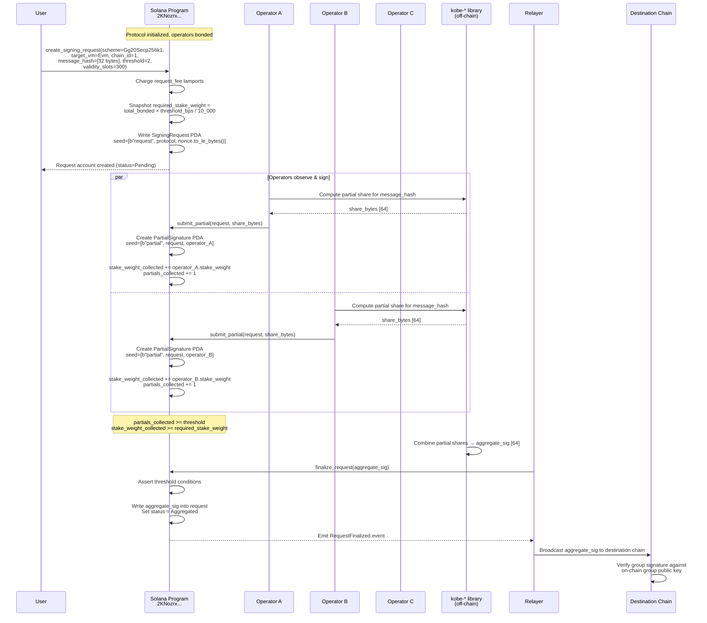
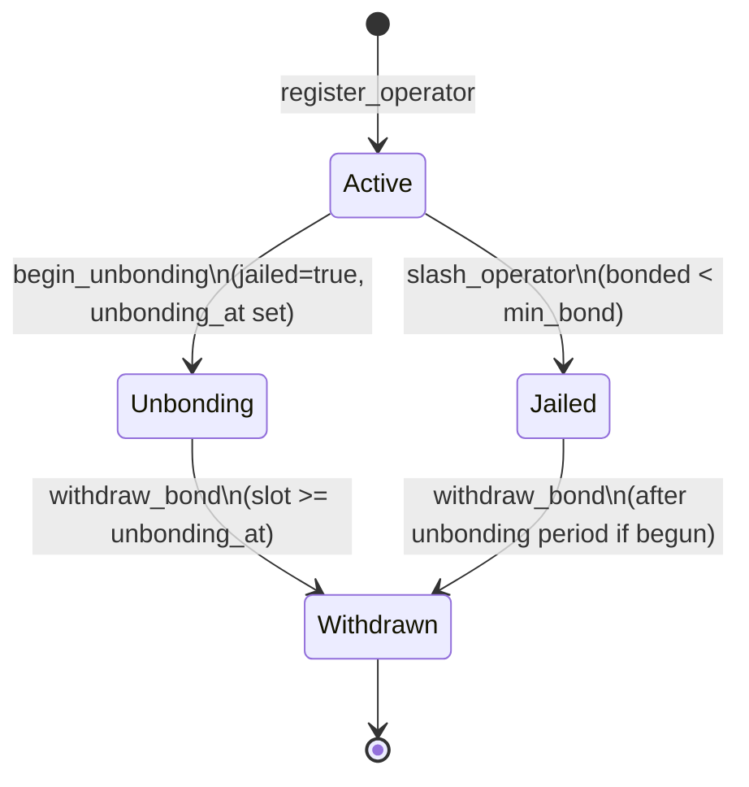

# How It Works

Distin turns Solana into a **threshold-signature control plane**. Every cross-chain signing action moves through four phases: operator bonding, intent posting, partial-signature aggregation, and off-chain relay. Each phase is enforced on-chain by the program deployed at `4xy9dYHfAzi7cAcX5JHxNR6EoMJ9PGfeQDMHx6YUQQM6`. This page traces those phases end-to-end with the exact account layouts, instruction signatures, invariants, and failure modes that govern each step.

---

## The Core Insight: Solana as Control Plane

Most cross-chain signature schemes treat their coordination layer as an afterthought -- a side-car service that operators watch out-of-band. Distin inverts this: the *coordination layer is the Solana program itself*.

Solana's ~400ms slot time matters here in a concrete way. A multi-round MPC protocol like GG20 requires 3--7 network round trips between signing parties. At 400ms finality, those rounds complete in seconds rather than minutes. Chains with 12-second block times (Ethereum) or 10-minute block times (Bitcoin) cannot serve as the coordination plane for their own outbound signing -- they are too slow to be their own synchronization primitive. Distin uses Solana slots as the liveness clock for request deadlines, partial-submission ordering, and unbonding windows.

The on-chain layer is responsible for:

- **Economic security accounting** -- operator bonds, stake-weight computation via Pyth oracle, slash pool
- **Threshold enforcement** -- whether collected weight ≥ required weight, whether partial count ≥ threshold
- **Liveness deadlines** -- slot-based expiry windows, `MAX_VALIDITY_SLOTS_CEILING`
- **Double-submission prevention** -- PDA uniqueness on `[PARTIAL_SEED, request, operator]`
- **Slashing execution** -- collateral movement into the slash pool, jailing, weight recalculation

The on-chain layer is **not** responsible for:

- Cryptographic share verification (delegated to off-chain `kobe-{svm,evm,tron,cosmos}` signing libraries)
- Final group key combination (off-chain, produce the `aggregate_sig` written back on finalization)
- Broadcasting the aggregate signature to the destination chain (off-chain relayer)

---

## Phase 0 — Protocol Initialization

Before any operator can bond or user can request a signature, a singleton `Protocol` account must be bootstrapped via `initialize`. This is a one-time permissioned call.

```rust
pub fn initialize(
    ctx: Context<Initialize>,
    threshold_bps: u16,       // fraction of total_bonded required; 1–10_000
    min_bond: u64,            // minimum LST atoms an operator must post
    unbonding_slots: u64,     // slots an operator waits before withdrawing bond
    request_fee: u64,         // lamports charged per signing request
    max_validity_slots: u64,  // upper bound on request expiry; ≤ 432_000
    lst_price_feed: Pubkey,   // Pyth price account for the bonded LST
) -> Result<()>
```

The `Protocol` account is a PDA derived from `[b"protocol"]`. It holds the entire global accounting state in 248 bytes (+8 discriminator):

| Field | Type | Description |
|---|---|---|
| `admin` | `Pubkey` | Current admin authority |
| `pending_admin` | `Pubkey` | Nominated successor (two-step handover); `Pubkey::default()` until set |
| `bond_mint` | `Pubkey` | Token-2022 LST mint accepted as collateral |
| `bond_vault` | `Pubkey` | PDA-owned vault holding active bonds |
| `slash_pool` | `Pubkey` | PDA-owned pool collecting slashed collateral |
| `lst_price_feed` | `Pubkey` | Pyth price account for LST→SOL valuation |
| `threshold_bps` | `u16` | bps fraction of `total_bonded` that must sign |
| `min_bond` | `u64` | Minimum bond in raw LST atoms |
| `unbonding_slots` | `u64` | Unbonding delay in slots |
| `request_fee` | `u64` | Lamports per signing request |
| `max_validity_slots` | `u64` | Hard ceiling on request validity window |
| `operator_count` | `u32` | Active operators in the signing set |
| `total_bonded` | `u64` | Sum of active operators' stake weight |
| `request_nonce` | `u64` | Monotonic counter seeding request PDAs |
| `paused` | `bool` | Emergency pause flag |
| `bump` | `u8` | PDA canonical bump |

`initialize` enforces three invariants immediately:

```
threshold_bps ∈ [1, 10_000]          → DistinError::InvalidThreshold
min_bond > 0                          → DistinError::InsufficientBond
max_validity_slots ∈ [1, 432_000]    → DistinError::InvalidValidityWindow
```

The constant `MAX_VALIDITY_SLOTS_CEILING = 432_000` corresponds to ~48 hours at 400ms per slot. Stale requests that linger longer than this would corrupt the economic-security snapshot (see Phase 2).

### Admin Two-Step Handover

Admin is transferred in two steps to prevent accidental key loss:

```rust
// Step 1 — current admin nominates a successor
pub fn transfer_admin(ctx: Context<AdminConfig>, new_admin: Pubkey) -> Result<()>
// Writes new_admin into protocol.pending_admin (cannot be Pubkey::default())

// Step 2 — successor claims the role by signing
pub fn accept_admin(ctx: Context<AcceptAdmin>) -> Result<()>
// Asserts ctx.accounts.new_admin.key() == protocol.pending_admin
// Promotes pending_admin → admin, clears pending_admin to Pubkey::default()
```

---

## Phase 1 — Operator Registration & Bonding

An operator joins the signing set by calling `register_operator`, depositing LST collateral into the protocol-owned vault.

```rust
pub fn register_operator(
    ctx: Context<RegisterOperator>,
    group_pubkey: [u8; 33],   // compressed FROST/ECDSA group share identifier
    bond_amount: u64,         // raw LST atoms; must be ≥ protocol.min_bond
) -> Result<()>
```

The instruction does four things atomically:

1. **Token transfer** -- pulls `bond_amount` from `operator_token_account` into the `bond_vault` via a CPI to the Token-2022 program (`transfer_checked` with the mint's decimal precision).
2. **Stake-weight computation** -- calls `compute_stake_weight(&lst_price_feed, bond_amount)`, which reads the Pyth oracle to derive a SOL-denominated economic weight from the raw LST amount.
3. **Operator account creation** -- writes the `Operator` PDA at seeds `[b"operator", protocol, authority]`.
4. **Protocol accounting update** -- increments `protocol.total_bonded` by `stake_weight` and `protocol.operator_count` by 1.

The `Operator` account (143 bytes + 8 discriminator) tracks:

| Field | Type | Description |
|---|---|---|
| `protocol` | `Pubkey` | Owning protocol |
| `authority` | `Pubkey` | Operator signer key |
| `group_pubkey` | `[u8; 33]` | Compressed group pub key / FROST share identifier |
| `bonded_amount` | `u64` | Raw LST atoms held in vault |
| `stake_weight` | `u64` | SOL-denominated economic weight |
| `partials_submitted` | `u64` | Lifetime partial signature count |
| `slash_count` | `u32` | Slash event count |
| `jailed` | `bool` | Cannot sign new requests when `true` |
| `unbonding_at` | `u64` | Slot unbonding completes; `0` while active |
| `joined_slot` | `u64` | Slot of registration |
| `bump` | `u8` | PDA canonical bump |

On success the program emits:

```rust
emit!(OperatorRegistered {
    operator: operator.key(),
    authority: operator.authority,
    stake_weight,
});
```

### Threshold Impact

Every new operator immediately shifts the global `total_bonded`. Because `required_stake_weight` is **snapshotted at request creation time** (not evaluated live), operators that join after a request is posted do not affect that request's threshold. This prevents griefing via operator churn.

---

## Phase 2 — Posting a Signing Intent

A user (or protocol integration) calls `create_signing_request` to publish the intent on-chain.

```rust
pub fn create_signing_request(
    ctx: Context<CreateSigningRequest>,
    scheme: SignatureScheme,      // FrostEd25519 | Gg20Secp256k1
    target_vm: TargetVm,         // Svm | Evm | Tron | Cosmos | Bitcoin
    target_chain_id: u64,        // EVM chain id, Cosmos chain index, etc.
    message_hash: [u8; 32],      // 32-byte hash of the tx/message to sign
    threshold: u16,              // minimum distinct partials required; 1..=operator_count
    validity_slots: u64,         // request lifetime; 1..=max_validity_slots
) -> Result<()>
```

### Scheme × VM Routing

The `scheme` and `target_vm` fields determine which off-chain signing library handles the cryptographic work:

| `SignatureScheme` | `TargetVm` | Off-chain library | Curve |
|---|---|---|---|
| `FrostEd25519` | `Svm` | `kobe-svm` | Ed25519 (Schnorr) |
| `FrostEd25519` | `Cosmos` | `kobe-cosmos` | Ed25519 (Schnorr) |
| `Gg20Secp256k1` | `Evm` | `kobe-evm` | secp256k1 (ECDSA) |
| `Gg20Secp256k1` | `Tron` | `kobe-tron` | secp256k1 (ECDSA) |
| `Gg20Secp256k1` | `Bitcoin` | `kobe-evm` | secp256k1 (ECDSA) |

The on-chain program does not verify the (scheme, target_vm) pairing. The correctness of that choice is the requester's responsibility; a mismatched pair produces an unusable aggregate signature on the destination chain.

### Economic Security Snapshot

The required stake weight is locked in at creation time:

```rust
let required_stake_weight = protocol
    .total_bonded
    .checked_mul(protocol.threshold_bps as u64)
    .ok_or(DistinError::MathOverflow)?
    / BPS_DENOMINATOR;
```

So if `total_bonded = 1_000_000` and `threshold_bps = 6_000`, the request requires `600_000` stake weight worth of partial signatures before it can be finalized. This value is written into `SigningRequest.required_stake_weight` and does not change for the lifetime of the request.

### Request Fee

If `protocol.request_fee > 0`, the instruction CPIs into the system program to charge the requester:

```rust
system_program::transfer(
    CpiContext::new(...),
    protocol.request_fee, // lamports
)?;
```

The fee lands in the protocol PDA account (rent-exemption balance is additive). There is no fee refund on expiry or cancellation.

### Request Account

The `SigningRequest` PDA is created at seeds `[b"request", protocol, request_id.to_le_bytes()]` where `request_id = protocol.request_nonce` (incremented after creation). The account is 224 bytes (+8 discriminator):

| Field | Type | Initial Value |
|---|---|---|
| `request_id` | `u64` | `protocol.request_nonce` at creation |
| `scheme` | `SignatureScheme` | caller-supplied |
| `target_vm` | `TargetVm` | caller-supplied |
| `target_chain_id` | `u64` | caller-supplied |
| `message_hash` | `[u8; 32]` | caller-supplied (must be non-zero) |
| `threshold` | `u16` | caller-supplied |
| `partials_collected` | `u16` | `0` |
| `stake_weight_collected` | `u64` | `0` |
| `required_stake_weight` | `u64` | snapshotted from `total_bonded * threshold_bps / 10_000` |
| `created_slot` | `u64` | `Clock::get().slot` |
| `expiry_slot` | `u64` | `created_slot + validity_slots` |
| `status` | `RequestStatus` | `Pending` |
| `aggregate_sig` | `[u8; 64]` | `[0u8; 64]` |

### Pre-flight Checks

`create_signing_request` fails with the following errors before writing any state:

| Check | Error |
|---|---|
| `protocol.paused` | `ProtocolPaused` |
| `protocol.operator_count == 0` | `NoActiveOperators` |
| `message_hash` is all-zero | `EmptyMessageHash` |
| `threshold < 1` or `threshold > operator_count` | `InvalidThreshold` |
| `validity_slots < 1` or `validity_slots > max_validity_slots` | `InvalidValidityWindow` |
| `total_bonded * threshold_bps` overflows `u64` | `MathOverflow` |

---

## Phase 3 — Partial Signature Submission & Aggregation

After a request is posted, eligible operators (not jailed, not unbonding) watch for new `SigningRequest` accounts and submit their partial signatures via `submit_partial`. Each submission creates a `PartialSignature` PDA.

### PartialSignature Account

Seeds: `[b"partial", request, operator]`. The PDA uniqueness at these seeds means an operator cannot submit twice for the same request -- the account init will fail on a duplicate attempt.

| Field | Type | Description |
|---|---|---|
| `request` | `Pubkey` | Request this share contributes to |
| `operator` | `Pubkey` | Operator that submitted the share |
| `scheme` | `SignatureScheme` | Must match `request.scheme` → `SchemeMismatch` on mismatch |
| `share` | `[u8; 64]` | 64-byte partial-signature share material |
| `submitted_slot` | `u64` | Slot of submission |
| `stake_weight` | `u64` | Operator's stake weight credited |
| `bump` | `u8` | PDA canonical bump |

The on-chain layer credits `stake_weight_collected += operator.stake_weight` and increments `partials_collected`. Cryptographic validity of the `share` bytes is verified by the off-chain `kobe-*` library before submission; the program itself treats `share` as opaque 64-byte data.

### Finalization

Once the program sees:

```
request.stake_weight_collected >= request.required_stake_weight
AND
request.partials_collected >= request.threshold
```

the `finalize_request` instruction can be called. The off-chain `kobe-*` library combines the partial shares into the final group signature and passes the 64-byte result as `aggregate_sig`. The program verifies the threshold conditions, writes `aggregate_sig` into `request.aggregate_sig`, and sets `request.status = RequestStatus::Aggregated`.

A `RequestAlreadyFinalized` error is returned if the request is already `Aggregated`.

---

## Full Sequence Diagram



---

## Phase 4 — Off-chain Relay

The program does not directly call the destination chain. Instead it writes the finalized `aggregate_sig` field and emits a `RequestFinalized` event. An off-chain relayer monitors the program's event stream, reads the `SigningRequest` account at `[b"request", protocol, request_id_le]`, and submits the `aggregate_sig` bytes to the appropriate destination:

- **EVM chains:** `eth_sendRawTransaction` with the aggregated secp256k1 ECDSA signature recovered via `kobe-evm`
- **SVM / Aptos:** transaction with the aggregated Ed25519 Schnorr signature from `kobe-svm`
- **Tron:** `kobe-tron` produces a Tron-encoded secp256k1 signature
- **Cosmos:** `kobe-cosmos` wraps the Ed25519 Schnorr share in a CosmosSDK-compatible signature envelope
- **Bitcoin:** `kobe-evm` secp256k1 ECDSA output, serialized per the relevant Bitcoin script type

The relayer is trust-minimized in the sense that the aggregate signature is deterministic from the on-chain partial shares: any party with the on-chain data can reconstruct and relay it.

---

## Operator Lifecycle & Economic Security

### Unbonding

An operator initiates exit by calling `begin_unbonding`:

```rust
pub fn begin_unbonding(ctx: Context<OperatorLifecycle>) -> Result<()>
```

The instruction:

1. Asserts `operator.unbonding_at == 0` (not already unbonding → `AlreadyUnbonding`)
2. Sets `operator.unbonding_at = clock.slot + protocol.unbonding_slots`
3. Sets `operator.jailed = true` -- immediately removes the operator from the active signing set
4. Decrements `protocol.total_bonded` by `operator.stake_weight`
5. Decrements `protocol.operator_count` by 1

The operator cannot sign new requests from this point. Their bond remains in the vault and is slashable until `withdraw_bond` completes.

### Bond Withdrawal

After `clock.slot >= operator.unbonding_at`, the operator calls `withdraw_bond`:

```rust
pub fn withdraw_bond(ctx: Context<WithdrawBond>) -> Result<()>
```

The program:
1. Asserts `operator.unbonding_at != 0` → `NotUnbonding`
2. Asserts `clock.slot >= operator.unbonding_at` → `UnbondingNotComplete`
3. CPIs into Token-2022 to return `operator.bonded_amount` from the vault to `operator_token_account`, signing with the protocol PDA seeds `[PROTOCOL_SEED, &[protocol.bump]]`
4. Closes the operator account (rent returned to authority)

### Slashing

The admin calls `slash_operator` with a `reason: u8` code and `amount: u64` of LST atoms to slash:

```rust
pub fn slash_operator(
    ctx: Context<SlashOperator>,
    amount: u64,  // must be ≤ operator.bonded_amount → SlashAmountExceedsBond
    reason: u8,
) -> Result<()>
```

The flow:

1. Transfers `amount` from `bond_vault` to `slash_pool` via Token-2022 CPI (signed by protocol PDA)
2. Decrements `operator.bonded_amount -= amount`
3. Increments `operator.slash_count`
4. Recomputes `operator.stake_weight` from the residual bond via the oracle
5. If `operator.bonded_amount < protocol.min_bond` → sets `operator.jailed = true`
6. If the operator was active before the slash (not already jailed/unbonding), recalculates `protocol.total_bonded` using the weight delta; if the operator is now jailed, also decrements `protocol.operator_count`



---

## Threshold Math in Detail

The stake-weight threshold is evaluated in two places with subtly different semantics.

### At Request Creation

```rust
let required_stake_weight = protocol
    .total_bonded
    .checked_mul(protocol.threshold_bps as u64)
    .ok_or(DistinError::MathOverflow)?
    / BPS_DENOMINATOR;           // BPS_DENOMINATOR = 10_000
```

This is a snapshot. If `total_bonded` at creation time is `800_000` weight units and `threshold_bps = 6667`, then `required_stake_weight = 533_360`. Operators that join or leave after this snapshot do not affect this value.

### At Finalization

The program checks both independently:

```
stake_weight_collected >= required_stake_weight   (economic security)
partials_collected     >= threshold               (distinct-operator count)
```

Both must be satisfied. A single high-weight operator cannot satisfy the count threshold alone; a large number of dust-bond operators cannot satisfy the weight threshold alone.

### Stake Weight Computation

`compute_stake_weight(&lst_price_feed, bond_amount)` reads the Pyth oracle account stored in `protocol.lst_price_feed`. If the price data is stale or the account does not match the configured feed, the call fails with `StaleOraclePrice` or `InvalidOracleAccount` respectively. The weight is denominated in SOL terms, not raw LST atoms, so LST price volatility directly affects operator weight and therefore threshold calculations.

---

## PDA Account Map

```
[b"protocol"]
    └─ Protocol (singleton, 248+8 bytes)
          ├─ bond_vault (Token-2022 account, PDA-owned)
          │    seed: [b"bond_vault", protocol]
          └─ slash_pool (Token-2022 account, PDA-owned)
               seed: [b"slash_pool", protocol]

[b"operator", protocol, authority]
    └─ Operator (per signing-set member, 143+8 bytes)

[b"request", protocol, request_id_le_bytes]
    └─ SigningRequest (per intent, 224+8 bytes)
          └─ [b"partial", request, operator]
               └─ PartialSignature (per (request, operator) pair, 146+8 bytes)
```

PDA uniqueness at `[b"partial", request, operator]` is the sole on-chain double-submission guard. An operator that attempts to submit a second partial for the same request will hit an `AccountAlreadyInitialized` error from Anchor's `init` constraint, before any program logic runs.

---

## Signature Scheme Branching

The `SignatureScheme` enum encodes the cryptographic family needed at the destination:

```rust
pub enum SignatureScheme {
    FrostEd25519,   // FROST Schnorr, Ed25519 curve — SVM / Aptos / Sui
    Gg20Secp256k1,  // GG20 threshold ECDSA, secp256k1 curve — EVM / BTC / Tron
}
```

| Property | `FrostEd25519` | `Gg20Secp256k1` |
|---|---|---|
| Curve | Ed25519 | secp256k1 |
| Protocol | FROST (RFC 9591) | GG20 |
| Share size (on-chain) | 64 bytes in `share` | 64 bytes in `share` |
| Aggregate sig | 64-byte Ed25519 Schnorr sig | 64-byte compact ECDSA (r ∥ s) |
| Off-chain library | `kobe-svm` / `kobe-cosmos` | `kobe-evm` / `kobe-tron` |
| Round complexity | 2-round FROST | 3--7 round GG20 |

The on-chain program does not branch on `scheme` internally -- the `share` field is 64 bytes regardless. The scheme is recorded so that off-chain components route to the correct signing library and so that the `submit_partial` instruction can reject mismatches (`SchemeMismatch`) between a partial's declared scheme and the parent request's scheme.

---

## Edge Cases and Failure Modes

### Request Expires Before Threshold

If `clock.slot > request.expiry_slot` when `finalize_request` is called, the program returns `RequestExpired`. The request status is written as `Expired`. The requester's fee is not refunded. Partial-signature submitters have already paid their transaction fees.

The maximum expiry window is enforced at creation by `MAX_VALIDITY_SLOTS_CEILING = 432_000` slots (~48 hours). A request cannot be created with `validity_slots > 432_000`.

### Operator Slashed Mid-Request

If an operator is slashed between submitting a partial and request finalization, their already-credited `stake_weight` in `PartialSignature.stake_weight` and `request.stake_weight_collected` are **not retroactively adjusted**. The stake weight credited to a partial is snapshotted at submission time. This is intentional: retroactive weight removal would allow griefing attacks where a slash precisely targets operators whose partials are already counted, retroactively invalidating an otherwise-valid request.

The economic consequence is that the aggregated signature may represent slightly less economic weight than the threshold required at finalization time if the operator was slashed between submission and finalization. The snapshot at creation (`required_stake_weight`) and the snapshot per partial (`PartialSignature.stake_weight`) both use point-in-time oracle reads.

### Operator Jailed Before Threshold

An operator that is jailed (via `begin_unbonding` or `slash_operator`) can no longer submit new partials. Any partials already submitted and counted are valid. If the count of remaining active operators drops below `threshold`, a pending request becomes permanently unfulfillable and will expire.

### Oracle Staleness

`compute_stake_weight` reads the Pyth account in `protocol.lst_price_feed`. If the price is stale at registration or slash time, the call fails with `StaleOraclePrice`. If the wrong oracle account is passed, it fails with `InvalidOracleAccount`. The oracle account is enforced to match `protocol.lst_price_feed`.

### Protocol Paused

While `protocol.paused = true`, the following instructions are blocked and return `ProtocolPaused`:

- `register_operator`
- `begin_unbonding`
- `create_signing_request`

Admin lifecycle instructions (`update_config`, `pause`, `unpause`, `transfer_admin`, `accept_admin`) and `slash_operator` remain callable while paused. This allows the admin to respond to incidents without losing the ability to slash misbehaving operators.

### Arithmetic Overflow

All arithmetic on `total_bonded`, `operator_count`, and `required_stake_weight` uses Rust `checked_*` arithmetic. Any overflow returns `MathOverflow` and reverts the entire instruction. Underflows on `total_bonded` and `operator_count` during removal use `saturating_sub` rather than `checked_sub` to ensure the protocol never hard-faults on an accounting inconsistency.

---

## Complete Error Reference

| Error | Code | Trigger |
|---|---|---|
| `ProtocolPaused` | 6000 | `paused = true` on a blocked instruction |
| `Unauthorized` | 6001 | `accept_admin` called by non-pending-admin |
| `InvalidThreshold` | 6002 | `threshold_bps` outside `[1, 10_000]`; request threshold outside `[1, operator_count]` |
| `InsufficientBond` | 6003 | `bond_amount < min_bond`; `min_bond = 0` on init |
| `OperatorJailed` | 6004 | Jailed operator attempts to submit a partial |
| `AlreadyUnbonding` | 6005 | `begin_unbonding` on an already-unbonding operator |
| `NotUnbonding` | 6006 | `withdraw_bond` before `begin_unbonding` |
| `UnbondingNotComplete` | 6007 | `withdraw_bond` before `unbonding_at` slot |
| `RequestExpired` | 6008 | `clock.slot > expiry_slot` on submit or finalize |
| `RequestNotPending` | 6009 | Submit/finalize on non-`Pending` request |
| `ThresholdNotMet` | 6010 | Finalize called before weight/count thresholds satisfied |
| `RequestAlreadyFinalized` | 6011 | Finalize on `Aggregated` request |
| `MalformedPartialSignature` | 6012 | Share bytes fail format validation |
| `EmptyMessageHash` | 6013 | All-zero `message_hash` |
| `SchemeMismatch` | 6014 | `partial.scheme != request.scheme` |
| `StaleOraclePrice` | 6015 | Pyth price data is stale |
| `InvalidOracleAccount` | 6016 | Oracle account != `protocol.lst_price_feed` |
| `InvalidVault` | 6017 | Vault or pool account doesn't match protocol config |
| `InvalidValidityWindow` | 6018 | `validity_slots` outside `[1, 432_000]`; `max_validity_slots` same on init |
| `NoActiveOperators` | 6019 | `operator_count == 0` on request creation |
| `SlashAmountExceedsBond` | 6020 | `amount > operator.bonded_amount` |
| `InvalidAdminTransfer` | 6021 | `new_admin == Pubkey::default()` |
| `MathOverflow` | 6022 | `checked_*` arithmetic failed |

---

## Working End-to-End Example

The following TypeScript sketch (using `@coral-xyz/anchor`) shows the complete happy path from operator registration to a finalized EVM signing request.

```typescript
// Derive PDAs
const [protocolPda] = PublicKey.findProgramAddressSync(
  [Buffer.from("protocol")],
  Distin_PROGRAM_ID
);

const [operatorPda] = PublicKey.findProgramAddressSync(
  [Buffer.from("operator"), protocolPda.toBuffer(), authority.publicKey.toBuffer()],
  Distin_PROGRAM_ID
);

// --- Operator registration ---
await program.methods
  .registerOperator(
    Array.from(groupPubkey33Bytes),   // [u8; 33] compressed public key
    new BN(5_000_000_000)             // 5,000 LST atoms (must be >= min_bond)
  )
  .accounts({
    protocol: protocolPda,
    operator: operatorPda,
    authority: authority.publicKey,
    operatorTokenAccount: operatorAta,
    bondVault: bondVaultPda,
    bondMint: bondMintPubkey,
    lstPriceFeed: pythLstFeedPubkey,
    tokenProgram: TOKEN_2022_PROGRAM_ID,
    systemProgram: SystemProgram.programId,
  })
  .signers([authority])
  .rpc();

// --- Post a signing intent for Ethereum mainnet ---
const messageHash = Buffer.from(
  keccak256(ethers.utils.arrayify(rawTxBytes)),
  "hex"
);                        // exactly 32 bytes, non-zero

const [requestPda] = PublicKey.findProgramAddressSync(
  [
    Buffer.from("request"),
    protocolPda.toBuffer(),
    currentNonce.toArrayLike(Buffer, "le", 8),
  ],
  Distin_PROGRAM_ID
);

await program.methods
  .createSigningRequest(
    { gg20Secp256k1: {} },    // SignatureScheme enum variant
    { evm: {} },              // TargetVm enum variant
    new BN(1),                // Ethereum mainnet chain_id = 1
    Array.from(messageHash),  // [u8; 32]
    2,                        // threshold: 2 distinct operators
    new BN(150)               // validity: 150 slots ≈ 60 seconds
  )
  .accounts({
    protocol: protocolPda,
    request: requestPda,
    requester: user.publicKey,
    systemProgram: SystemProgram.programId,
  })
  .signers([user])
  .rpc();

// --- Operator A submits partial signature ---
const [partialPdaA] = PublicKey.findProgramAddressSync(
  [Buffer.from("partial"), requestPda.toBuffer(), operatorPdaA.toBuffer()],
  Distin_PROGRAM_ID
);

await program.methods
  .submitPartial(
    { gg20Secp256k1: {} },       // must match request.scheme → SchemeMismatch if not
    Array.from(shareA64Bytes)    // [u8; 64] partial share from kobe-evm
  )
  .accounts({
    protocol: protocolPda,
    request: requestPda,
    operator: operatorPdaA,
    partial: partialPdaA,
    authority: operatorAuthA.publicKey,
    systemProgram: SystemProgram.programId,
  })
  .signers([operatorAuthA])
  .rpc();

// --- After operators A and B submit, relayer finalizes ---
const aggregateSig = kobeEvm.combineShares([shareA64Bytes, shareB64Bytes]);

await program.methods
  .finalizeRequest(Array.from(aggregateSig))
  .accounts({
    protocol: protocolPda,
    request: requestPda,
  })
  .rpc();

// request.status is now Aggregated
// request.aggregate_sig holds the 64-byte (r ∥ s) ECDSA signature
// Relayer reads it and calls eth_sendRawTransaction on Ethereum mainnet
```

---

## Constants Quick Reference

| Constant | Value | Meaning |
|---|---|---|
| `BPS_DENOMINATOR` | `10_000` | Denominator for all bps calculations |
| `MAX_VALIDITY_SLOTS_CEILING` | `432_000` | ~48 hours at 400ms/slot; hard cap on request lifetime |
| `PROTOCOL_SEED` | `b"protocol"` | Singleton protocol PDA seed |
| `BOND_VAULT_SEED` | `b"bond_vault"` | Active bond vault PDA seed |
| `SLASH_POOL_SEED` | `b"slash_pool"` | Slashed collateral pool PDA seed |
| `OPERATOR_SEED` | `b"operator"` | Per-operator PDA seed |
| `REQUEST_SEED` | `b"request"` | Per-signing-request PDA seed |
| `PARTIAL_SEED` | `b"partial"` | Per-(request, operator) partial PDA seed |
| Program ID | `4xy9dYHfAzi7cAcX5JHxNR6EoMJ9PGfeQDMHx6YUQQM6` | Deployed program address |