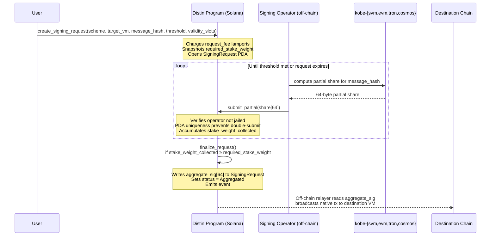
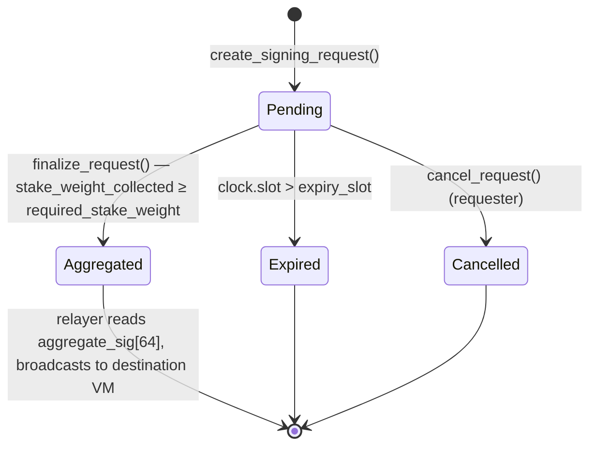

# Distin

**Threshold-signature coordination and aggregation on Solana.** One Solana account signs natively for any chain — no bridge contracts, no wrapped assets, no lock-and-mint. Solana is the control plane: operators bond slashable LST collateral, users post signing intents as instructions, and the program enforces threshold logic at 400 ms per-slot resolution so multi-round MPC completes in near-real-time.

> Program ID: `4xy9dYHfAzi7cAcX5JHxNR6EoMJ9PGfeQDMHx6YUQQM6`

---

## The Problem Distin Solves

Cross-chain bridging forces every asset to travel through a lock-and-mint contract. The contract holds custody, creates a synthetic representation, and introduces a new trust assumption at every hop. The canonical failure mode is well-documented: the custodial bridge becomes the most valuable attack target on the destination chain.

Distin reverses the model. Instead of moving assets to a chain where a user's key does not exist, Distin extends the user's existing key to every chain by producing a valid native signature for that chain's VM — Ed25519 for Aptos/Sui/Solana-style VMs, secp256k1 ECDSA for Ethereum/BTC/Tron. No asset moves. No custody. The destination chain sees a signature that is indistinguishable from one produced by the user's local key.

The coordination bottleneck in threshold-signature systems has historically been the multi-round MPC ceremony itself: FROST requires two rounds of communication among all signers; GG20 requires three or more. The reason Solana is used as the control plane rather than Ethereum or an L2 is blunt arithmetic: 400 ms slot time collapses a three-round ceremony that would take 45 seconds on a 15-second block chain into under two seconds of on-chain latency.

---

## High-Level Architecture



The on-chain program is responsible exclusively for: bonded-collateral accounting, threshold enforcement, liveness deadlines, and slashing. Cryptographic share verification and group-key combination are the domain of the off-chain `kobe-{svm,evm,tron,cosmos}` signing libraries; the integration points are marked in the source but the math lives off-chain.

---

## Core Concepts

### Signing Intent (SigningRequest)

A user posts a 32-byte `message_hash` — the hash of the transaction or payload they want signed on the destination chain — alongside a `scheme`, `target_vm`, `target_chain_id`, and a `validity_slots` window. The program snapshots the current economic-security target at that moment:

```
required_stake_weight = total_bonded * threshold_bps / BPS_DENOMINATOR
```

`BPS_DENOMINATOR` is fixed at `10_000`. If `threshold_bps = 6_667`, at least two-thirds of total bonded weight must contribute partial signatures before the request can finalize. The snapshot is immutable for the life of the request, insulating it from operators joining or leaving mid-flight.

The request expires at `created_slot + validity_slots`. The hard ceiling is `MAX_VALIDITY_SLOTS_CEILING = 432_000` slots, which is approximately 48 hours at 400 ms per slot. Requests that are not finalized by `expiry_slot` can be cancelled and their status set to `Expired`.

### Signing Scheme Routing

Distin branches on two cryptographic families, selected by the requester at intent creation and enforced by the program on every partial-signature submission (`SchemeMismatch` is returned if they diverge):

| `SignatureScheme` variant | Algorithm | Target VM family |
|---|---|---|
| `FrostEd25519` | FROST Schnorr over Ed25519 | `Svm`, and Aptos/Sui-style chains |
| `Gg20Secp256k1` | GG20-style threshold ECDSA over secp256k1 | `Evm`, `Tron`, `Cosmos`, `Bitcoin` |

The `TargetVm` enum values are: `Svm`, `Evm`, `Tron`, `Cosmos`, `Bitcoin`. `target_chain_id` carries the chain-specific identifier (EVM chain id, Cosmos chain index, etc.) and is opaque to the on-chain program — it is passed through to the aggregate output so the relayer knows where to broadcast.

### Operator Bond and Stake Weight

Operators are not distinguished by count alone — they are weighted by economic stake. An operator bonds Token-2022 LST into the protocol-owned `bond_vault`. The program converts this raw LST amount into a SOL-denominated `stake_weight` via a Pyth price feed (`lst_price_feed` on the `Protocol` account, validated against `InvalidOracleAccount` and `StaleOraclePrice`). This weight is what accumulates in `stake_weight_collected` on each signing request.

The minimum bond to join the signing set is the protocol-configured `min_bond`. Operators below `min_bond` after a slash are automatically jailed (`jailed = true`); they can no longer sign new requests.

### Slashing and Jailing

The `slash_operator` instruction moves `amount` LST from `bond_vault` to `slash_pool` (a separate protocol-owned Token-2022 account). The `reason: u8` field is an opaque fraud-proof classifier produced by the off-chain signing library — the on-chain program enforces the economic effect without verifying the cryptographic proof itself. After slashing:

- `bonded_amount` is reduced
- `stake_weight` is recomputed from the residual bond
- If `bonded_amount < min_bond`, `jailed = true`
- If the operator was previously active, `total_bonded` and `operator_count` on the `Protocol` account are updated immediately

Slashed funds accumulate in `slash_pool` and are not automatically redistributed; the protocol admin controls their disposition.

### Unbonding Delay

To prevent an operator from front-running a fraud proof by immediately withdrawing their bond, `begin_unbonding` sets `unbonding_at = current_slot + unbonding_slots` and jails the operator. Only after `clock.slot >= unbonding_at` can `withdraw_bond` execute the Token-2022 transfer back to the operator's account. The `unbonding_slots` parameter is admin-configurable via `update_config`.

---

## Account Architecture

All accounts derive `InitSpace` from their field set. Rent is computed as `8 (discriminator) + T::INIT_SPACE` bytes.

| Account | PDA Seeds | INIT_SPACE | Total (with disc) | Count |
|---|---|---|---|---|
| `Protocol` | `[b"protocol"]` | 248 bytes | 256 bytes | 1 (singleton) |
| `Operator` | `[b"operator", protocol, authority]` | 143 bytes | 151 bytes | 1 per operator |
| `SigningRequest` | `[b"request", protocol, request_id_le]` | 224 bytes | 232 bytes | 1 per request |
| `PartialSignature` | `[b"partial", request, operator]` | 146 bytes | 154 bytes | 1 per (request × operator) |

Two additional Token-2022 accounts are owned by the protocol PDA but are not Anchor accounts with discriminators:

| Account | PDA Seeds | Purpose |
|---|---|---|
| `bond_vault` | `[b"bond_vault", protocol]` | Holds active operator bonds |
| `slash_pool` | `[b"slash_pool", protocol]` | Accumulates slashed collateral |

The `PartialSignature` PDA's seeds — `[b"partial", request, operator]` — enforce uniqueness at the account layer. An operator that attempts to submit a second partial signature to the same request will trigger an `AccountAlreadyInitialized` error from the Anchor runtime before the instruction body is reached.

---

## Protocol Account Fields

The singleton `Protocol` account (PDA `[b"protocol"]`) holds all global parameters and live accounting:

```rust
pub struct Protocol {
    pub admin: Pubkey,             // current admin authority
    pub pending_admin: Pubkey,     // nominee in two-step handover; Pubkey::default() if unset
    pub bond_mint: Pubkey,         // Token-2022 LST mint accepted as collateral
    pub bond_vault: Pubkey,        // protocol-owned vault holding active bonds
    pub slash_pool: Pubkey,        // protocol-owned pool for slashed collateral
    pub lst_price_feed: Pubkey,    // Pyth price account for LST→SOL valuation
    pub threshold_bps: u16,        // fraction of total_bonded required per request (bps)
    pub min_bond: u64,             // minimum LST bond to join the signing set
    pub unbonding_slots: u64,      // delay between begin_unbonding and withdraw_bond
    pub request_fee: u64,          // lamports charged per signing request
    pub max_validity_slots: u64,   // hard ceiling on request expiry (≤ 432_000)
    pub operator_count: u32,       // active operators (excludes jailed / unbonding)
    pub total_bonded: u64,         // sum of active operators' stake_weight
    pub request_nonce: u64,        // monotonic counter seeding request PDAs
    pub paused: bool,              // emergency pause flag
    pub bump: u8,
}
```

`threshold_bps` must satisfy `1 ≤ threshold_bps ≤ 10_000` at both `initialize` and `update_config` time; values outside this range return `InvalidThreshold`.

---

## Operator Lifecycle

```mermaid
stateDiagram-v2
    [*] --> Active: register_operator(group_pubkey, bond_amount ≥ min_bond)
    Active --> Jailed_Unbonding: begin_unbonding()
    Active --> Jailed_Slashed: slash_operator() reduces bond < min_bond
    Jailed_Slashed --> Active: (no automatic path — admin must top up bond externally)
    Jailed_Unbonding --> Withdrawn: withdraw_bond() after clock.slot ≥ unbonding_at
    Withdrawn --> [*]: operator account closed; rent returned to authority
```



An operator in `Active` state has `jailed = false` and `unbonding_at = 0`. Both `jailed` flags (`AlreadyUnbonding` if `unbonding_at != 0`, `OperatorJailed` if `jailed = true`) block partial-signature submission. `begin_unbonding` is a one-way door per-account: it immediately sets `jailed = true`, decrements `protocol.operator_count`, and subtracts the operator's `stake_weight` from `protocol.total_bonded`.

The `group_pubkey: [u8; 33]` field on the `Operator` account stores the operator's 33-byte compressed group public key, used by the off-chain `kobe-*` libraries to verify share provenance. It is set at registration and is immutable.

---

## Signing Request Lifecycle



Every `SigningRequest` stores a running `aggregate_sig: [u8; 64]` accumulator. On `finalize_request`, the program writes the assembled group signature into this field and transitions `status` to `Aggregated`. An off-chain relayer observes the `Aggregated` event and broadcasts the native transaction to the destination chain — the relayer carries no signing key of its own.

`partials_collected: u16` counts the number of distinct operators that have submitted, while `stake_weight_collected: u64` tracks the economic weight. Both are incremented atomically in the same instruction as the `PartialSignature` account is created. The threshold check at finalization requires:

```
stake_weight_collected ≥ required_stake_weight
```

`required_stake_weight` is snapshotted at `create_signing_request` time so that an operator exiting or being slashed between intent creation and finalization cannot retroactively invalidate a legitimate collection window.

---

## Protocol Constants

| Constant | Value | Meaning |
|---|---|---|
| `BPS_DENOMINATOR` | `10_000` | Divisor for all basis-point calculations |
| `MAX_VALIDITY_SLOTS_CEILING` | `432_000` | Hard ceiling on `max_validity_slots` (~48 h at 400 ms/slot) |

The `request_fee` is denominated in **lamports** and transferred via `system_program::transfer` to the protocol PDA at `create_signing_request` time. It is separate from Solana rent, which is charged normally for the `SigningRequest` account itself.

---

## Error Reference Summary

All errors are defined in `DistinError`. The table below lists every variant and the guard that triggers it:

| Error | Trigger |
|---|---|
| `ProtocolPaused` | Any state-transition instruction while `protocol.paused = true` |
| `Unauthorized` | `accept_admin` called by non-`pending_admin` |
| `InvalidThreshold` | `threshold_bps` outside `[1, 10_000]` |
| `InsufficientBond` | `bond_amount < min_bond` at registration, or `min_bond = 0` at config |
| `OperatorJailed` | Partial submission by a jailed or unbonding operator |
| `AlreadyUnbonding` | `begin_unbonding` when `unbonding_at != 0` |
| `NotUnbonding` | `withdraw_bond` when `unbonding_at == 0` |
| `UnbondingNotComplete` | `withdraw_bond` before `clock.slot >= unbonding_at` |
| `RequestExpired` | Operation on a request past `expiry_slot` |
| `RequestNotPending` | Partial submission or finalization on a non-`Pending` request |
| `ThresholdNotMet` | Finalization attempted before threshold is satisfied |
| `RequestAlreadyFinalized` | Second finalization attempt on `Aggregated` request |
| `MalformedPartialSignature` | 64-byte share fails basic structure validation |
| `EmptyMessageHash` | `message_hash` is all zero bytes |
| `SchemeMismatch` | Partial share's `scheme` differs from the request's `scheme` |
| `StaleOraclePrice` | Pyth feed price is stale at bond or weight computation |
| `InvalidOracleAccount` | Oracle account key does not match `protocol.lst_price_feed` |
| `InvalidVault` | Vault or pool account passed does not match the protocol's stored key |
| `InvalidValidityWindow` | `validity_slots` outside `[1, max_validity_slots]` or exceeds `432_000` |
| `NoActiveOperators` | `create_signing_request` when `operator_count == 0` |
| `SlashAmountExceedsBond` | `amount > operator.bonded_amount` in `slash_operator` |
| `InvalidAdminTransfer` | `new_admin == Pubkey::default()` in `transfer_admin` |
| `MathOverflow` | Any checked arithmetic saturates (counters, weight accumulation) |

---

## What Distin Does Not Do

Being precise about scope matters for integration planning:

- **Cryptographic share verification is off-chain.** The on-chain program does not verify FROST commitments or GG20 zero-knowledge proofs. That work is delegated to the `kobe-{svm,evm,tron,cosmos}` signing libraries. The program verifies economic accounting and uniqueness; the signing libraries verify cryptographic correctness.
- **Relaying is off-chain.** After `status = Aggregated`, the `aggregate_sig[64]` stored in the `SigningRequest` account is read by an off-chain relayer that constructs and broadcasts the native transaction to the destination chain. No on-chain CPI to any destination chain is possible; this is an inherent constraint of Solana's execution environment.
- **No key generation or DKG on-chain.** The distributed key generation ceremony that produces operator shares and the `group_pubkey` is coordinated off-chain. Only the resulting compressed group public key (`[u8; 33]`) is registered on-chain at `register_operator` time.
- **Slash pool disposition.** Slashed collateral accumulates in `slash_pool` but the program does not implement redistribution logic. Governance over those funds is entirely in the hands of the admin key.

---

## Quick Example: End-to-End Flow

The following illustrates the minimum happy path for an EVM signing request using the TypeScript SDK (pseudocode — actual SDK types are in the API Reference):

```typescript
// 1. Derive the singleton protocol PDA
const [protocolPda] = PublicKey.findProgramAddressSync(
  [Buffer.from("protocol")],
  Distin_PROGRAM_ID
);

// 2. User creates a signing intent for Ethereum mainnet (chain id 1)
// message_hash is the 32-byte keccak256 of the EVM transaction payload
const tx = await program.methods
  .createSigningRequest(
    { gg20Secp256k1: {} },        // SignatureScheme::Gg20Secp256k1
    { evm: {} },                   // TargetVm::Evm
    new BN(1),                     // target_chain_id = Ethereum mainnet
    Array.from(messageHash),       // [u8; 32]
    3,                             // threshold: at least 3 partials required
    new BN(150)                    // validity_slots: ~60 seconds
  )
  .accounts({ requester: wallet.publicKey, protocol: protocolPda, /* ... */ })
  .rpc();

// 3. Operators observe the event, compute partial shares via kobe-evm,
//    and each submit a PartialSignature instruction.
//    The PDA [b"partial", request, operator] enforces uniqueness.

// 4. Once threshold is met, anyone can call finalize_request.
//    The aggregate_sig[64] field on the SigningRequest account
//    is written and status transitions to Aggregated.

// 5. The relayer reads aggregate_sig and broadcasts
//    the signed transaction to Ethereum.
```

---

## Navigation

| Page | Description |
|---|---|
| Architecture | Detailed component diagram: on-chain program, kobe signing libs, relayer |
| How It Works | Step-by-step instruction execution and state transitions |
| Security & Trust | Slashing conditions, fraud-proof lifecycle, oracle trust assumptions |
| Economics | Bond mechanics, fee model, stake-weight computation |
| Getting Started | Devnet deployment, CLI quickstart |
| Integration | SDK setup, account derivation, event subscription |
| API Reference | Full instruction signatures, account schemas, PDA derivation |
| Error Reference | Every `DistinError` variant with cause and resolution |
| FAQ | Common integration questions |