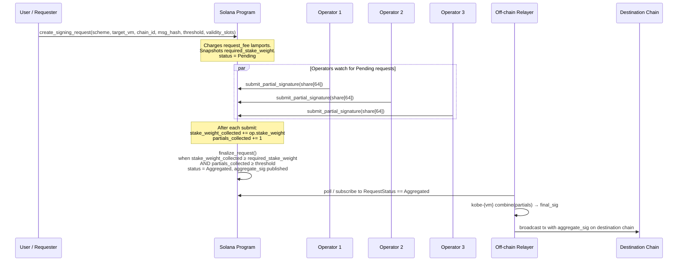

# Integration

Distin's on-chain program (`4xy9dYHfAzi7cAcX5JHxNR6EoMJ9PGfeQDMHx6YUQQM6`) acts as a coordination control plane: it holds economic state, enforces liveness deadlines, and publishes aggregate signatures that an off-chain relayer carries to the destination chain. This page covers every integration touchpoint — PDA derivation, account schemas, instruction parameters, TypeScript examples, and failure modes — drawn directly from `programs/distin/src/lib.rs` and `state.rs`.

---

## Prerequisites

| Dependency | Version |
|---|---|
| `@coral-xyz/anchor` | `^0.30.x` |
| `@solana/web3.js` | `^1.95.x` |
| `@solana/spl-token` | `^0.4.x` (Token-2022 support) |
| Solana CLI | `>=1.18.26` |
| Anchor CLI | `0.30.1` |

The program uses Token-2022 (`anchor_spl::token_interface`) for all LST bond transfers. Make sure you pass the Token-2022 program ID (`TokenzQdBNbLqP5VEhdkAS6EPFLC1PHnBqCXEpPxuEb`) wherever `token_program` is expected, not the legacy SPL token address.

---

## Program ID & Global Constants

```typescript
import { PublicKey } from "@solana/web3.js";

const Distin_PROGRAM_ID = new PublicKey(
  "4xy9dYHfAzi7cAcX5JHxNR6EoMJ9PGfeQDMHx6YUQQM6"
);

// Basis-point denominator for staked-weight threshold checks.
const BPS_DENOMINATOR = 10_000n;

// Hard ceiling on how far into the future a request's expiry can be set.
// Corresponds to ~48 hours at 400 ms per slot.
const MAX_VALIDITY_SLOTS_CEILING = 432_000n;
```

`BPS_DENOMINATOR` and `MAX_VALIDITY_SLOTS_CEILING` are protocol-level compile-time constants in `lib.rs`; they cannot be overridden by `update_config`. The practical implication: any `validity_slots` you pass to `create_signing_request` must satisfy `1 ≤ validity_slots ≤ min(protocol.max_validity_slots, 432_000)`.

---

## PDA Derivation Reference

All accounts in Distin are program-derived. The seed strings are byte-literals defined in `state.rs`; match them exactly (no null terminators, no length prefix).

| Account | Seeds | Notes |
|---|---|---|
| `Protocol` | `[b"protocol"]` | Singleton — one per deployment |
| `BondVault` | `[b"bond_vault", protocol_pubkey]` | Token-2022 account owned by Protocol PDA |
| `SlashPool` | `[b"slash_pool", protocol_pubkey]` | Token-2022 account owned by Protocol PDA |
| `Operator` | `[b"operator", protocol_pubkey, authority_pubkey]` | One per operator authority |
| `SigningRequest` | `[b"request", protocol_pubkey, request_id_le8]` | `request_id` is u64, little-endian 8 bytes |
| `PartialSignature` | `[b"partial", request_pubkey, operator_pubkey]` | Uniqueness prevents double-submit per (request, operator) pair |

```typescript
import { PublicKey } from "@solana/web3.js";
import BN from "bn.js";

function deriveProtocol(): [PublicKey, number] {
  return PublicKey.findProgramAddressSync(
    [Buffer.from("protocol")],
    Distin_PROGRAM_ID
  );
}

function deriveBondVault(protocolPda: PublicKey): [PublicKey, number] {
  return PublicKey.findProgramAddressSync(
    [Buffer.from("bond_vault"), protocolPda.toBuffer()],
    Distin_PROGRAM_ID
  );
}

function deriveSlashPool(protocolPda: PublicKey): [PublicKey, number] {
  return PublicKey.findProgramAddressSync(
    [Buffer.from("slash_pool"), protocolPda.toBuffer()],
    Distin_PROGRAM_ID
  );
}

function deriveOperator(
  protocolPda: PublicKey,
  authority: PublicKey
): [PublicKey, number] {
  return PublicKey.findProgramAddressSync(
    [Buffer.from("operator"), protocolPda.toBuffer(), authority.toBuffer()],
    Distin_PROGRAM_ID
  );
}

function deriveSigningRequest(
  protocolPda: PublicKey,
  requestId: bigint
): [PublicKey, number] {
  const idBuf = Buffer.alloc(8);
  idBuf.writeBigUInt64LE(requestId);
  return PublicKey.findProgramAddressSync(
    [Buffer.from("request"), protocolPda.toBuffer(), idBuf],
    Distin_PROGRAM_ID
  );
}

function derivePartialSignature(
  requestPda: PublicKey,
  operatorPda: PublicKey
): [PublicKey, number] {
  return PublicKey.findProgramAddressSync(
    [Buffer.from("partial"), requestPda.toBuffer(), operatorPda.toBuffer()],
    Distin_PROGRAM_ID
  );
}
```

> **`request_id` endianness.** The PDA seed uses the raw little-endian bytes of the u64 `request_nonce` snapshotted at request creation time. When you fetch `protocol.request_nonce` to pre-compute a request PDA before sending the transaction, use `writeBigUInt64LE`, not `writeBigUInt64BE`.

---

## Account Schema Reference

### `Protocol` — 256 bytes (8 disc + 248 data)

```
admin             Pubkey   [32]   current admin authority
pending_admin     Pubkey   [32]   nominated successor (Pubkey::default if unset)
bond_mint         Pubkey   [32]   Token-2022 LST mint accepted as collateral
bond_vault        Pubkey   [32]   protocol-owned vault holding active bonds
slash_pool        Pubkey   [32]   protocol-owned pool collecting slashed collateral
lst_price_feed    Pubkey   [32]   Pyth price account valuing the LST in SOL terms
threshold_bps     u16      [2]    fraction of total_bonded required to finalize (bps)
min_bond          u64      [8]    minimum bond an operator must post
unbonding_slots   u64      [8]    delay between begin_unbonding and withdraw_bond
request_fee       u64      [8]    lamports charged per signing request
max_validity_slots u64     [8]    ceiling on validity_slots per request
operator_count    u32      [4]    active operators in the signing set
total_bonded      u64      [8]    sum of active operators' staked economic weight
request_nonce     u64      [8]    monotonic counter; next request PDA seed
paused            bool     [1]    emergency brake
bump              u8       [1]    PDA bump
```

### `Operator` — 151 bytes (8 disc + 143 data)

```
protocol          Pubkey   [32]   owning protocol
authority         Pubkey   [32]   signer for submissions and lifecycle actions
group_pubkey      [u8;33]  [33]   compressed group pubkey / FROST share identifier
bonded_amount     u64      [8]    raw LST amount held in the vault
stake_weight      u64      [8]    SOL-denominated economic weight from oracle
partials_submitted u64     [8]    lifetime partial signatures submitted
slash_count       u32      [4]    number of slashing events
jailed            bool     [1]    cannot sign new requests when true
unbonding_at      u64      [8]    slot unbonding completes; 0 while active
joined_slot       u64      [8]    slot the operator joined
bump              u8       [1]    PDA bump
```

An operator is "active" when `jailed == false && unbonding_at == 0`. Only active operators contribute to `protocol.total_bonded` and `protocol.operator_count`.

### `SigningRequest` — 232 bytes (8 disc + 224 data)

```
protocol              Pubkey        [32]
requester             Pubkey        [32]   rent refund destination on close
request_id            u64           [8]    monotonic id in PDA seed
scheme                SignatureScheme [1]  FrostEd25519 | Gg20Secp256k1
target_vm             TargetVm      [1]    Svm | Evm | Tron | Cosmos | Bitcoin
target_chain_id       u64           [8]    EVM chainId, Cosmos index, etc.
message_hash          [u8;32]       [32]   hash of the message to sign
threshold             u16           [2]    minimum distinct partial sigs required
partials_collected    u16           [2]    partial sigs collected so far
stake_weight_collected u64          [8]    economic weight collected so far
required_stake_weight  u64          [8]    bps snapshot of total_bonded at creation
created_slot          u64           [8]
expiry_slot           u64           [8]    after this slot no new partials are accepted
status                RequestStatus [1]    Pending | Aggregated | Cancelled | Expired
aggregate_sig         [u8;64]       [64]   published on finalization
bump                  u8            [1]
```

### `PartialSignature` — 154 bytes (8 disc + 146 data)

```
request           Pubkey         [32]
operator          Pubkey         [32]
scheme            SignatureScheme [1]   must match the parent request scheme
share             [u8;64]        [64]   partial-signature material
submitted_slot    u64            [8]
stake_weight      u64            [8]    credited weight from this contribution
bump              u8             [1]
```

---

## Signing Scheme & Target VM Selection

The program branches on two orthogonal axes: the cryptographic scheme and the destination VM family.

| `TargetVm` | `SignatureScheme` | Off-chain library | Curve |
|---|---|---|---|
| `Svm` | `FrostEd25519` | `kobe-svm` | Ed25519 |
| `Evm` | `Gg20Secp256k1` | `kobe-evm` | secp256k1 |
| `Tron` | `Gg20Secp256k1` | `kobe-tron` | secp256k1 |
| `Cosmos` | `FrostEd25519` | `kobe-cosmos` | Ed25519 |
| `Bitcoin` | `Gg20Secp256k1` | `kobe-evm` (BTC variant) | secp256k1 |

The `scheme` field in both `SigningRequest` and `PartialSignature` must match. The program enforces `SchemeMismatch` if an operator submits a partial with a different scheme than the request. Selecting the wrong scheme for a given VM is a user error — neither the program nor the relayer will catch it after the request is created.

```typescript
enum SignatureScheme {
  FrostEd25519 = 0,
  Gg20Secp256k1 = 1,
}

enum TargetVm {
  Svm = 0,
  Evm = 1,
  Tron = 2,
  Cosmos = 3,
  Bitcoin = 4,
}

function inferScheme(vm: TargetVm): SignatureScheme {
  switch (vm) {
    case TargetVm.Svm:
    case TargetVm.Cosmos:
      return SignatureScheme.FrostEd25519;
    case TargetVm.Evm:
    case TargetVm.Tron:
    case TargetVm.Bitcoin:
      return SignatureScheme.Gg20Secp256k1;
  }
}
```

---

## End-to-End Flow



The Solana program is responsible for the **coordination layer only**: fee collection, economic-weight accounting, partial-sig accumulation, and threshold enforcement. The actual cryptographic combination (`kobe-*`) and destination broadcast are off-chain concerns.

---

## TypeScript Integration

### Project Setup

```bash
anchor build
anchor idl parse --file programs/distin/src/lib.rs -o target/idl/distin.json
```

```typescript
import { AnchorProvider, Program, BN } from "@coral-xyz/anchor";
import {
  Connection,
  Keypair,
  PublicKey,
  SystemProgram,
  LAMPORTS_PER_SOL,
} from "@solana/web3.js";
import {
  TOKEN_2022_PROGRAM_ID,
  getAssociatedTokenAddressSync,
} from "@solana/spl-token";
import idl from "./target/idl/distin.json";

const connection = new Connection("https://api.devnet.solana.com", "confirmed");
const wallet = /* your Anchor wallet */;
const provider = new AnchorProvider(connection, wallet, {
  commitment: "confirmed",
});
const program = new Program(idl as any, provider);

const Distin_PROGRAM_ID = new PublicKey(
  "4xy9dYHfAzi7cAcX5JHxNR6EoMJ9PGfeQDMHx6YUQQM6"
);
const TOKEN_2022 = TOKEN_2022_PROGRAM_ID;
```

### Reading Protocol State

```typescript
async function fetchProtocol() {
  const [protocolPda] = deriveProtocol();
  const protocol = await program.account.protocol.fetch(protocolPda);

  console.log({
    admin: protocol.admin.toBase58(),
    thresholdBps: protocol.thresholdBps,          // e.g. 6667 for ~2/3
    minBond: protocol.minBond.toString(),
    unbondingSlots: protocol.unbondingSlots.toString(),
    requestFee: protocol.requestFee.toString(),    // lamports
    maxValiditySlots: protocol.maxValiditySlots.toString(),
    operatorCount: protocol.operatorCount,
    totalBonded: protocol.totalBonded.toString(),
    requestNonce: protocol.requestNonce.toString(),
    paused: protocol.paused,
  });

  return protocol;
}
```

### Creating a Signing Request (User Path)

```typescript
async function createSigningRequest({
  targetVm,
  targetChainId,
  messageHash,   // Uint8Array of exactly 32 bytes
  threshold,     // number of distinct partials required; must be ≤ operator_count
  validitySlots, // 1 – max_validity_slots (≤ 432_000)
}: {
  targetVm: TargetVm;
  targetChainId: bigint;
  messageHash: Uint8Array;
  threshold: number;
  validitySlots: bigint;
}) {
  const [protocolPda] = deriveProtocol();
  const protocol = await program.account.protocol.fetch(protocolPda);

  // The request PDA seeds use the CURRENT nonce before the instruction increments it.
  const requestId = BigInt(protocol.requestNonce.toString());
  const [requestPda] = deriveSigningRequest(protocolPda, requestId);

  const scheme = inferScheme(targetVm);

  const tx = await program.methods
    .createSigningRequest(
      { [SignatureScheme[scheme]]: {} },        // Anchor enum variant
      { [TargetVm[targetVm]]: {} },
      new BN(targetChainId.toString()),
      Array.from(messageHash),                  // [u8; 32] as number[]
      threshold,
      new BN(validitySlots.toString())
    )
    .accounts({
      protocol: protocolPda,
      request: requestPda,
      requester: wallet.publicKey,
      systemProgram: SystemProgram.programId,
    })
    .rpc();

  console.log("SigningRequest created:", requestPda.toBase58(), "tx:", tx);
  return { requestPda, requestId };
}
```

**Fee note.** `protocol.request_fee` lamports are transferred from `requester` to the `protocol` PDA via `system_program::transfer` inside the instruction. Ensure the requester account holds `request_fee + transaction_fee` lamports before calling. If `request_fee == 0` the transfer CPI is skipped entirely.

**`message_hash` constraint.** The program rejects an all-zero `[u8; 32]` with `EmptyMessageHash`. Always pass the actual hash of your cross-chain payload.

### Registering as a Signing Operator

```typescript
async function registerOperator({
  bondAmount,    // u64 in LST base units; must be >= protocol.min_bond
  groupPubkey,   // Uint8Array of exactly 33 bytes (compressed pubkey / FROST share id)
}: {
  bondAmount: bigint;
  groupPubkey: Uint8Array;
}) {
  const authority = wallet.publicKey;
  const [protocolPda] = deriveProtocol();
  const protocol = await program.account.protocol.fetch(protocolPda);

  const [operatorPda] = deriveOperator(protocolPda, authority);
  const [bondVaultPda] = deriveBondVault(protocolPda);

  // Operator must hold LST in a Token-2022 ATA.
  const operatorTokenAccount = getAssociatedTokenAddressSync(
    protocol.bondMint,
    authority,
    false,
    TOKEN_2022
  );

  const tx = await program.methods
    .registerOperator(
      Array.from(groupPubkey),   // [u8; 33] as number[]
      new BN(bondAmount.toString())
    )
    .accounts({
      protocol: protocolPda,
      operator: operatorPda,
      authority,
      operatorTokenAccount,
      bondVault: bondVaultPda,
      bondMint: protocol.bondMint,
      lstPriceFeed: protocol.lstPriceFeed,
      tokenProgram: TOKEN_2022,
    })
    .rpc();

  console.log("Operator registered:", operatorPda.toBase58(), "tx:", tx);
  return operatorPda;
}
```

**`group_pubkey` format.** This is a 33-byte compressed public key / FROST public-share identifier that the `kobe-svm` / `kobe-evm` libraries use to verify partial-signature shares. Pass the correct compressed point for your signing key material; the program stores it as opaque bytes and does not validate the curve point on-chain.

**`stake_weight` derivation.** The program calls `compute_stake_weight(&lst_price_feed, bond_amount)` using the Pyth price account set at `initialize`. The resulting `stake_weight` is stored in the `Operator` account and is what gets accumulated in `required_stake_weight` checks. If the oracle price is stale the instruction fails with `StaleOraclePrice`.

### Operator Lifecycle — Unbonding and Withdrawal

```typescript
async function beginUnbonding() {
  const [protocolPda] = deriveProtocol();
  const [operatorPda] = deriveOperator(protocolPda, wallet.publicKey);

  const tx = await program.methods
    .beginUnbonding()
    .accounts({
      protocol: protocolPda,
      operator: operatorPda,
      authority: wallet.publicKey,
    })
    .rpc();

  const operator = await program.account.operator.fetch(operatorPda);
  console.log(
    "Unbonding until slot:",
    operator.unbondingAt.toString(),
    "tx:", tx
  );
}

async function withdrawBond() {
  const [protocolPda] = deriveProtocol();
  const protocol = await program.account.protocol.fetch(protocolPda);
  const [operatorPda] = deriveOperator(protocolPda, wallet.publicKey);
  const [bondVaultPda] = deriveBondVault(protocolPda);

  const operator = await program.account.operator.fetch(operatorPda);
  const current = await connection.getSlot();

  if (current < operator.unbondingAt.toNumber()) {
    const remaining = operator.unbondingAt.toNumber() - current;
    throw new Error(`Unbonding incomplete. ~${remaining * 0.4}s remaining.`);
  }

  const operatorTokenAccount = getAssociatedTokenAddressSync(
    protocol.bondMint,
    wallet.publicKey,
    false,
    TOKEN_2022
  );

  const tx = await program.methods
    .withdrawBond()
    .accounts({
      protocol: protocolPda,
      operator: operatorPda,
      authority: wallet.publicKey,
      operatorTokenAccount,
      bondVault: bondVaultPda,
      bondMint: protocol.bondMint,
      tokenProgram: TOKEN_2022,
    })
    .rpc();

  console.log("Bond withdrawn, tx:", tx);
}
```

The program uses `signer_seeds` derived from `[PROTOCOL_SEED, &[protocol.bump]]` when transferring from the vault back to the operator — the Protocol PDA is the vault authority, not the admin.

### Watching for Aggregation (Off-chain Relayer)

```typescript
async function watchRequest(requestPda: PublicKey): Promise<Uint8Array> {
  return new Promise((resolve, reject) => {
    const sub = connection.onAccountChange(
      requestPda,
      async (accountInfo) => {
        const request = program.coder.accounts.decode(
          "signingRequest",
          accountInfo.data
        );

        if (request.status.aggregated !== undefined) {
          connection.removeAccountChangeListener(sub);
          // aggregate_sig is a [u8; 64] stored in the account.
          resolve(new Uint8Array(request.aggregateSig));
        }

        if (
          request.status.expired !== undefined ||
          request.status.cancelled !== undefined
        ) {
          connection.removeAccountChangeListener(sub);
          reject(new Error(`Request ended with status: ${JSON.stringify(request.status)}`));
        }
      },
      "confirmed"
    );
  });
}
```

Once `aggregate_sig` is published (status transitions to `Aggregated`), your relayer passes the 64-byte value to the appropriate `kobe-*` library for final combination into a chain-native signature, then broadcasts the destination transaction.

---

## Instruction Reference

### `initialize`

Bootstrap the protocol singleton. Called once by the deployer.

```rust
pub fn initialize(
    ctx: Context<Initialize>,
    threshold_bps: u16,       // 1–10_000
    min_bond: u64,            // > 0
    unbonding_slots: u64,
    request_fee: u64,         // lamports; 0 = free
    max_validity_slots: u64,  // 1–432_000
    lst_price_feed: Pubkey,   // Pyth price account
) -> Result<()>
```

### `update_config`

Admin-only. All parameters are `Option<T>` — omit to leave unchanged.

```rust
pub fn update_config(
    ctx: Context<AdminConfig>,
    threshold_bps: Option<u16>,
    min_bond: Option<u64>,
    unbonding_slots: Option<u64>,
    request_fee: Option<u64>,
    max_validity_slots: Option<u64>,
) -> Result<()>
```

### `transfer_admin` / `accept_admin`

Two-step admin handover. `transfer_admin` sets `protocol.pending_admin`; `accept_admin` must be called by the nominee (enforced via `require_keys_eq!(protocol.pending_admin, ctx.accounts.new_admin.key())`). Passing `Pubkey::default()` to `transfer_admin` fails with `InvalidAdminTransfer`.

### `pause` / `unpause`

Emergency brake. When `protocol.paused == true`, `register_operator`, `begin_unbonding`, and `create_signing_request` all fail with `ProtocolPaused`. Admin-only.

### `register_operator`

```rust
pub fn register_operator(
    ctx: Context<RegisterOperator>,
    group_pubkey: [u8; 33],
    bond_amount: u64,         // must be >= protocol.min_bond
) -> Result<()>
```

Emits `OperatorRegistered { operator, authority, stake_weight }`.

### `begin_unbonding`

Marks the operator `jailed = true`, sets `unbonding_at = current_slot + unbonding_slots`, and decrements `protocol.total_bonded` and `protocol.operator_count`. After this call the operator is excluded from new request coverage.

### `withdraw_bond`

Fails with `UnbondingNotComplete` if `Clock::get().slot < operator.unbonding_at`. Transfers `operator.bonded_amount` LST back to the operator's Token-2022 ATA and closes the operator account (returning rent).

### `slash_operator`

Admin-only. Moves `amount` LST from the bond vault to the slash pool. Post-slash, if `operator.bonded_amount < protocol.min_bond` the operator is automatically jailed. Emits `OperatorSlashed { operator, amount, reason }`. `reason` is an opaque `u8` whose semantics are application-defined (equivocation, invalid share, liveness fault, etc.).

### `create_signing_request`

```rust
pub fn create_signing_request(
    ctx: Context<CreateSigningRequest>,
    scheme: SignatureScheme,
    target_vm: TargetVm,
    target_chain_id: u64,
    message_hash: [u8; 32],   // non-zero
    threshold: u16,           // 1 <= threshold <= operator_count
    validity_slots: u64,      // 1 <= validity_slots <= max_validity_slots
) -> Result<()>
```

Internally snapshots:
```
required_stake_weight = total_bonded * threshold_bps / BPS_DENOMINATOR
expiry_slot           = current_slot + validity_slots
request_id            = protocol.request_nonce  (then nonce++)
```

---

## Threshold Math

The program uses two independent threshold conditions that both must be satisfied before a request can be finalized:

1. **Count threshold** (`partials_collected >= request.threshold`): minimum number of distinct operator submissions.
2. **Weight threshold** (`stake_weight_collected >= required_stake_weight`): economic security expressed in stake weight units.

`required_stake_weight` is computed at creation time as a snapshot of `total_bonded * threshold_bps / BPS_DENOMINATOR`. If operators are slashed or begin unbonding between request creation and finalization, the absolute weight target remains fixed — it does not recompute. This means:

- A request created when 10 operators hold 1000 weight each, at `threshold_bps = 6667`, sets `required_stake_weight = 6667`. If 4 operators are later slashed to dust, the remaining operators may still accumulate 6667 weight and finalize legitimately.
- Conversely, a spike in `total_bonded` after creation does not tighten the bar for an existing request.

```
required_stake_weight = (total_bonded × threshold_bps) / 10_000

Example: total_bonded = 15_000, threshold_bps = 6_667
         required     = (15_000 × 6_667) / 10_000 = 10_000 (two-thirds)
```

---

## Error Reference

Every error is declared in `programs/distin/src/errors.rs` with a 6-digit Anchor error code (base offset `6000`).

| Error name | When it fires |
|---|---|
| `ProtocolPaused` | `register_operator`, `begin_unbonding`, or `create_signing_request` called while `paused == true` |
| `Unauthorized` | `accept_admin` called by a non-nominee, or protected instruction called by non-admin |
| `InvalidThreshold` | `threshold_bps` outside `[1, 10_000]`; or `threshold` param to `create_signing_request` is 0 or exceeds `operator_count` |
| `InsufficientBond` | `bond_amount < protocol.min_bond`, or `min_bond` updated to 0 |
| `OperatorJailed` | Operator with `jailed == true` attempts to submit a partial signature |
| `AlreadyUnbonding` | `begin_unbonding` called when `operator.unbonding_at != 0` |
| `NotUnbonding` | `withdraw_bond` called when `operator.unbonding_at == 0` |
| `UnbondingNotComplete` | `Clock::slot < operator.unbonding_at` at `withdraw_bond` time |
| `RequestExpired` | Partial submitted after `request.expiry_slot` |
| `RequestNotPending` | Partial submitted to a request with status != `Pending` |
| `ThresholdNotMet` | Finalization attempted before both weight and count thresholds are met |
| `RequestAlreadyFinalized` | Finalization attempted on an `Aggregated` request |
| `MalformedPartialSignature` | Share bytes fail basic sanity check |
| `EmptyMessageHash` | All 32 bytes of `message_hash` are zero |
| `SchemeMismatch` | `partial.scheme != request.scheme` |
| `StaleOraclePrice` | Pyth price account is past its max confidence window |
| `InvalidOracleAccount` | `lst_price_feed` in the account does not match `protocol.lst_price_feed` |
| `InvalidVault` | Bond vault or slash pool account key does not match the derived PDA |
| `InvalidValidityWindow` | `validity_slots` is 0 or > `MAX_VALIDITY_SLOTS_CEILING` (432_000) |
| `NoActiveOperators` | `create_signing_request` with `protocol.operator_count == 0` |
| `SlashAmountExceedsBond` | `amount > operator.bonded_amount` in `slash_operator` |
| `InvalidAdminTransfer` | `transfer_admin(Pubkey::default())` |
| `MathOverflow` | Checked arithmetic overflow in weight or nonce accounting |

### Handling Errors in TypeScript

```typescript
import { AnchorError } from "@coral-xyz/anchor";

try {
  await createSigningRequest({ ... });
} catch (err) {
  if (err instanceof AnchorError) {
    switch (err.error.errorCode.code) {
      case "ProtocolPaused":
        console.error("Protocol is paused. Contact admin.");
        break;
      case "NoActiveOperators":
        console.error("No operators are currently bonded.");
        break;
      case "InvalidValidityWindow":
        console.error(
          `validity_slots must be 1–${MAX_VALIDITY_SLOTS_CEILING}.`
        );
        break;
      case "EmptyMessageHash":
        console.error("message_hash must be non-zero.");
        break;
      default:
        console.error("Distin error:", err.error.errorCode.code, err.error.errorMessage);
    }
  }
}
```

---

## Edge Cases and Common Pitfalls

### Slot expiry races

Every `SigningRequest` has a hard `expiry_slot = created_slot + validity_slots`. Solana's cluster advances roughly one slot every 400 ms, but slot rate fluctuates under load. Operator relayers should:

1. Subscribe to the request account immediately after `create_signing_request` confirms.
2. Monitor `Clock::slot` against `request.expiry_slot`; do not attempt `submit_partial` if the current slot is at or past expiry.
3. Factor in ~2–4 slots of confirmation latency when setting `validity_slots`. A minimum of 150 slots (~60s) is a reasonable floor for networks of fewer than 20 operators; larger networks converge faster.

### Pre-computing request PDAs

The `request_id` used in the PDA seed equals `protocol.request_nonce` at the moment `create_signing_request` executes. If two requests land in the same block, the nonce is incremented atomically per instruction. Read `request_nonce` immediately before constructing the transaction; do not cache it across multiple requests without re-fetching.

### Double-submit prevention

`PartialSignature` PDAs are seeded `[b"partial", request, operator]`. Because PDA derivation is deterministic, a second `submit_partial_signature` from the same operator for the same request will attempt to `init` an account at an address that already exists and fail with an Anchor account-already-initialized error, not a custom Distin error. This is by design — there is no explicit "already submitted" error.

### Operator jailing on slash

`slash_operator` can reduce `bonded_amount` below `min_bond`, which triggers automatic jailing (`operator.jailed = true`). A jailed operator's `stake_weight` is still subtracted from `protocol.total_bonded` inside the same instruction. If this causes `total_bonded` to drop so low that no future set of partial submissions can reach `required_stake_weight` for an in-flight request, that request will expire — there is no on-chain mechanism to re-open it. Monitor `total_bonded` relative to open request thresholds when running the admin slash path.

### `begin_unbonding` is irreversible

Once `begin_unbonding` is called, `operator.unbonding_at` is set and `operator.jailed = true`. There is no `cancel_unbonding` instruction in the current program. The operator must wait out the full `unbonding_slots` delay and call `withdraw_bond`, then re-register with a new `register_operator` call if they wish to rejoin the set.

### Oracle staleness

`register_operator` and `slash_operator` both call `compute_stake_weight` against the Pyth price feed. If the feed is stale at the time of the call the transaction fails with `StaleOraclePrice`. This is a liveness concern for operators registering during periods of low oracle activity. Retry after the feed refreshes — typically within one Pythnet heartbeat interval (~400 ms).

### Token-2022 transfer hook compatibility

The program uses `transfer_checked` from `anchor_spl::token_interface`, which is compatible with Token-2022 transfer hooks. However, if the LST mint has a transfer hook enabled, the hook's extra accounts must be appended to the instruction's remaining accounts. Anchor does not do this automatically; you must resolve and append them using the `@solana/spl-token` `resolveExtraAccountMetas` helper before sending.

### `paused` flag and in-flight requests

The `paused` flag blocks `create_signing_request` and `register_operator` but does not prevent operators from submitting partials to requests that were created before the pause. In-flight requests continue accumulating partial signatures during a pause; the pause only stops new requests from entering the pipeline.

---

## Monitoring Events

The program emits two named events via `emit!()`:

```typescript
// OperatorRegistered
program.addEventListener("OperatorRegistered", (event) => {
  console.log({
    operator: event.operator.toBase58(),
    authority: event.authority.toBase58(),
    stakeWeight: event.stakeWeight.toString(),
  });
});

// OperatorSlashed
program.addEventListener("OperatorSlashed", (event) => {
  console.log({
    operator: event.operator.toBase58(),
    amount: event.amount.toString(),
    reason: event.reason,  // u8, application-defined
  });
});
```

No event is emitted for request creation, partial submission, or finalization in the current code — subscribe to account changes on the `SigningRequest` PDA directly for lifecycle monitoring.