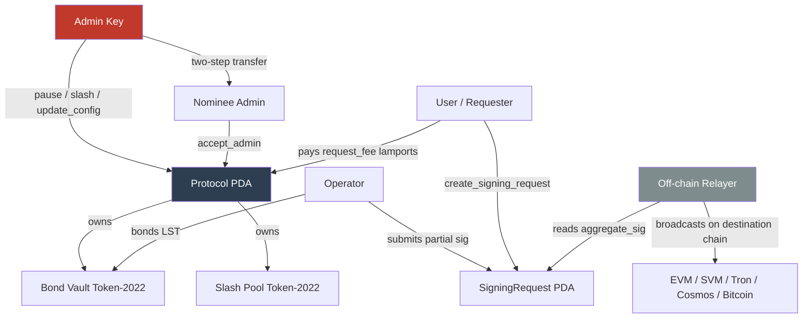

# Security & Trust Model

Distin is a threshold-signature coordination layer on Solana. Its security properties split cleanly between what the Solana program enforces on-chain and what is delegated to the off-chain signing libraries (`kobe-svm`, `kobe-evm`, `kobe-tron`, `kobe-cosmos`). Understanding that boundary is the most important thing a security reviewer or integration builder needs to know.

---

## Trust Hierarchy



| Principal | Trust Level | What they can do unilaterally |
|---|---|---|
| Admin | Privileged | Pause, update_config, slash_operator, nominate successor |
| Operator | Bonded, economically constrained | Submit partial sigs; begin_unbonding; withdraw bond after window |
| Requester (User) | Permissionless | Post signing intents; pays lamport fee |
| Off-chain Relayer | Trusted for liveness, not safety | Reads `aggregate_sig`; broadcasts to destination chain |
| Pyth Oracle feed | External, staleness-checked | Prices LST bond in SOL terms for stake-weight accounting |

---

## On-Chain Security Guarantees

The Solana program enforces the following properties unconditionally; no amount of operator collusion or relayer misbehavior can violate them.

### PDA Account Isolation

Every persistent account is a PDA derived from deterministic seeds. Collisions are computationally infeasible because Anchor rejects any account whose discriminator or seeds do not match.

| Account | Seeds | Uniqueness property |
|---|---|---|
| `Protocol` | `[b"protocol"]` | Singleton; one config per deployment |
| Bond vault | `[b"bond_vault", protocol]` | Singleton Token-2022 vault |
| Slash pool | `[b"slash_pool", protocol]` | Singleton Token-2022 pool |
| `Operator` | `[b"operator", protocol, authority]` | One operator record per authority key |
| `SigningRequest` | `[b"request", protocol, request_id_le]` | One record per monotonic nonce |
| `PartialSignature` | `[b"partial", request, operator]` | One share per (request, operator) pair |

The `PartialSignature` seed structure is the mechanism that prevents double-submission. A second call from the same operator for the same request will attempt to `init` an account at the same PDA address and fail with Anchor's `ConstraintSeeds` / "account already in use" error before any program logic runs.

### Threshold Enforcement

When a signing request is created, the required economic weight is snapshotted from the live state:

```rust
let required_stake_weight = protocol
    .total_bonded
    .checked_mul(protocol.threshold_bps as u64)
    .ok_or(DistinError::MathOverflow)?
    / BPS_DENOMINATOR;
```

`BPS_DENOMINATOR` is the compile-time constant `10_000`. A threshold of `6_666 bps` therefore requires 66.66% of `total_bonded` at the moment of request creation. This snapshot is stored in `SigningRequest.required_stake_weight` and is immutable for the lifetime of the request. An operator joining or unbonding after request creation does not retroactively change what is needed to finalize that specific request.

The protocol-level `threshold_bps` is range-checked at every write site:

```rust
require!(
    threshold_bps as u64 >= 1 && threshold_bps as u64 <= BPS_DENOMINATOR,
    DistinError::InvalidThreshold
);
```

Per-request `threshold` (the minimum distinct partial count) is also range-checked: `threshold >= 1 && threshold <= operator_count`. Both conditions must be satisfied independently; a request can require a head-count threshold and a stake-weight threshold simultaneously.

### Validity Windows

Every signing request carries an `expiry_slot = created_slot + validity_slots`. The hard ceiling is enforced at the protocol level:

```rust
pub const MAX_VALIDITY_SLOTS_CEILING: u64 = 432_000; // ~48 h at 400 ms slots
```

The ceiling is also checked at initialization and on every `update_config` call. A requester cannot post a request that lingers indefinitely; the maximum stale-intent window is 48 hours. After expiry, the request status transitions to `RequestStatus::Expired` and can no longer receive partial signatures.

### Emergency Pause

`pause` / `unpause` are gated on `AdminConfig`, which checks `protocol.admin == ctx.accounts.admin.key()`. When `protocol.paused == true`, every user- and operator-facing instruction (`register_operator`, `create_signing_request`, `begin_unbonding`) returns `DistinError::ProtocolPaused` at the top of its handler before touching any state. Admin-only instructions (`update_config`, `slash_operator`, `unpause`) are not blocked by the pause flag.

### Bonding and Withdrawal Flow

The bond lifecycle enforces an ordering invariant: an operator cannot withdraw collateral until it has exited the active signing set **and** waited out the unbonding delay:

```mermaid
sequenceDiagram
    participant OP as Operator
    participant PROG as Solana Program
    participant VAULT as Bond Vault (Token-2022)
    participant POOL as Slash Pool

    OP->>PROG: register_operator(bond_amount, group_pubkey)
    PROG->>VAULT: transfer_checked(bond_amount) via CPI
    Note over PROG: operator.unbonding_at = 0<br/>operator.jailed = false<br/>protocol.total_bonded += stake_weight

    OP->>PROG: begin_unbonding()
    Note over PROG: operator.unbonding_at = current_slot + unbonding_slots<br/>operator.jailed = true<br/>protocol.total_bonded -= stake_weight<br/>protocol.operator_count -= 1

    Note over OP: Wait until clock.slot >= unbonding_at

    OP->>PROG: withdraw_bond()
    PROG->>VAULT: transfer_checked(bonded_amount) via PDA signer
    Note over PROG: operator account closed; rent returned

    alt Admin initiates slash
        PROG->>VAULT: transfer_checked(slash_amount) via PDA signer
        VAULT->>POOL: funds move to slash pool
        Note over PROG: operator.bonded_amount -= amount<br/>operator.stake_weight recomputed<br/>operator.jailed = true if below min_bond
    end
```

The protocol PDA signer seeds used for vault withdrawals and slashes are `&[PROTOCOL_SEED, &[protocol.bump]]`. No instruction other than `withdraw_bond` and `slash_operator` can move tokens out of the vault.

---

## Signing Scheme Security Boundary

This is the most consequential trust boundary in the protocol. The Solana program is responsible for **accounting and economic incentives**. Cryptographic validity of individual partial signatures is **not verified on-chain**.

| Property | Enforced on-chain? | Mechanism |
|---|---|---|
| An operator cannot submit two shares for the same request | Yes | `[PARTIAL_SEED, request, operator]` PDA uniqueness |
| The `share: [u8; 64]` bytes are cryptographically valid for the scheme | **No** | Delegated to `kobe-{svm,evm,tron,cosmos}` off-chain libraries |
| The `aggregate_sig: [u8; 64]` is a valid group signature | **No** | Assembled off-chain; stored on-chain for relayer consumption |
| The operator's `group_pubkey: [u8; 33]` corresponds to a valid key share | **No** | Checked off-chain at DKG / registration time |
| Submitted scheme matches the request scheme | Yes | `DistinError::SchemeMismatch` check in `submit_partial_signature` |
| Staked-weight threshold is met before finalization | Yes | `stake_weight_collected >= required_stake_weight` check |
| Partial-count threshold is met before finalization | Yes | `partials_collected >= threshold` check |

### Scheme Dispatch

The `SignatureScheme` enum drives which off-chain library handles cryptographic work:

```rust
pub enum SignatureScheme {
    FrostEd25519,    // SVM / Aptos / Sui — FROST Schnorr over Ed25519
    Gg20Secp256k1,   // EVM / BTC / Tron — GG20 ECDSA over secp256k1
}
```

`TargetVm` carries the destination context alongside the scheme:

```rust
pub enum TargetVm { Svm, Evm, Tron, Cosmos, Bitcoin }
```

The pairing matters because a mismatch (e.g., `FrostEd25519` targeting `Bitcoin`) would produce an aggregate signature unacceptable on the destination chain. The on-chain program stores both fields in `SigningRequest` but does not enforce scheme-to-VM compatibility; that validation belongs to the off-chain relayer and to protocol-layer tooling that constructs the signing request.

---

## Threat Model

### Threat Matrix

| Threat | Attacker | On-chain mitigation | Residual risk |
|---|---|---|---|
| Operator submits garbage share bytes | Malicious operator | None (share not verified on-chain) | Off-chain library rejects invalid share; stake at risk via slash |
| Operator equivocates (two different shares for same request) | Malicious operator | PDA uniqueness prevents second on-chain submission | Equivocation in off-chain MPC round; slashable via `slash_operator` |
| Operator unbonds before request finalizes | Rational operator gaming liveness | `required_stake_weight` snapshotted at creation; begin_unbonding removes weight from `total_bonded` immediately | Requests may fail to reach threshold if too many operators unbond concurrently |
| Admin slashes an innocent operator | Malicious admin | None (admin-gated slash, no on-chain fraud proof) | **Honest weakness** — see below |
| Requester floods with cheap requests | Griefing user | `request_fee > 0` (set in `initialize`); fee charged via `system_program::transfer` | Fee level is a governance parameter; low fees do not prevent spam |
| Stale oracle inflates stake weight | Oracle manipulation | `StaleOraclePrice` error on stale feed; `InvalidOracleAccount` error on wrong account | Oracle compromise can over-weight operators |
| Admin key compromise | External attacker | Two-step transfer (`transfer_admin` → `accept_admin`) only protects succession; does not protect against compromise of the current key | Single key failure; no on-chain multisig in current code |
| Relayer censors the aggregate signature | Malicious relayer | Aggregate sig is publicly readable on-chain; any party can relay | Liveness risk only; safety unaffected since sig is on-chain |
| Request lingers past expiry | — | `MAX_VALIDITY_SLOTS_CEILING = 432_000` enforced at creation | Expired requests cannot finalize; no lingering attack |
| Math overflow in weight accounting | — | All arithmetic uses `checked_add` / `checked_mul`; returns `DistinError::MathOverflow` | Conservative; no silent truncation |

---

## Honest Weaknesses

The following limitations are present in the current on-chain code. They are accurately documented here, not papered over.

### 1. Admin-Gated Slashing (No On-Chain Fraud Proof)

The `slash_operator` instruction comment is explicit:

> "In production this entry point is gated by a verified fraud proof (equivocation / invalid-share / liveness fault) produced by the signing libraries; the on-chain effect — moving collateral and jailing — is what is enforced here."

In the current code, `slash_operator` is gated solely on `AdminConfig`, meaning the admin key can slash any operator for any `amount` up to `operator.bonded_amount` and set any `reason: u8` without supplying cryptographic evidence. The on-chain check is:

```rust
require!(
    amount <= ctx.accounts.operator.bonded_amount,
    DistinError::SlashAmountExceedsBond
);
```

Nothing else. Integrators and operators must trust that the admin will only slash on production-grade fraud evidence generated by the off-chain signing libraries. This is a systemic trust assumption that protocol governance must resolve (e.g., by requiring a fraud proof account in the `SlashOperator` context before slashing becomes trustless).

### 2. No On-Chain Cryptographic Share Verification

The `PartialSignature.share: [u8; 64]` field is stored verbatim. The Solana program does not call any native precompile or custom verifier to check that the bytes constitute a valid FROST partial signature (Ed25519) or a valid GG20 partial ciphertext (secp256k1). A malicious operator can submit 64 bytes of garbage, satisfy the stake-weight threshold in collusion with enough bonded-but-corrupt operators, and cause the off-chain aggregator to fail to produce a valid group signature while having all their shares credited on-chain. They bear slashing risk but only after the fact via admin action.

### 3. Single Admin Key

The current `Protocol.admin` field is a single `Pubkey`. The two-step handover (`transfer_admin` → `accept_admin`) protects against accidental overwrite but not against compromise of the active key. A compromised admin can:
- Pause the protocol indefinitely
- Slash all operators to zero
- Reduce `threshold_bps` to `1` (one basis point), trivially enabling threshold fulfillment
- Raise `request_fee` to an arbitrarily high lamport value

There is no on-chain multisig requirement or timelock on `AdminConfig` instructions in the current code.

### 4. Stake Weight Depends on Oracle Liveness

`compute_stake_weight` reads `lst_price_feed` (a Pyth price account stored as `protocol.lst_price_feed: Pubkey`). If the oracle becomes stale, operators cannot register and the per-operator `stake_weight` cannot be recomputed after a slash. The program returns `DistinError::StaleOraclePrice` and `DistinError::InvalidOracleAccount` as hard errors, so bad oracle data halts registration rather than silently under/over-counting, but Pyth downtime becomes a liveness risk for operator onboarding.

### 5. `total_bonded` Accounting Asymmetry on Slash

In `slash_operator`, the weight delta is only subtracted from `protocol.total_bonded` if the operator was active (`was_active = unbonding_at == 0 && !jailed`). If the operator was already jailed (e.g., had begun unbonding) and is then slashed, `total_bonded` is not further decremented. This is correct because `begin_unbonding` already removed the weight. The code relies on `was_active` being computed before the operator's `jailed` field is mutated:

```rust
let was_active = ctx.accounts.operator.unbonding_at == 0 && !ctx.accounts.operator.jailed;
// ...
let operator = &mut ctx.accounts.operator;
// mutations happen here
if was_active { /* adjust protocol.total_bonded */ }
```

If the pre-mutation snapshot is wrong (e.g., because another instruction in the same transaction mutated the operator), the accounting could drift. In practice Anchor's single-account-per-type constraint prevents same-transaction double-write, but composability with future instructions warrants review.

---

## Admin Key Risk: Mitigations Available

The current code provides a clean two-step admin transfer path. The intended upgrade path to reduce admin key risk (not yet in the on-chain code, noted here for completeness) would be to make `protocol.admin` a program-derived multisig or a governance program address. Until that upgrade, operators and users bear admin key risk.

The two-step handover as implemented:

```rust
// Step 1 — nominate
pub fn transfer_admin(ctx: Context<AdminConfig>, new_admin: Pubkey) -> Result<()> {
    require_keys_neq!(new_admin, Pubkey::default(), DistinError::InvalidAdminTransfer);
    ctx.accounts.protocol.pending_admin = new_admin;
    Ok(())
}

// Step 2 — accept (called by the nominee, not the current admin)
pub fn accept_admin(ctx: Context<AcceptAdmin>) -> Result<()> {
    let protocol = &mut ctx.accounts.protocol;
    require_keys_eq!(
        protocol.pending_admin,
        ctx.accounts.new_admin.key(),
        DistinError::Unauthorized
    );
    protocol.admin = protocol.pending_admin;
    protocol.pending_admin = Pubkey::default();
    Ok(())
}
```

This prevents the current admin from unilaterally redirecting control to an arbitrary address without the nominee's cooperation. After `accept_admin`, `pending_admin` is zeroed to `Pubkey::default()`, preventing replay.

---

## Oracle Risk

The LST price feed is stored at `protocol.lst_price_feed: Pubkey`, set once at `initialize` and not changeable by `update_config` (the field is absent from `update_config`'s parameter list). This means oracle migration requires an admin upgrade path that is not currently implemented.

The `InvalidOracleAccount` error fires if the passed oracle account does not match `protocol.lst_price_feed`:

```rust
// DistinError::InvalidOracleAccount
#[msg("Oracle account does not match the configured price feed")]
InvalidOracleAccount,
```

The `StaleOraclePrice` error fires if the feed's confidence interval or publish time falls outside the program's staleness threshold. The exact staleness window is enforced inside `compute_stake_weight`; the specific confidence interval or age check is not shown in the provided excerpt but the error path is defined.

---

## Edge Cases and Failure Modes

### Threshold Impossible After Operator Churn

If enough operators call `begin_unbonding` between when a request is created and when it needs to be finalized, `required_stake_weight` (snapshotted at creation) may exceed the weight still held by operators who remain active. The request will expire with `RequestStatus::Expired`. This is a liveness failure, not a safety failure. The requester loses the `request_fee` and must repost.

### Jailed Operator After Slash Falls Below `min_bond`

```rust
if operator.bonded_amount < min_bond {
    operator.jailed = true;
}
```

An operator slashed below `min_bond` is automatically jailed even if they had not initiated unbonding. Their weight is removed from `total_bonded` and `operator_count` decremented, but their `bonded_amount` is not zero. They can still call `begin_unbonding` to start the withdrawal timer and eventually recover the residual bond. The residual bond remains in the vault and is slashable until `withdraw_bond` is called.

### Zero-Weight Operator Registration Race

`register_operator` checks `bond_amount >= protocol.min_bond` but computes `stake_weight` from the oracle at the time of the call. If the oracle price is very low (extreme LST depeg) at registration time, `stake_weight` may be non-zero but very small. The operator joins the set, contributes negligible weight to threshold calculations, and poses minimal economic security. There is no minimum `stake_weight` floor check separate from the `min_bond` LST amount check.

### `total_bonded` Saturation Behavior

Subtractions from `protocol.total_bonded` use `saturating_sub` rather than `checked_sub`:

```rust
protocol.total_bonded = protocol.total_bonded.saturating_sub(removed_weight);
protocol.operator_count = protocol.operator_count.saturating_sub(1);
```

This means a double-removal bug (if one were introduced in a future instruction) would silently clamp to zero rather than error. The use of saturation is a defensive choice against underflow panics; reviewers should audit any future instruction that removes weight to ensure it does not double-count.

### Request Fee Bypass

The lamport fee transfer uses `system_program::transfer`, which requires the requester to be a signer. There is no way to bypass the fee for a `create_signing_request` call. However, `request_fee = 0` is a valid configuration (set at `initialize` or via `update_config`). If the fee is zero, the fee transfer CPI is skipped entirely:

```rust
if protocol.request_fee > 0 {
    system_program::transfer(/* ... */, protocol.request_fee)?;
}
```

At zero fee, request spam costs only the Solana transaction fee plus the rent for the `SigningRequest` account. Protocol governance should set a non-zero `request_fee` to prevent griefing.

---

## Security-Relevant Error Reference

| Error | Code mnemonic | Condition that triggers it |
|---|---|---|
| `ProtocolPaused` | 6000 | Admin called `pause`; user/operator action blocked |
| `Unauthorized` | 6001 | Caller is not `protocol.admin` or `protocol.pending_admin` |
| `InvalidThreshold` | 6002 | `threshold_bps` outside `[1, 10_000]` or per-request threshold outside `[1, operator_count]` |
| `InsufficientBond` | 6003 | `bond_amount < protocol.min_bond` at registration |
| `OperatorJailed` | 6004 | Jailed or unbonding operator attempts to sign |
| `AlreadyUnbonding` | 6005 | `begin_unbonding` called when `unbonding_at != 0` |
| `NotUnbonding` | 6006 | `withdraw_bond` called before `begin_unbonding` |
| `UnbondingNotComplete` | 6007 | `withdraw_bond` called before `clock.slot >= unbonding_at` |
| `RequestExpired` | 6008 | `submit_partial_signature` or finalize called after `expiry_slot` |
| `RequestNotPending` | 6009 | Action on a non-Pending request |
| `ThresholdNotMet` | 6010 | Finalize attempted before weight + count thresholds satisfied |
| `RequestAlreadyFinalized` | 6011 | Duplicate finalization attempt |
| `MalformedPartialSignature` | 6012 | Share bytes fail basic format check (length, non-zero) |
| `EmptyMessageHash` | 6013 | `message_hash` is all zeros |
| `SchemeMismatch` | 6014 | Submitted share scheme differs from request scheme |
| `StaleOraclePrice` | 6015 | Oracle publish time is too old |
| `InvalidOracleAccount` | 6016 | Passed oracle account != `protocol.lst_price_feed` |
| `InvalidVault` | 6017 | Vault or pool account does not match protocol config |
| `InvalidValidityWindow` | 6018 | `validity_slots` outside `[1, MAX_VALIDITY_SLOTS_CEILING]` |
| `NoActiveOperators` | 6019 | `protocol.operator_count == 0` at request creation |
| `SlashAmountExceedsBond` | 6020 | Slash `amount > operator.bonded_amount` |
| `InvalidAdminTransfer` | 6021 | `new_admin == Pubkey::default()` in `transfer_admin` |
| `MathOverflow` | 6022 | Checked arithmetic (add/mul) overflowed |